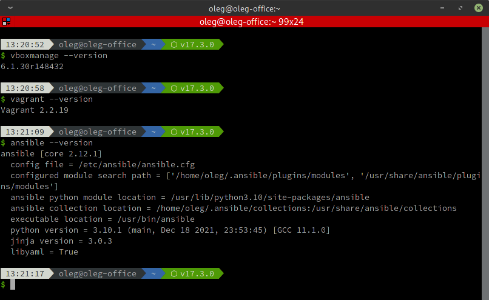
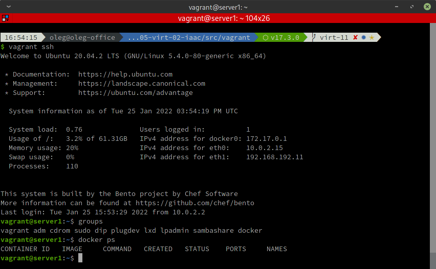

# Домашнее задание к занятию "5.2. Применение принципов IaaC в работе с виртуальными машинами"


## Задача 1

- Опишите своими словами основные преимущества применения на практике IaaC паттернов.
- Какой из принципов IaaC является основополагающим?

===

- Основные преимущества использования IaaC состоят в возможности добиться быстрой и безошибочной настройки множественных сред разработки, тестирования и эксплуатации. Это, в свою очередь, позволяет существенно ускорить производство ПО, упростить и оптимизировать его настройку и эксплуатацию

- Основополагающим принципом IaaC является **идемпотентность**, т.е. повторяя одни и те же операции любое число раз, мы будем всегда получать одинаковый результат. Как в математике, умножая число на 1 или извлекая его модуль сколько угодно раз мы всегда будем получать один и тот же результат, так и в IaaC мы можем, разворачивать сущности в любом количестве, гарантированно получая идентичный результат.

---

## Задача 2

- Чем Ansible выгодно отличается от других систем управление конфигурациями?
- Какой, на ваш взгляд, метод работы систем конфигурации более надёжный push или pull?

===

- Ansible не требует установки никакого дополнительного дополнительного набора средств для шифрования соединений на основе закрытого и открытого ключей (Public Key Infrastructure), а использует уже имеющиеся инструменты SSH-доступа. Достаточно знать IP-адреса виртуальных машин для работы с ними.
Скорость запуска, простота описания конфигураций и расширяемость также являются преимущества Ansible над другими системами управления конфигурациями.

- И PUSH, и PULL и гибридный методы обладают одинаковой надёжностью при их правильной реализации.

---

## Задача 3

Установить на личный компьютер:

- VirtualBox
- Vagrant
- Ansible

*Приложить вывод команд установленных версий каждой из программ, оформленный в markdown.*

===



---

## Задача 4 (*)

Воспроизвести практическую часть лекции самостоятельно.

- Создать виртуальную машину.
- Зайти внутрь ВМ, убедиться, что Docker установлен с помощью команды
```
docker ps
```

===


