# Домашнее задание к занятию "5.3. Введение. Экосистема. Архитектура. Жизненный цикл Docker контейнера"


## Задача 1

Сценарий выполения задачи:

- создайте свой репозиторий на https://hub.docker.com;
- выберете любой образ, который содержит веб-сервер Nginx;
- создайте свой fork образа;
- реализуйте функциональность:
запуск веб-сервера в фоне с индекс-страницей, содержащей HTML-код ниже:
```
<html>
<head>
Hey, Netology
</head>
<body>
<h1>I’m DevOps Engineer!</h1>
</body>
</html>
```
Опубликуйте созданный форк в своем репозитории и предоставьте ответ в виде ссылки на https://hub.docker.com/username_repo.

===

---

### Адрес веб-страницы созданного образа: https://hub.docker.com/repository/docker/olezhuravlev/nginx

---

Опишем более подробно процесс создания образа и проверку его работоспособности.

1. Логинимся под заранее созданной учетной записью в публичном репозитории: 
````
docker login -u olezhuravlev
````

2. Скачиваем базовый образ (но это сейчас необязательно - при его отсутствии в локальном репозитории базовый образ будет скачан из публичного репозитория автоматически при сборке пользовательского образа):
````
docker pull nginx:1.20.2
````
3. Создадим файл папке проекта html-файл с требуемым содержимым:
````
vim home.html

<html>
  <head>
    Hey, Netology
  </head>
  <body>
    <h1>I’m DevOps Engineer!</h1>
  </body>
</html>
````
4. Создадим файл Dockerfile - манифест пользовательского контейнера и наполним его содержимым с указанием, какой html-файл следует отображать веб-серверу nginx::
````
vim Dockerfile

FROM nginx:1.20.2
COPY home.html /usr/share/nginx/html
````

5. Соберем образ (точка через пробел в конце указывает, что используемый Dockerfile находится в текущей директории):
````
docker build -t olezhuravlev/nginx:1.20.2 .
````

6. После этого созданный образ появится в списке локальных образов:
````
docker image ls
````

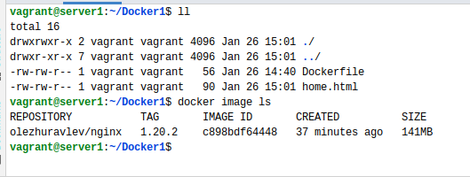

7. Отправим созданный образ в публичный репозиторий.
````
docker image push olezhuravlev/nginx:1.20.2
````

Созданный образ теперь можно наблюдать на веб-странице в этом репозитории по адресу:
https://hub.docker.com/repository/docker/olezhuravlev/nginx:

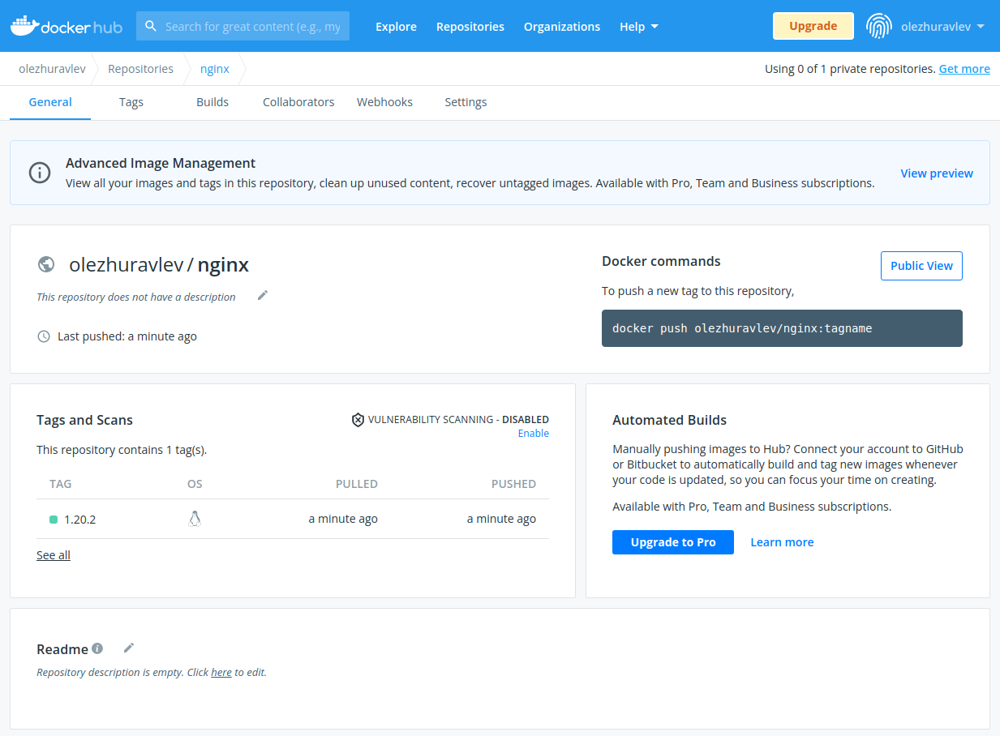

8. Проверим работоспособность созданного образа. Для этого запустим контейнер на хосте.

Здесь возможны два варианта - либо указать сопоставление портов хоста и гостевой системы:
````
docker run -p 8080:80 --name myNginx olezhuravlev/nginx:1.20.2
````

Или просто использовать сеть типа `host`, чтобы использовать все порты хоста:
````
docker run --network host --name myNginx olezhuravlev/nginx:1.20.2
````
Воспользуемся вторым вариантом, а также для удобства укажем имя контейнера с помощью тега `--name`.

Теперь контейнер можно наблюдать в списке запущенных контейнеров:

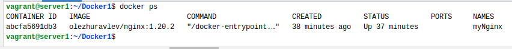

Т.к. мы подключили контейнер, используя сеть типа `host`, то мы можем получить доступ к созданной html-странице из браузера хоста используя порт по-умолчанию (80) и IP-адрес гостевой машины:

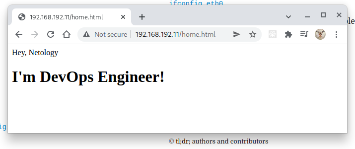


Как видим, запущенный в контейнере веб-сервер работает и предоставляет нам созданную страницу `home.html`. 

---

## Задача 2

Посмотрите на сценарий ниже и ответьте на вопрос:
"Подходит ли в этом сценарии использование Docker контейнеров или лучше подойдет виртуальная машина, физическая машина? Может быть возможны разные варианты?"

Детально опишите и обоснуйте свой выбор.

--

Сценарий:

- Высоконагруженное монолитное java веб-приложение;
- Nodejs веб-приложение;
- Мобильное приложение c версиями для Android и iOS;
- Шина данных на базе Apache Kafka;
- Elasticsearch кластер для реализации логирования продуктивного веб-приложения - три ноды elasticsearch, два logstash и две ноды kibana;
- Мониторинг-стек на базе Prometheus и Grafana;
- MongoDB, как основное хранилище данных для java-приложения;
- Gitlab сервер для реализации CI/CD процессов и приватный (закрытый) Docker Registry.

===
- Высоконагруженное монолитное java веб-приложение;
  - Монолитному приложению лучше отдать монолитную машину, т.е физическая машина, способная отдать все ресурсы высоконагруженному приложению здесь подходит лучше;
- Nodejs веб-приложение;
  - Здесь лучше использовать контейнеризацию, чтобы получить возможность оперативно наращивать ресурсы в случае повышения нагрузки; 
- Мобильное приложение c версиями для Android и iOS;
  - Здесь нельзя применить контейнеризацию, поскольку ядра разные. Виртуальные машины для каждой из систем будут удобнее в разработке, тестировании и эксплуатации;
- Шина данных на базе Apache Kafka;
  - Выделенный физический сервер здесь предпочтительнее, поскольку Apache Kafka является многопоточным приложением и добавлять еще и слой контейнеризации не имеет смысла (каждый контейнер - это один поток);
- Elasticsearch кластер для реализации логирования продуктивного веб-приложения - три ноды elasticsearch, два logstash и две ноды kibana;
  - В зависимости от нагрузки здесь можно применить и контейнеризацию, и выделить отдельные машины для каждого из элементов кластера или все запустить на одном сервере;
- Мониторинг-стек на базе Prometheus и Grafana;
  - Здесь также возможны все варианты - и выделенный сервер/кластер, и виртуальные машины, и контейнеры, в зависимости от нагрузки; 
- MongoDB, как основное хранилище данных для java-приложения;
  - Для баз данных лучше иметь отдельный сервер и все его ресурсы, хотя в целях разработки широко используются контейнеризированные СУБД;
- Gitlab сервер для реализации CI/CD процессов и приватный (закрытый) Docker Registry.
  - В зависимости от нагрузки здесь можно применить как кластер серверов, так и набор виртуальных машин.

---

## Задача 3

- Запустите первый контейнер из образа ***centos*** c любым тэгом в фоновом режиме, подключив папку ```/data``` из текущей рабочей директории на хостовой машине в ```/data``` контейнера;
- Запустите второй контейнер из образа ***debian*** в фоновом режиме, подключив папку ```/data``` из текущей рабочей директории на хостовой машине в ```/data``` контейнера;
- Подключитесь к первому контейнеру с помощью ```docker exec``` и создайте текстовый файл любого содержания в ```/data```;
- Добавьте еще один файл в папку ```/data``` на хостовой машине;
- Подключитесь во второй контейнер и отобразите листинг и содержание файлов в ```/data``` контейнера.

===

Создадим директорию на хосте:
````
mkdir ~/data
````
Скачаем образы требуемых операционных систем с монтированием для них созданной папки хоста.
````
docker run -it -d --name centos --mount type=bind,source="/home/vagrant/data",target="/data" centos:centos8.4.2105
docker run -it -d --name debian --mount type=bind,source="/home/vagrant/data",target="/data" debian:stable-20211220-slim
````
Ключи означают следующее:

`-it` - запустить с открытым STDIN (т.наз. "интерактивный" режим) и драйвером псевдо-TTY, что позволяет подключаться к контейнеру с использованием терминальной сессии;

`-d` - запустить контейнер в фоновом режиме (detach), чтобы после запуска контейнера вернуться в терминальную сессию хоста;

`--name` - имя/идентификатор контейнера в списке;

`--mount` - Параметр монтирования вида `ключ=значение`, где:

- `type` - тип монтирования. Может быть `bind`, `volume` или `tmpfs`, но здесь мы монтируем папку, поэтому используем `bind`;
- `source` - путь к папке хоста, которую надлежит смонтировать в контейнер;
- `target` - путь к папке контейнера, в которую следует смонтировать папку хоста.

Теперь можно наблюдать запущенные контейнеры с помощью команды `docker ps`:

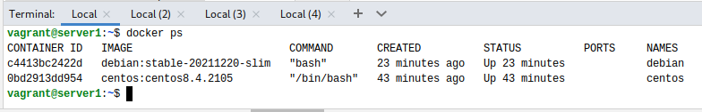

Подключимся к контейнеру `centos` в интерактивном режиме через bash-консоль:
````
docker exec -it centos /bin/bash
````

Как видим, в папке пользователя присутствует смонтированная папка `data`. Создадим в ней текстовый файл `fromCentos.txt`:

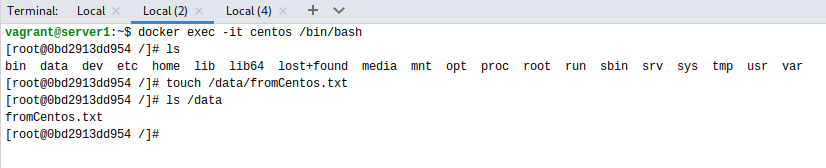

Из консоли хостовой машины можно наблюдать папку `data` и созданный файл `fromCentos.txt` в ней:

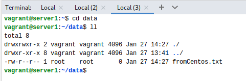

Создадим в папке `data` хостовой машины файл `fromHost.txt`:

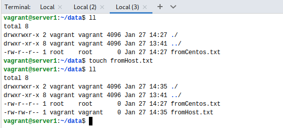

Подключимся к контейнеру `debian` в интерактивном режиме через bash-консоль:
````
docker exec -it debian /bin/bash
````

Как видим, в папке пользователя присутствует смонтированная папка `data`, содержащая ранее созданные файлы `fromCentos.txt` и `fromCentos.txt`:

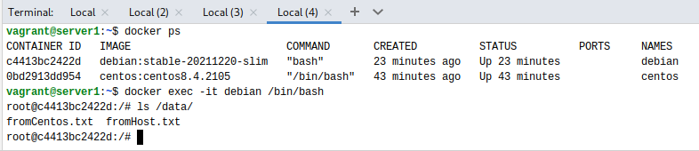

Таким образом, папка хоста, будучи смонтированной в разные контейнеры, является доступной из этих контейнеров и на чтение и на запись.

---

## Задача 4 (*)

Воспроизвести практическую часть лекции самостоятельно.

Соберите Docker образ с Ansible, загрузите на Docker Hub и пришлите ссылку вместе с остальными ответами к задачам.

===
1. Собираем образ, находясь в папке с предоставленным Dockerfile (/virt-homeworks/05-virt-03-docker/src/build/ansible/Dockerfile):
````
docker build -t olezhuravlev/ansible:2.9.24 .

````

2. Образ собран и наблюдается в списке:

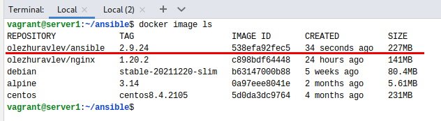

3. Логинимся в репозиторий и отправляем в него образ:

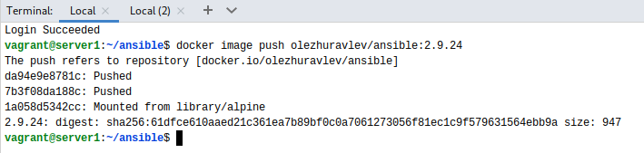

Из сообщений видно, что слой 'library/alpine' не был отправлен в репозиторий, а был использован слой, уже существующий в репозитории.

4. Теперь созданный образ можно увидеть в репозитории по адресу
### https://hub.docker.com/repository/docker/olezhuravlev/ansible:

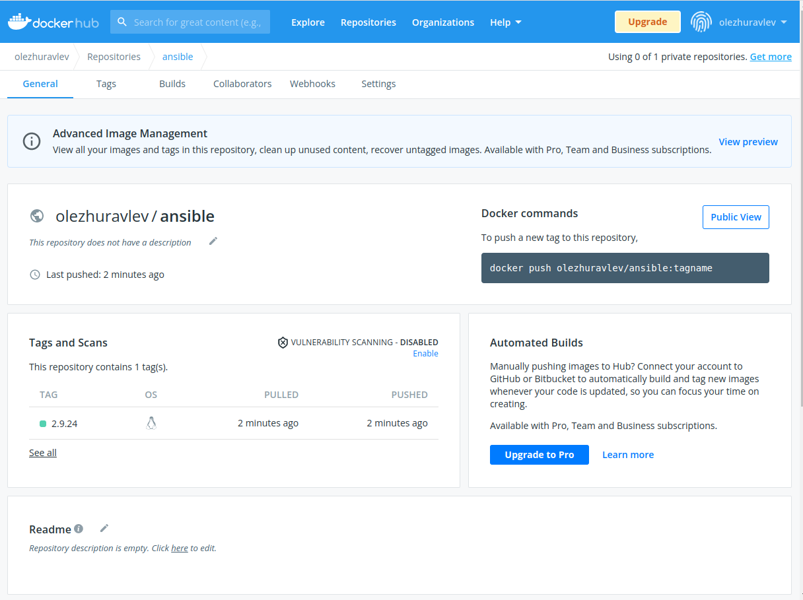
