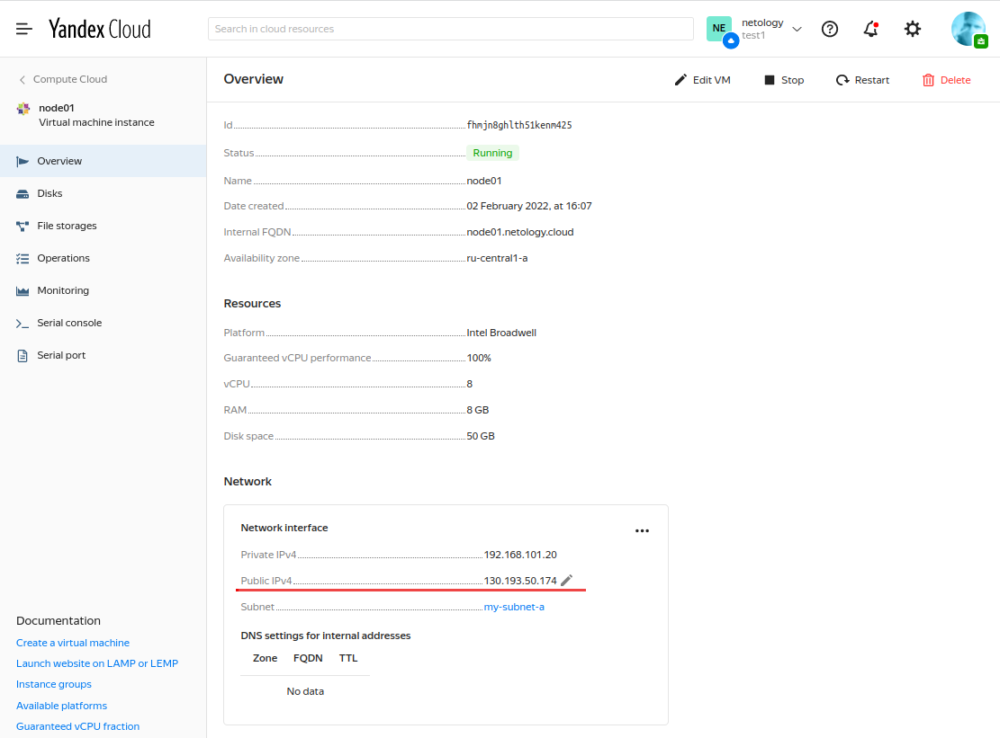

# Домашнее задание к занятию "5.4. Оркестрация группой Docker контейнеров на примере Docker Compose"


## Задача 1

Создать собственный образ операционной системы с помощью Packer.

Для получения зачета, вам необходимо предоставить:
- Скриншот страницы, как на слайде из презентации (слайд 37).

===

Результат:


===

###TL;DR: Далее следует подробное описание того, как был достигнут результат.

В учебных целях будем реализовывать задачу в контейнеризированной ОС версии CentOS 7.

1. Запускаем контейнер с операционной системой CentOS:
````
# docker run -it -d --name centos-cloud centos:centos7
````

2. Подключаемся к созданному контейнеру через терминал:
````
# docker exec -it centos-cloud /bin/bash
````

3. Для удобства добавим в файл `.bashrc` пседоним для команды `ls -al --color`:
````
alias la='ls -al --color'
````
Нужно переинициализировать оболочку, чтобы псевдоним вступил в действие:
````
# source ~/.bashrc
```` 

Теперь команда `la` будет выводить удобный список содержимого директорий.


4. Устанавливаем набор утилит, необходимых для работы:
````
# yum install sudo -y # Утилита для управления полномочиями.
# yum install vim-enhanced -y # Редактор vim.
# yum install curl -y # Утилита установки сетевых соединений.
# yum install ncurses -y # Команды для работы с экраном терминала.
# yum install openssh-clients openssh-server -y # Утилиты SSH.
# yum install yum-utils -y # Утилиты, требуемые для работы Packer и Terraform
# yum-config-manager --add-repo https://rpm.releases.hashicorp.com/RHEL/hashicorp.repo # Репозиторий HashiCorp.
# yum install packer -y # Установка Packer.
# yum install terraform -y # Установка Terraform.
# yum install epel-release # Репозиторий с Ansible.
# yum install ansible -y # Установка Ansible.
````

5. Т.к. в CentOS 7 по умолчанию команда `packer` уже занята другой утилитой, то для удобства использования создадим символическую ссылку, указывающую на утилиту, которая нам нужна (требуемая утилита находится по пути `/usr/bin/packer`). Ссылке дадим имя `packer.io`:
````
# ln -s /usr/bin/packer packer.io
````

6. Проверим установленную версию Packer:
````
# packer.io --version
1.7.9
````

7. Проверим установленную версию Terraform:
````
# terraform --version
Terraform v1.1.4
on linux_amd64
````

8. Проверим установленную версию Ansible:
````
# ansible --version
ansible 2.9.27
config file = /root/yandex-cloud-ansible/ansible.cfg
configured module search path = [u'/root/.ansible/plugins/modules', u'/usr/share/ansible/plugins/modules']
ansible python module location = /usr/lib/python2.7/site-packages/ansible
executable location = /usr/bin/ansible
python version = 2.7.5 (default, Nov 16 2020, 22:23:17) [GCC 4.8.5 20150623 (Red Hat 4.8.5-44)]
````

9. Сгенерируем пару ssh-ключей:
````
# ssh-keygen
Generating public/private rsa key pair.
Enter file in which to save the key (/root/.ssh/id_rsa):
Created directory '/root/.ssh'.
Enter passphrase (empty for no passphrase):
Enter same passphrase again:
Your identification has been saved in /root/.ssh/id_rsa.
Your public key has been saved in /root/.ssh/id_rsa.pub.
The key fingerprint is:
SHA256:3qWAdACcJz7Q4UX3noyD/EaPQSylspPcS0LtE7x3SEI root@e94b7606e5b4
The key's randomart image is:
+---[RSA 2048]----+
|   oo=E o        |
|  ..==.* .       |
|   o+oO = .      |
|   ooO @ = .     |
|    *.X S = .    |
|     + B O o     |
|      . = +      |
|       .         |
|                 |
+----[SHA256]-----+
# la ~/.ssh
total 20
drwx------ 2 root root 4096 Feb  2 05:16 .
dr-xr-x--- 1 root root 4096 Feb  2 05:16 ..
-rw------- 1 root root 1679 Feb  2 05:16 id_rsa
-rw-r--r-- 1 root root  399 Feb  2 05:16 id_rsa.pub
````
 
10. Устанавливаем утилиту Yandex Cloud:
````
# curl https://storage.yandexcloud.net/yandexcloud-yc/install.sh | bash
````

11. Т.к. при установке утилиты YC изменяется содержимое файла `.bashrc` (переменная `PATH`), то снова переинициализируем оболочку:
````
# source ~/.bashrc
````

12. Теперь команды утилиты YC доступны и можно проверить версию утилиты:
````
# yc --version
Yandex.Cloud CLI 0.87.0 linux/amd64
````

13. Через веб-интефейс по адресу `https://console.cloud.yandex.ru` создаём облако (к сожалению информацию о том, как выполнить это через CLI, найти не удалось);


14. Конфигурируем профиль, рабочую папку и зону учётной записи Yandex Cloud:
````
# yc init
Welcome! This command will take you through the configuration process.
Pick desired action:
 [1] Re-initialize this profile 'netology' with new settings 
 [2] Create a new profile
 [3] Switch to and re-initialize existing profile: 'default'
Please enter your numeric choice: 1
Please go to https://oauth.yandex.ru/authorize?response_type=token&client_id=1a6990aa636648e9b2ef855fa7bec2fb in order to obtain OAuth token.

Please enter OAuth token: [AQAAAAABL*********************PBEbq222c] 
You have one cloud available: 'test1' (id = b1gveipln6minl76p6le). It is going to be used by default.
Please choose folder to use:
 [1] default (id = b1gqlab71lo8dh7dufvv)
 [2] Create a new folder
Please enter your numeric choice: 2
Please enter a folder name: netology
Your current folder has been set to 'netology' (id = b1g7dvesu6em2goh4b8t).
Do you want to configure a default Compute zone? [Y/n] Y
Which zone do you want to use as a profile default?
 [1] ru-central1-a
 [2] ru-central1-b
 [3] ru-central1-c
 [4] Don't set default zone
Please enter your numeric choice: 1
Your profile default Compute zone has been set to 'ru-central1-a'.
````

С этого момента в веб-интерфейсе Yandex Cloud можно наблюдать созданный профиль (каталог) 'netology':


Также можно просмотреть идентификаторы созданных сущностей через CLI:
````
# yc config list
token: AQAAAAABLXyWAATuwWlZUqK2wkxsqOPBEbq222c
cloud-id: b1gveipln6minl76p6le
folder-id: b1g7dvesu6em2goh4b8t
compute-default-zone: ru-central1-a
````

Также список имеющихся каталогов можно получить командой `yc resource-manager folder list`:
````
# yc resource-manager folder list
+----------------------+----------+--------+--------+
|          ID          |   NAME   | LABELS | STATUS |
+----------------------+----------+--------+--------+
| b1gqlab71lo8dh7dufvv | default  |        | ACTIVE |
| b1g7dvesu6em2goh4b8t | netology |        | ACTIVE |
+----------------------+----------+--------+--------+
````

Вывести список имеющихся образов Yandex Compute Cloud можно командой `yc compute image list`:
````
# yc compute image list
+----+------+--------+-------------+--------+
| ID | NAME | FAMILY | PRODUCT IDS | STATUS |
+----+------+--------+-------------+--------+
+----+------+--------+-------------+--------+
````
Как видим, пока ни одного образа не создано.

15. Инициализируем сеть:
````
# yc vpc network create --name net --labels my-label=netology --description "My first network via Yandex Cloud."
id: enpmintantmckhrest5m
folder_id: b1g7dvesu6em2goh4b8t
created_at: "2022-02-02T13:47:34Z"
name: net
description: My first network via Yandex Cloud.
labels:
  my-label: netology
````

С этого момента в веб-интерфейсе Yandex Cloud можно наблюдать созданную сеть с именем 'net':


16. В созданной сети `net` создаём подсеть с именем `my-subnet-a`:
````
# yc vpc subnet create --name my-subnet-a --zone ru-central1-a --range 10.1.2.0/24 --network-name net --description "My first subnet via Yandex Cloud."
id: e9bedtifn5j35l49uv8j
folder_id: b1g7dvesu6em2goh4b8t
created_at: "2022-02-02T13:50:23Z"
name: my-subnet-a
description: My first subnet via Yandex Cloud.
network_id: enpmintantmckhrest5m
zone_id: ru-central1-a
v4_cidr_blocks:
- 10.1.2.0/24
````
####ВНИМАНИЕ! Значение поля `id` в дальнейшем будет использовано для конфигурирования сети виртуальной машины путём указания его в файле `centos-7-base.json` в поле "subnet_id"!

С этого момента в веб-интерфейсе Yandex Cloud можно наблюдать подсеть, созданную в сети 'net':


####Теперь приступаем непосредственно к созданию образа ОС с помощью утилиты Packer.

17. На локальной машине создадим директорию `yandex-cloud-packer`:
````
mkdir ~/yandex-cloud-packer
````

18. Скопируем в эту директорию предоставленный файл `centos-7-base.json`;

19. Изменим в файле `centos-7-base.json` параметры идентификаторов `token`, `folder_id` и `subnet_id` в соответствии с идентификаторами сущностей, созданных нами ранее в Yandex Cloud.

Значения `token` и `folder_id` получаем командой `yc config list`.
Значение `subnet_id` получаем командой `yc vpc subnet list` из поля `ID`.

````
...
{
  "disk_type": "network-nvme",
  "folder_id": "b1g7dvesu6em2goh4b8t",
  "image_description": "by packer",
  "image_family": "centos",
  "image_name": "centos-7-base",
  "source_image_family": "centos-7",
  "ssh_username": "centos",
  "subnet_id": "e9bedtifn5j35l49uv8j",
  "token": "AQAAAAABLXyWAATuwWlZUqK2wkxsqOPBEbq222c",
  "type": "yandex",
  "use_ipv4_nat": true,
  "zone": "ru-central1-a"
}
...
````

20. Проверим с помощью команды `packer validate` корректность созданного файла:
````
# packer.io validate centos-7-base.json 
The configuration is valid.
````

21. Соберем образ операционной системы с помощью команды `build`:
````
# packer.io build centos-7-base.json 
yandex: output will be in this color.

==> yandex: Creating temporary RSA SSH key for instance...
==> yandex: Using as source image: fd8aqitd4vl5950ihohp (name: "centos-7-v20220131", family: "centos-7")
==> yandex: Use provided subnet id e9bedtifn5j35l49uv8j
==> yandex: Creating disk...
==> yandex: Creating instance...
==> yandex: Waiting for instance with id fhm8ak2qkv0lvbrjl8jm to become active...
    yandex: Detected instance IP: 84.252.128.254
==> yandex: Using SSH communicator to connect: 84.252.128.254
==> yandex: Waiting for SSH to become available...
==> yandex: Connected to SSH!
==> yandex: Provisioning with shell script: /tmp/packer-shell4102549931
...
...
    yandex: Complete!
==> yandex: Stopping instance...
==> yandex: Deleting instance...
    yandex: Instance has been deleted!
==> yandex: Creating image: centos-7-base
==> yandex: Waiting for image to complete...
==> yandex: Success image create...
==> yandex: Destroying boot disk...
    yandex: Disk has been deleted!
Build 'yandex' finished after 2 minutes 2 seconds.

==> Wait completed after 2 minutes 2 seconds

==> Builds finished. The artifacts of successful builds are:
--> yandex: A disk image was created: centos-7-base (id: fd89r1e98nifudrh94qo) with family name centos
````

22. Выведем список образов с помощью команды `yc compute image list`:


Как видим, образ создан. Созданный образ также можно наблюдать в графическом интерфейсе Yandex Cloud:


Таким образом, с помощью утилиты Packer мы создали собственный образ операционной системы в Yandex Cloud. 

---

## Задача 2

Создать вашу первую виртуальную машину в Яндекс.Облаке.

Для получения зачета, вам необходимо предоставить:
- Скриншот страницы свойств созданной ВМ, как на примере ниже:

<p align="left">
  
</p>

===

Результат:



===

###TL;DR: Далее следует подробное описание того, как был достигнут результат.

1. Создадим папку `yandex-cloud-terraform` и скопируем в неё предоставленные файлы:
   1. `network.tf` - имена используемых сетей и их параметры (имя подсети и зону можно получить командой `yc vpc subnet list`);
   2. `node01.tf` - задаёт параметры экземляра ВМ;
   3. `output.tf` - IP-адреса сетевых интерфейсов ВМ, необходимых в консоли управления;
   4. `provider.tf` - зависимости используемого облачного провайдера - плагин для работы с API и авторизация в Yandex Cloud;
   5. `variables.tf` - переменные, используемые в конфигурации Terraform (ID сущностей, которые следует подставить, можно получить командами `yc resource-manager cloud list`, `yc resource-manager folder list` и `yc compute image list`);


2. Используя утилиту `yc` создадим сервисный аккаунт с именем `my-service-acc`:
````
yc iam service-account create --name my-service-acc --description "This is my first service account"
id: ajepjac0p5n2uegrpigp
folder_id: b1g7dvesu6em2goh4b8t
created_at: "2022-02-02T05:32:12.712218024Z"
name: my-service-acc
description: This is my first service account
```` 

Впоследствии список имеющихся сервисных аккаунтов можно получить командой `yc iam service-account list`:
````
# yc iam service-account list
+----------------------+----------------+
|          ID          |      NAME      |
+----------------------+----------------+
| ajepjac0p5n2uegrpigp | my-service-acc |
+----------------------+----------------+
````

3. Используя утилиту `yc` назначим созданному сервисному аккаунту роль `admin` (список ролей можно предварительно получить командой `yc iam role list`) на папку `netology2`:
````
yc resource-manager folder add-access-binding netology --role admin --subject serviceAccount:ajepjac0p5n2uegrpigp
````

Список созданных сервисных аккаунтов можно получить командой `yc iam service-account list`:
````
# yc iam service-account list
+----------------------+----------------+
|          ID          |      NAME      |
+----------------------+----------------+
| ajepjac0p5n2uegrpigp | my-service-acc |
+----------------------+----------------+
````
Более подробную информацию по определенному сервисному аккаунту можно получить командой `yc iam service-account get {ИмяАккаунта}`:
````
# yc iam service-account get my-service-acc
id: ajepjac0p5n2uegrpigp
folder_id: b1g7dvesu6em2goh4b8t
created_at: "2022-02-02T05:32:12Z"
name: my-service-acc
description: This is my first service account
````

Роль, назначенную сервисному аккаунту на папку можно увидеть командой `yc resource-manager folder list-access-bindings {ИмяПапки}`:
````
# yc resource-manager folder list-access-bindings netology
+---------+----------------+----------------------+
| ROLE ID |  SUBJECT TYPE  |      SUBJECT ID      |
+---------+----------------+----------------------+
| admin   | serviceAccount | ajepjac0p5n2uegrpigp |
+---------+----------------+----------------------+
````

Созданный сервисный аккаунт и назначенные на папку роли также можно увидеть в веб-интерфейсе Yandex Cloud:


4. Используя утилиту `yc` создадим IAM-токен (будет сгенерирован файл key.json):
````
# yc iam key create --service-account-id ajepjac0p5n2uegrpigp --output key.json
id: ajefh14et59dha1e1mb0
service_account_id: ajepjac0p5n2uegrpigp
created_at: "2022-02-02T05:39:36.842134905Z"
key_algorithm: RSA_2048
````

5. Инициализируем Terraform командой `terraform init`. Используя данные из предоставленных конфигурационных `tf`-файлов рабочая директорий Terraform (это локальная директория) будет подготовлена для работы:


В т.ч. в ней будут созданы служебные файлы `.terraform` и `.terraform.lock.hcl`:


6. При желании, можно просмотреть изменения, требуемые для внесения в текущую конфигурацию. Это выполняется командой `terraform plan`.

7. Т.к. на аккаунтах Yandex Cloud по умолчанию установлен лимит на существование только одной сети и одной подсети, а Terraform будет создавать свою сеть и подсеть в ней, то нам следует удалить существующую сеть и её подсеть, созданные в Задаче №1 при генерации образа:
````
# yc vpc network list
+----------------------+------+
|          ID          | NAME |
+----------------------+------+
| enpmintantmckhrest5m | net  |
+----------------------+------+

# yc vpc subnet list
+----------------------+-------------+----------------------+----------------+---------------+---------------+
|          ID          |    NAME     |      NETWORK ID      | ROUTE TABLE ID |     ZONE      |     RANGE     |
+----------------------+-------------+----------------------+----------------+---------------+---------------+
| e9bedtifn5j35l49uv8j | my-subnet-a | enpmintantmckhrest5m |                | ru-central1-a | [10.1.2.0/24] |
+----------------------+-------------+----------------------+----------------+---------------+---------------+

# yc vpc subnet delete e9bedtifn5j35l49uv8j
done (1s)
# yc vpc network delete enpmintantmckhrest5m
````

8. С помощью команды `terraform apply` создаём виртуальную машину в облаке. Можно использовать ключ `-auto-approve` чтобы избежать запроса подтверждения на каждое действие:
````
[root@e94b7606e5b4 yandex-cloud-terraform]# terraform apply -auto-approve

Terraform used the selected providers to generate the following execution plan. Resource actions are indicated with the following symbols:
  + create

...
...

Apply complete! Resources: 3 added, 0 changed, 0 destroyed.

Outputs:

external_ip_address_node01_yandex_cloud = "130.193.50.174"
internal_ip_address_node01_yandex_cloud = "192.168.101.20"
````
####ВНИМАНИЕ! Если в процессе работы команды `terraform apply` произошел какой-либо сбой, то следует удалить результат работы командой `terraform destroy -auto-approve`:
````
# terraform destroy -auto-approve

Changes to Outputs:

You can apply this plan to save these new output values to the Terraform state, without changing any real infrastructure.

Destroy complete! Resources: 0 destroyed.
````

Результатом успешно выполненной работы утилиты будет созданная виртуальная машина. Её можно наблюдать в веб-интерфейсе Yandex Cloud: 


Также список имеющихся виртуальных машин можно получить командой `yc compute instance list`:
````
# yc compute instance list
+----------------------+--------+---------------+---------+----------------+----------------+
|          ID          |  NAME  |    ZONE ID    | STATUS  |  EXTERNAL IP   |  INTERNAL IP   |
+----------------------+--------+---------------+---------+----------------+----------------+
| fhmjn8ghlth51kenm425 | node01 | ru-central1-a | RUNNING | 130.193.50.174 | 192.168.101.20 |
+----------------------+--------+---------------+---------+----------------+----------------+ 
````
####ВНИМАНИЕ! Значение поля `EXTERNAL IP` в дальнейшем будет использовано для конфигурирования Ansible путём указания его в файле `/ansible/stack/inventory` в поле "ansible_host":
````
node01.netology.cloud ansible_host=130.193.50.174
````

Таким образом, с помощью утилиты Terraform мы создали в Yandex Cloud собственную виртуальную машину.

---

## Задача 3

Создать ваш первый готовый к боевой эксплуатации компонент мониторинга, состоящий из стека микросервисов.

Для получения зачета, вам необходимо предоставить:
- Скриншот работающего веб-интерфейса Grafana с текущими метриками, как на примере ниже
<p align="left">
  
</p>

===

Результат:


===

###TL;DR: Далее следует подробное описание того, как был достигнут результат.

1. Создадим папку `yandex-cloud-ansible` и скопируем в неё предоставленные файлы, необходимые для работы Ansible:
    1. `provision.yml` - конфигурация;
    2. `ansible.cfg` - конфигурация;
    3. `inventory` - конфигурация сети (здесь следует указать внешний IPv4-адрес виртуальной машины - его можно получить командой `yc compute instance list` из колонки `EXTERNAL IP`);

####ВНИМАНИЕ! Внешний адрес виртуальной машины может быть не статическим и изменяться при каждом перезапуске виртуальной машины!

2. Создадим папку `stack`, содержащую вложенные папки, соответствующие создаваемым с помощью Ansible микросервисам:
   1. папка `exporters` c файлом `docker-compose.exporters.yaml`, описывающем конфигурацию микросервисов;
   2. папка `prometheus`с файлами:
      1. `prometheus.yml` - конфигурация playbook Prometheus;
      2. `alert.rules` - описание отслеживаемых событий и соответствующих им сигналов;
   3. папка `alertmanager` с файлом `config.yml` - конфигурация Alert manager;
   4. папка `caddy` - с файлом `Caddyfile` - конфигурация веб-сервера Caddy;
   5. папка `grafana` - с папкой `provisioning`, содержащей, в свою очередь, следующие вложенные папки:
      1. `datasources` - с файлом, описывающим конфигурацию источников данный для Grafana;
      2. `dashboards` - с вложенными файлами:
         1. `dashboard.yml` - конфигурация панели;
         2. `general_docker_host.json` - конфигурация отслеживаемых метрик Docker (?); 
         3. `general_monitor_services.json` - конфигурация отслеживаемых метрик (?); 

Кроме того, папка `stack` содержит ещё два файла:
- `.env` - учётные данные администратора;
- `docker-compose.yaml` - конфигурация Docker Compose, описывающая запускаемые в контейнерах сервисы;

Общая структура конфигурационных файлов Ansible и создаваемых им микросервисов выглядит следующим образом:


3. Командой `ansible-playbook` инициализируем создание и запуск стека микросервисов:
````
# ansible-playbook provision.yml

PLAY [nodes] *************************************************************************************************************************************************************************************************************************************************************

TASK [Gathering Facts] ***************************************************************************************************************************************************************************************************************************************************
The authenticity of host '130.193.50.174 (130.193.50.174)' can't be established.
ECDSA key fingerprint is SHA256:ZFzV2S0keVE7Po7eGoT+ePlWC0+qaIpFNt+1EcYGyxk.
ECDSA key fingerprint is MD5:15:9f:cd:01:1b:21:3e:31:22:b3:54:15:d8:ab:89:77.
Are you sure you want to continue connecting (yes/no)? yes
ok: [node01.netology.cloud]
...
... 
PLAY RECAP ***************************************************************************************************************************************************************************************************************************************************************
node01.netology.cloud      : ok=12   changed=10   unreachable=0    failed=0    skipped=0    rescued=0    ignored=0
````

4. Мы можем непосредственно проверить статус контейнеров, используя терминальное SSH-соединение с нашей виртуальной машиной (пользователь - `centos`):
````
# ssh centos@130.193.50.174
[centos@node01 ~]$ sudo -i
[root@node01 ~]# docker ps
CONTAINER ID   IMAGE                                       COMMAND                  CREATED         STATUS                   PORTS                                                                              NAMES
456fdeb2c128   grafana/grafana:7.4.2                       "/run.sh"                3 minutes ago   Up 2 minutes             3000/tcp                                                                           grafana
8ac7cc667857   stefanprodan/caddy                          "/sbin/tini -- caddy…"   3 minutes ago   Up 2 minutes             0.0.0.0:3000->3000/tcp, 0.0.0.0:9090-9091->9090-9091/tcp, 0.0.0.0:9093->9093/tcp   caddy
b62a48a18080   prom/prometheus:v2.17.1                     "/bin/prometheus --c…"   3 minutes ago   Up 2 minutes             9090/tcp                                                                           prometheus
66be16a0ece9   prom/pushgateway:v1.2.0                     "/bin/pushgateway"       3 minutes ago   Up 2 minutes             9091/tcp                                                                           pushgateway
7d2a9bd0dd23   prom/alertmanager:v0.20.0                   "/bin/alertmanager -…"   3 minutes ago   Up 2 minutes             9093/tcp                                                                           alertmanager
9199b5c67e24   gcr.io/google-containers/cadvisor:v0.34.0   "/usr/bin/cadvisor -…"   3 minutes ago   Up 2 minutes (healthy)   8080/tcp                                                                           cadvisor
c61d2839901c   prom/node-exporter:v0.18.1                  "/bin/node_exporter …"   3 minutes ago   Up 2 minutes             9100/tcp                                                                           nodeexporter
````

Как видим, контейнеры всех микросервисов находятся в активном состоянии.

Можно воспользоваться более удобным представлением работающих контейнеров с помощью Docker Compose. Для этого перейдем в директорию `/opt/stack`, в которой расположен конфигурационный файл Docker Compose (`docker-compose.yaml`) и выполним команду `docker-compose ps`:

````
[root@node01 ~]# cd /opt/stack
[root@node01 stack]# docker-compose ps
    Name                  Command                  State                                                   Ports                                             
-------------------------------------------------------------------------------------------------------------------------------------------------------------
alertmanager   /bin/alertmanager --config ...   Up             9093/tcp                                                                                      
caddy          /sbin/tini -- caddy -agree ...   Up             0.0.0.0:3000->3000/tcp, 0.0.0.0:9090->9090/tcp, 0.0.0.0:9091->9091/tcp, 0.0.0.0:9093->9093/tcp
cadvisor       /usr/bin/cadvisor -logtostderr   Up (healthy)   8080/tcp                                                                                      
grafana        /run.sh                          Up             3000/tcp                                                                                      
nodeexporter   /bin/node_exporter --path. ...   Up             9100/tcp                                                                                      
prometheus     /bin/prometheus --config.f ...   Up             9090/tcp                                                                                      
pushgateway    /bin/pushgateway                 Up             9091/tcp       
````
Здесь, как и в предыдущем случае, видим, что контейнеры всех микросервисов находятся в активном состоянии.

5. Откроем веб-страницу по внешнему IPv4-адресу нашей виртуальной машины и по порту, прослушиваемому веб-сервером Caddy (порт виден в списке запущенных контейнеров): `http://130.193.50.174:3000`. Далее авторизуемся в Grafana с использованнием аутентификационных данных, заданных в файле `/ansible/stack/.env` и можем наблюдать контрольную панель системы мониторинга, созданной на основе микросервисов:


Таким образом, мы создали требуемый компонент мониторинга, состоящий из стека микросервисов.

---

## Задача 4 (*)

Создать вторую ВМ и подключить её к мониторингу развёрнутому на первом сервере.

Для получения зачета, вам необходимо предоставить:
- Скриншот из Grafana, на котором будут отображаться метрики добавленного вами сервера.

===

Результат:


####* На этом задании виртуальная машина была перезагружена, поэтому её внешний IP-адрес отличается от предыдущих трех заданий.

===

###TL;DR: Далее следует подробное описание того, как был достигнут результат.

####Создадим еще один экземпляр виртуальной машины.

1. Создадим копию папки `terraform` под именем `terraform2`;
2. Файл `network.tf` удалим, он не нужен, поскольку вторая виртуальная машина будет создаваться в существующей подсети;
3. Файл `node01.tf` переименуем в `node02.tf`;
4. Получим идентификатор существующей подсети командой `yc vpc subnet list`:
````
# yc vpc subnet list
+----------------------+-------------+----------------------+----------------+---------------+--------------------+
|          ID          |    NAME     |      NETWORK ID      | ROUTE TABLE ID |     ZONE      |       RANGE        |
+----------------------+-------------+----------------------+----------------+---------------+--------------------+
| e9b621schggu7eeaqjrc | my-subnet-a | enpqdc30pbrtgt76csv2 |                | ru-central1-a | [192.168.101.0/24] |
+----------------------+-------------+----------------------+----------------+---------------+--------------------+
````

и укажем этот идентификатор (поле `ID`) в качестве параметра `subnet_id` в файле `node02.tf`:
````
network_interface {
    subnet_id = "e9b621schggu7eeaqjrc"
    nat       = true
}
````
5. В файле `node02.tf` изменим все имеющиеся идентификаторы `node01` на `node02`;
6. В файле `output.tf` изменим в именах строку `node01` на `node02`;
7. Файлы `provider.tf` и `variables.tf` изменять не нужно, всё оставляем, как есть, поскольку будет использоваться та же самая инфраструктура - облачный провайдер, облако, папка и образ системы;
8. Копию файла `key.json` (сгенерированного в предыдущих заданиях и скопированного в папку `terraform2`) тоже оставляем как есть (хотя могли бы этот файл удалить, а использовать имеющийся файл из папки `terraform` - для этого нужно было бы поменять путь в параметре `service_account_key_file` в файле `provider.tf`);
9. Инициализируем Terraform, находясь в созданной папке `terraform2`:
```` 
# terraform init

Initializing the backend...

Initializing provider plugins...
- Finding latest version of yandex-cloud/yandex...
- Installing yandex-cloud/yandex v0.70.0...
- Installed yandex-cloud/yandex v0.70.0 (self-signed, key ID E40F590B50BB8E40)
    ...
    ...
````

10. Применяем созданную конфигурацию командой `terraform apply -auto-approve`:
````
# terraform apply -auto-approve

Terraform used the selected providers to generate the following execution plan. Resource actions are indicated with the following symbols:
  + create

Terraform will perform the following actions:

  # yandex_compute_instance.node02 will be created
  + resource "yandex_compute_instance" "node02" {
      + allow_stopping_for_update = true
      + created_at                = (known after apply)
      + folder_id                 = (known after apply)
      + fqdn                      = (known after apply)
      + hostname                  = "node02.netology.cloud"
    ...
    ...

Apply complete! Resources: 1 added, 0 changed, 0 destroyed.

Outputs:

external_ip_address_node02_yandex_cloud = "51.250.11.58"
internal_ip_address_node02_yandex_cloud = "192.168.101.21"
````

Новая виртуальная машина создана. Её можно наблюдать в веб-интерфейсе Yandex Cloud:


Следует обратить внимание, что созданная виртуальная машина находится в той же подсети, что и первая:


####Теперь запустим стек микросервисов cAdvisor (метрики Docker) и Node Exporter (метрики ОС) на созданном экземпляре виртуальной машины.

1. Создадим на локальной машине копию папки `yandex-cloud-ansible` под именем `yandex-cloud-ansible2`;
2. Файлы `provision.yml` и `ansible.cfg` остаются без изменений;
3. В файле `inventory` изменяем IPv4-адрес хоста второй машины в соответствии с назначенным:

````
# yc compute instance list
+----------------------+--------+---------------+---------+---------------+----------------+
|          ID          |  NAME  |    ZONE ID    | STATUS  |  EXTERNAL IP  |  INTERNAL IP   |
+----------------------+--------+---------------+---------+---------------+----------------+
| fhmjn8ghlth51kenm425 | node01 | ru-central1-a | RUNNING | 62.84.113.179 | 192.168.101.20 |
| fhmv350hjtj772at5uvb | node02 | ru-central1-a | RUNNING | 51.250.11.58  | 192.168.101.21 |
+----------------------+--------+---------------+---------+---------------+----------------+
````

Соответственно, в файле `inventory` укажем:
````
[manager]
node02.netology.cloud ansible_host=51.250.11.58
````
####* Это, похоже, нужно больше для порядка, поскольку внешний IPv4-адрес второй машины микросервисами первой фактически не используется и пригождается только для подключения по SSH-терминалу.

4. Из папки `stack` удалим подпапки сервисов, которые на второй машине нам не требуются: `alertmanager`, `caddy`, `grafana` и `prometheus` (но папка `exporters`, содержащая описание конфигураций сервисов `cAdvisor` и `Node Exporter` остаётся!);
5. Файл `.env` остаётся без изменений;
6. Из  файла `docker-compose.yaml` удаляем:
   1. раздел `volumes`;
   2. все лишние сервисы: `prometheus`, `alertmanager`, `grafana`, `pushgateway` и `caddy` (оставляем только то, что требуется - `nodeexporter` и `cadvisor`!);
7. В этом же файле `docker-compose.yaml`:
   1. для сервиса `nodeexporter` устанавливаем уникальное имя и явно пробрасываем порт 9100 из контейнера на хост-машину:
    ````
    nodeexporter:
      container_name: nodeexporter2
      ports:
        - "9100:9100"
      ...
    ````
   2. для сервиса `cadvisor` аналогично устанавливаем уникальное имя и явно пробрасываем порт 8080 из контейнера на хост-машину:
    ````
    cadvisor:
      container_name: cadvisor2
      ports:
        - "8080:8080"
      ...
    ````
####* Возможно, изменять имена на уникальные и не обязательно, если уникальность требуется только внутри машины.

8. В файле `/exporters/docker-compose.exporters.yaml` меняем имена экспортёров на такие же, как мы установили в файле `docker-compose.yaml`;
9. Инсталлируем инфраструктуру на вторую виртуальную машину: находясь в папке `yandex-cloud-ansible2` (с файлом `provision.yml`) выполняем команду `ansible-playbook provision.yml`;

#### Проверим на всякий случай работоспособность контейнеров.

10. Чтобы проверить статус микросервисов заходим на вторую машину по SSH и проверяем состояние контейнеров:
````
[root@e94b7606e5b4 yandex-cloud-ansible2]# ssh centos@51.250.11.58
[centos@node02 ~]$ sudo su
[root@node02 centos]# docker ps
CONTAINER ID   IMAGE                                       COMMAND                  CREATED          STATUS                             PORTS                                       NAMES
e3c9bde321cd   gcr.io/google-containers/cadvisor:v0.34.0   "/usr/bin/cadvisor -…"   3 minutes ago   Up 3 minutes (healthy)   0.0.0.0:8080->8080/tcp, :::8080->8080/tcp   cadvisor2
56aa77365114   prom/node-exporter:v0.18.1                  "/bin/node_exporter …"   3 minutes ago   Up 3 minutes             0.0.0.0:9100->9100/tcp, :::9100->9100/tcp   nodeexporter2
````

Оно же через Docker Compose:
````
[root@node02 centos]# cd /opt/stack
[root@node02 stack]# docker-compose ps
    Name                   Command                  State                        Ports                  
--------------------------------------------------------------------------------------------------------
cadvisor2       /usr/bin/cadvisor -logtostderr   Up (healthy)   0.0.0.0:8080->8080/tcp,:::8080->8080/tcp
nodeexporter2   /bin/node_exporter --path. ...   Up             0.0.0.0:9100->9100/tcp,:::9100->9100/tcp
````

Как видим, контейнеры сервисов-экспортеров метрик работают, экспортируя данные по TCP-протоколу через порты 8080 и 9100, которые сопоставлены с такими же портами хоста.

Здесь не лишним будет проверить, экспортируются ли метрики. Для этого сначала проверим, происходит ли экспорт непосредственно из контейнера. Для этого с помощью команды `docker inspect {Идентификатор|ИмяКонтейнера}` нужно сначала выяснить локальный IP-адрес, назначенный контейнеру.
В нашем конкретном случае контейнеру `nodeexporter2` был выделен  IPv4-адрес "172.18.0.2", а контейнеру `cadvisor2` - "172.18.0.3".
Проверим, что возвращается по этим адресам при непосредственном обращении к контейнерам:

**Node Exporter:**
````
[root@node02 stack]# curl http://172.18.0.2:9100/metrics
# HELP go_gc_duration_seconds A summary of the GC invocation durations.
# TYPE go_gc_duration_seconds summary
go_gc_duration_seconds{quantile="0"} 0
go_gc_duration_seconds{quantile="0.25"} 0
...
promhttp_metric_handler_requests_total{code="200"} 1
promhttp_metric_handler_requests_total{code="500"} 0
promhttp_metric_handler_requests_total{code="503"} 0
````
Видим, что Node Exporter возвращает список метрик и их значений.

**cAdvisor:**
````
[root@node02 stack]# curl http://172.18.0.3:8080/containers/
<html>
  <head>
    <title>cAdvisor - /</title>
    <script src="../static/popper.min.js"></script>
    <link rel="stylesheet" href="../static/bootstrap-4.0.0-beta.2.min.css">
    <link rel="stylesheet" href="../static/bootstrap-theme-3.1.1.min.css">
    <link rel="stylesheet" href="../static/containers.css">
...
  </body>
</html>
````

А здесь видим, что cAdvisor возвращает данные, но в виде веб-страницы.

#### Как видим, контейнеры выдают данные.

Теперь проверим, работает ли проброс (сопоставление, маппинг портов). Для этого выполним аналогичные запросы, но используя IP-адрес не контейнера, а текущей машины.

**Node Exporter:**
````
[root@node02 stack]# curl http://localhost:9100/metrics
... (Результат полностью аналогичен предыдущему.)
````

**cAdvisor:**

````
[root@node02 stack]# curl http://localhost:8080/containers/
... (Результат полностью аналогичен предыдущему.)
````

#### Как видим, проброс портов также работает.

Теперь проверим доступность метрик из первой виртуальной машины. Для этого из первой машины обратимся к сервисам, работающим на второй машине, по её внутреннему адресу.

````
# yc compute instance list
+----------------------+--------+---------------+---------+---------------+----------------+
|          ID          |  NAME  |    ZONE ID    | STATUS  |  EXTERNAL IP  |  INTERNAL IP   |
+----------------------+--------+---------------+---------+---------------+----------------+
| fhmjn8ghlth51kenm425 | node01 | ru-central1-a | RUNNING | 62.84.113.179 | 192.168.101.20 |
| fhmv350hjtj772at5uvb | node02 | ru-central1-a | RUNNING | 51.250.11.58  | 192.168.101.21 |
+----------------------+--------+---------------+---------+---------------+----------------+

[root@e94b7606e5b4 ~]# ssh centos@62.84.113.179
Last login: Thu Feb  3 15:06:37 2022 from 89.189.190.61
[centos@node01 ~]$ sudo su
[root@node01 centos]# curl http://192.168.101.21:9100/metrics
... (Результат полностью аналогичен предыдущему для Node Exporter.)
[root@node01 centos]# curl http://192.168.101.21:8080/containers/
... (Результат полностью аналогичен предыдущему для cAdvisor.)
````

#### Как видим, метрики, передаваемые из второй виртуальной машины, доступны на первой машине.

Кроме того, метрики открыто транслируются через внешний IP-адрес и их можно увидеть через браузер:


#### Теперь подключим микросервисы, экспортирующие метрики второй виртуальной машины, к Prometheus первой виртуальной машины.

1. Зайдем через SSH-терминал на первую виртуальную машину и добавим в конфигурационный файл `/opt/stack/prometheus/prometheus.yml` сведения о новых поставщиках данных:
````
- job_name: 'nodeexporter2'
  scrape_interval: 5s
  static_configs:
    - targets: [ '192.168.101.21:9100' ]

- job_name: 'cadvisor2'
  scrape_interval: 5s
  static_configs:
    - targets: ['192.168.101.21:8080']
````

2. Обновить конфигурацию Prometheus можно и без перезагрузки, отправив на сервер особый POST-запрос:
````
[root@e94b7606e5b4 ~]# curl -i -X POST http://62.84.113.179:9090/-/reload -u "admin:admin" -v
* About to connect() to 62.84.113.179 port 9090 (#0)
*   Trying 62.84.113.179...
* Connected to 62.84.113.179 (62.84.113.179) port 9090 (#0)
* Server auth using Basic with user 'admin'
> POST /-/reload HTTP/1.1
> Authorization: Basic YWRtaW46YWRtaW4=
> User-Agent: curl/7.29.0
> Host: 62.84.113.179:9090
> Accept: */*
> 
< HTTP/1.1 200 OK
HTTP/1.1 200 OK
< Content-Length: 0
Content-Length: 0
< Date: Fri, 04 Feb 2022 05:04:42 GMT
Date: Fri, 04 Feb 2022 05:04:42 GMT
< Server: Caddy
Server: Caddy
< Content-Type: text/plain; charset=utf-8
Content-Type: text/plain; charset=utf-8
< 
* Connection #0 to host 62.84.113.179 left intact
[root@e94b7606e5b4 ~]# 
````

####* Как видим, запрос принят, но, на самом деле, перезагрузки не происходит, даже несмотря на установленный при запуске контейнера Prometheus флаг `--web.enable-lifecycle` и приходится перезапускать или контейнер, или сервер, чтобы изменения вступили в силу.

3. С этого момента метрики второй виртуальной машины доступны для просмотра на приборной панели приложения Grafana первой виртуальной машины:


Таким образом, мы создали вторую виртуальную машину и подключили её к мониторингу развёрнутому на первом сервере.

===

####* Впрочем, здесь не обошлось без проблем - метрики Docker-контейнеров второй машины отображаются с ошибкой "Only queries that return single series/table is supported". Похоже, поставляемые со второй машины метрики контейнеров конфликтуют с аналогичной поставкой с первой машины:


---
---

#Addendum

####По окончании всех заданий командой `terraform destroy -auto-approve` уничтожаем всю созданную инфраструктуру!

Инфраструктура будет уничтожаться Terraform-ом в следующем порядке:
1. Виртуальная машина;
2. Диск;
3. Сеть;
4. Подсеть.

Образ удаляем сами командой `yc compute image delete {Имя|ИдентификаторОбраза}`:
````
# yc compute image list
+----------------------+---------------+--------+----------------------+--------+
|          ID          |     NAME      | FAMILY |     PRODUCT IDS      | STATUS |
+----------------------+---------------+--------+----------------------+--------+
| fd89r1e98nifudrh94qo | centos-7-base | centos | f2eacrudv331nbat9ehb | READY  |
+----------------------+---------------+--------+----------------------+--------+
# yc compute image delete fd89r1e98nifudrh94qo
````

---

###Packer

**Роль:**
сборка образа


**Файлы:**

`centos-7-base.json` <- `token`, `folder_id`, `subnet_id`


**Команды:**

`packer validate centos-7-base.json`

`packer.io build centos-7-base.json`

---

###Terraform

**Роль:**
создание экземпляра виртуальной машины


**Файлы:**

`network.tf` <- `name` (сеть), `name` (подсеть)

`node01.tf` <- `name` (узел), `hostname`, `name` (диск)

`output.tf` <- указание на узел

`provider.tf`

`variables.tf` <- ИД облака, папки, образа

`key.json` <- сгенерировать через `yc iam key create`


**Команды:**

`terraform init`

`terraform plan`

`terraform apply -auto-approve`

---

###Ansible

**Роль:**
создание стека микросервисов


**Файлы:**

`provision.yml`

`ansible.cfg`

`inventory` <- указать внешний IPv4-адрес виртуальной машины

`/stack`

    `.env` <- Учётные данные для входа в микросервисы
    `docker-compose.yaml`
    {папка микросервиса 1}
    {папка микросервиса 2}
    ...


**Команды:**

`ansible-playbook provision.yml`

---
