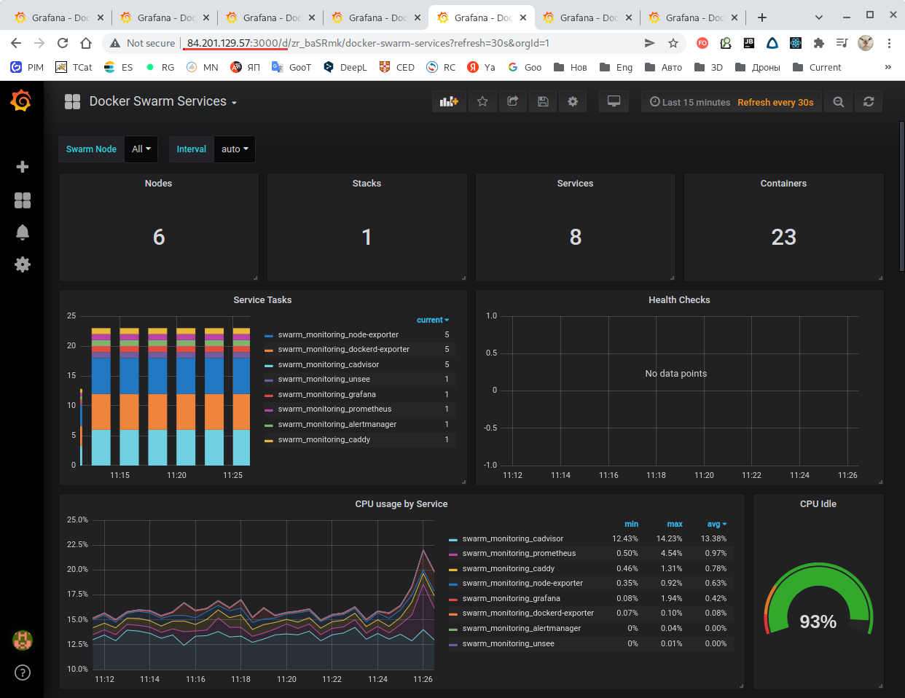

# Домашнее задание к занятию "5.5. Оркестрация кластером Docker контейнеров на примере Docker Swarm"


## Задача 1

Дайте письменные ответы на следующие вопросы:

- В чём отличие режимов работы сервисов в Docker Swarm кластере: replication и global?
- Какой алгоритм выбора лидера используется в Docker Swarm кластере?
- Что такое Overlay Network?

===

Режимы сервисов в Docker Swarm:
- **replicated** - указывается желаемое количество реплик сервиса для кластера и manager-узел старается поддерживать это количество работающих реплик;
- **global** - на всех узлах существет по одной реплике.

===

Для выбора лидера в Docker Swarm используется **Raft Consensus Algorithm** (Алгоритм Распределенного Консенсуса), когда на основе голосования узлов выбирается, какой из них будут исполнять роль лидера. Каждый узел может находиться в одном из трех состояний - Follower (Последователь) , Candidate (Кандидат) или Leader (Лидер). Алгоритм является развитием идей алгоритма Paxos и характеризуется простотой и надёжностью.

Стадия **Leader Election** (Выборы лидера) - узел находится в состоянии Follower (Последователь) и если он не имеет связи со своим лидером, то он сам пытается таковым лидером стать. Узел переходит в состояние Candidate и рассылает другим узлам запрос на голосование за него (сам за себя он уже проголосовал). Все узлы, которые получают такой запрос обязаны проголосовать за этого кандидата и если данный узел-кандидат получает "голоса" большинства узлов в кластере, то он переходит в состояние Leader и все изменения системы теперь будут проходить через него - лидер будет передавать входящие изменения всем своим Follower. 

Стадия **Log Replication** (Репликация протокола) - Лидер получает входящее изменение состояния и передаёт его всем своим последователям. Когда изменение состояния будет подтверждено всеми узлами-последователями, то лидер считает это состояние зафиксированным и оповещает об этом всех своих последователей. С этого момента кластер считается приведенным в состояние **Консенсуса**.

===

**Overlay Network** - это вид сети, созданной "поверх" другой, базовой сети или нескольких базовых сетей. Это достигается либо физическим соединением, либо логическим, когда в базовых сетях существуют соответствующие маршруты. Пакеры оверлейной сети являются дополнительным уровнем над пакетами базовой сети.
В экосистеме Docker оверлейная сеть создаётся специальным драйвером и используется для передачи информации между несколькими демонами Docker, позволяя контейнерам (включая менеджеров инфраструктуры Docker Swarm) безопасно обмениваться информацией друг с другом. Это своего рода внутренний VPN инфраструктуры Docker.

---

## Задача 2

Создать ваш первый Docker Swarm кластер в Яндекс.Облаке

Для получения зачета, вам необходимо предоставить скриншот из терминала (консоли), с выводом команды:
```
docker node ls
```

===

Результат:


===

###TL;DR: Далее следует подробное описание того, как был достигнут результат.

1. Авторизуемся в Yandex.Cloud.
2. Создаём сеть и подсеть, чтобы собрать образ ОС с помощью Packer и запускаем сборку образа.

3. Используем уже существующую инфраструктуру:
````
[root@5f9369012d66 terraform]# yc resource-manager cloud list
+----------------------+-------+----------------------+
|          ID          | NAME  |   ORGANIZATION ID    |
+----------------------+-------+----------------------+
| b1gveipln6minl76p6le | test1 | bpfvd2g3tvqab3h6ud0d |
+----------------------+-------+----------------------+

[root@5f9369012d66 terraform]# yc resource-manager folder list
+----------------------+----------+--------+--------+
|          ID          |   NAME   | LABELS | STATUS |
+----------------------+----------+--------+--------+
| b1g7dvesu6em2goh4b8t | netology |        | ACTIVE |
+----------------------+----------+--------+--------+

[root@e94b7606e5b4 /]# yc compute image list
+----------------------+---------------+--------+----------------------+--------+
|          ID          |     NAME      | FAMILY |     PRODUCT IDS      | STATUS |
+----------------------+---------------+--------+----------------------+--------+
| fd89r1e98nifudrh94qo | centos-7-base | centos | f2eacrudv331nbat9ehb | READY  |
+----------------------+---------------+--------+----------------------+--------+

[root@e94b7606e5b4 /]# yc vpc network list
+----------------------+------+
|          ID          | NAME |
+----------------------+------+
| enpqdc30pbrtgt76csv2 | net  |
+----------------------+------+

[root@e94b7606e5b4 /]# yc vpc subnet list
+----------------------+-------------+----------------------+----------------+---------------+--------------------+
|          ID          |    NAME     |      NETWORK ID      | ROUTE TABLE ID |     ZONE      |       RANGE        |
+----------------------+-------------+----------------------+----------------+---------------+--------------------+
| e9b621schggu7eeaqjrc | my-subnet-a | enpqdc30pbrtgt76csv2 |                | ru-central1-a | [192.168.101.0/24] |
+----------------------+-------------+----------------------+----------------+---------------+--------------------+
````

4. Т.к. мы планируем использовать существующую сеть, то заново создавать её не будем. Для этого удалим из папки `terraform` файл `network.tf`, а в файлах конфигурации узлов `node001...node006.tf` в качестве `subnet_id` укажем идентификатор существующей подсети:
````
network_interface {
    subnet_id  = "e9b621schggu7eeaqjrc"
    ...
}
````

5. Следует уменьшить параметр размера диска, посколько в случае большого количества машин мы упираемся в лимит на размер дискового пространства. Во всех файлах конфигурации узлов `node001...node006.tf` в качестве размера диска следует указать 15Гб:
````
boot_disk {
    initialize_params {
        ...
      size        = "15"
    }
}
````

6. Находясь в папке `terraform` инициализируем и провалидируем конфигурацию Terraform:
````
# terraform init
    ...
Terraform has been successfully initialized!

# terraform validate
Success! The configuration is valid.
````

7. Проверим план создания инфраструктуры:
````
# terraform plan
...
Terraform will perform the following actions:

  # local_file.inventory will be created...
  # null_resource.cluster will be created...
  # null_resource.monitoring will be created...
  # null_resource.sync will be created...
  # null_resource.wait will be created...
  # yandex_compute_instance.node001 will be created...
  # yandex_compute_instance.node002 will be created...
  # yandex_compute_instance.node003 will be created...
  # yandex_compute_instance.node004 will be created...
  # yandex_compute_instance.node005 will be created...
  # yandex_compute_instance.node006 will be created...

Plan: 11 to add, 0 to change, 0 to destroy.

Changes to Outputs:
  + external_ip_address_node001 = (known after apply)
  + external_ip_address_node002 = (known after apply)
  + external_ip_address_node003 = (known after apply)
  + external_ip_address_node004 = (known after apply)
  + external_ip_address_node005 = (known after apply)
  + external_ip_address_node006 = (known after apply)
  + internal_ip_address_node001 = "192.168.101.11"
  + internal_ip_address_node002 = "192.168.101.12"
  + internal_ip_address_node003 = "192.168.101.13"
  + internal_ip_address_node004 = "192.168.101.14"
  + internal_ip_address_node005 = "192.168.101.15"
  + internal_ip_address_node006 = "192.168.101.16"
````
Как следует из плата, Terraform создаст 11 сущностей, в т.ч. 6 виртуальных машин с внешними и внутренними IP-адресами (т.к. будет использоваться существующая сеть, то сеть и подсеть не создаваться не будут и в плане их нет).

8. Применим план:
````
# terraform apply -auto-approve
...
Terraform will perform the following actions:
  # local_file.inventory will be created...
  # null_resource.cluster will be created...
  # null_resource.monitoring will be created...
  # null_resource.sync will be created...
  # null_resource.wait will be created...
  # yandex_compute_instance.node001 will be created...
  # yandex_compute_instance.node002 will be created...
  # yandex_compute_instance.node003 will be created...
  # yandex_compute_instance.node004 will be created...
  # yandex_compute_instance.node005 will be created...
  # yandex_compute_instance.node006 will be created...

Plan: 11 to add, 0 to change, 0 to destroy.
...
Apply complete! Resources: 11 added, 0 changed, 0 destroyed.

Outputs:
external_ip_address_node001 = "84.201.131.43"
external_ip_address_node002 = "84.201.131.102"
external_ip_address_node003 = "84.201.129.240"
external_ip_address_node004 = "84.201.128.150"
external_ip_address_node005 = "84.201.129.57"
external_ip_address_node006 = "84.201.134.201"
internal_ip_address_node001 = "192.168.101.11"
internal_ip_address_node002 = "192.168.101.12"
internal_ip_address_node003 = "192.168.101.13"
internal_ip_address_node004 = "192.168.101.14"
internal_ip_address_node005 = "192.168.101.15"
internal_ip_address_node006 = "192.168.101.16"
````

9. Облачная инфраструктура создана. Залогинимся на узел-лидер и проверим список узлов:


Видим, что `node001` является лидером, а `node002` и `node003` готовы заменить лидера, если он окажется недоступным.

Таким образом кластер Docker Swarm в Yandex Cloud создан.

---

## Задача 3

Создать ваш первый, готовый к боевой эксплуатации кластер мониторинга, состоящий из стека микросервисов.

Для получения зачета, вам необходимо предоставить скриншот из терминала (консоли), с выводом команды:
```
docker service ls
```

===

Кластер мониторинга был создан в процессе выполнения Задачи №2:


Как видим, функционирует система из 8 сервисов под управлением Docker Swarm.

- cAdvisor - 6 реплик (global - мониторинг контейнеров Docker осуществляется на всех узлах);
- Node Exporter - 6 реплик (global мониторинг ОС осуществляетс на всех узлах);
- Prometheus - 1 реплика (replicated);
- Alertmanager - 1 реплика (replicated);
- Grafana - 1 реплика (replicated);
- Caddy - 1 реплика (replicated);

---

При этом кластер состоит из 6 узлов:
````
[root@node001 centos]# docker node ls
ID                            HOSTNAME              STATUS    AVAILABILITY   MANAGER STATUS   ENGINE VERSION
yb0y0shkg333udqk7qix5apln *   node001.netology.yc   Ready     Active         Leader           20.10.12
w59nr114t89ufw0k0fcm3z979     node002.netology.yc   Ready     Active         Reachable        20.10.12
ng4hdmqldw2jwjo824kfxg12z     node003.netology.yc   Ready     Active         Reachable        20.10.12
prjt6ze7am6jf6j4m4zhkvgta     node004.netology.yc   Ready     Active                          20.10.12
r681ku7pt7xuwu6xk38algmrx     node005.netology.yc   Ready     Active                          20.10.12
khc7ykdbmz6y70cs76vloj5xq     node006.netology.yc   Ready     Active                          20.10.12
````


Заметим, что по какому-бы внешнему IP-адресу мы не обратились к сервису, мы в любом случае попадем на сервис Grafana, хотя по факту он находится на одном узле.

````
[root@5f9369012d66 terraform]# yc compute instance list
+----------------------+---------+---------------+---------+----------------+----------------+
|          ID          |  NAME   |    ZONE ID    | STATUS  |  EXTERNAL IP   |  INTERNAL IP   |
+----------------------+---------+---------------+---------+----------------+----------------+
| fhma4s00if82ffdris6d | node002 | ru-central1-a | RUNNING | 84.201.131.102 | 192.168.101.12 |
| fhmfonbtjgg5la40qp3p | node003 | ru-central1-a | RUNNING | 84.201.129.240 | 192.168.101.13 |
| fhmhikn3akupnohb9he7 | node004 | ru-central1-a | RUNNING | 84.201.128.150 | 192.168.101.14 |
| fhmhs4mt911rfda0btdf | node005 | ru-central1-a | RUNNING | 84.201.129.57  | 192.168.101.15 |
| fhmmb55ba28f688v3bg5 | node001 | ru-central1-a | RUNNING | 84.201.131.43  | 192.168.101.11 |
| fhmqk0hmvh25524q0v9j | node006 | ru-central1-a | RUNNING | 84.201.134.201 | 192.168.101.16 |
+----------------------+---------+---------------+---------+----------------+----------------+
````
||||
|:---:|:---:|:---:|
||||
||||

Это происходит за счет того, что между узлами существует overlay-сеть, перенаправляющая запросы к узлу, отвечающему за обработку данного запроса.

Если узел-менеджер выходит из строя, то он заменяется другим лидером. Чтобы продемонстрировать это выключим узел `node001`.

До выключения `node001` набор узлов выглядит следующим образом:
````
[root@node002 centos]# docker node ls
ID                            HOSTNAME              STATUS    AVAILABILITY   MANAGER STATUS   ENGINE VERSION
yb0y0shkg333udqk7qix5apln     node001.netology.yc   Ready     Active         Leader           20.10.12
w59nr114t89ufw0k0fcm3z979 *   node002.netology.yc   Ready     Active         Reachable        20.10.12
ng4hdmqldw2jwjo824kfxg12z     node003.netology.yc   Ready     Active         Reachable        20.10.12
prjt6ze7am6jf6j4m4zhkvgta     node004.netology.yc   Ready     Active                          20.10.12
r681ku7pt7xuwu6xk38algmrx     node005.netology.yc   Ready     Active                          20.10.12
khc7ykdbmz6y70cs76vloj5xq     node006.netology.yc   Ready     Active                          20.10.12
````

После выключения `node001` лидером переизбран `node002`:
````
[root@node002 centos]# docker node ls
ID                            HOSTNAME              STATUS    AVAILABILITY   MANAGER STATUS   ENGINE VERSION
yb0y0shkg333udqk7qix5apln     node001.netology.yc   Unknown   Active         Unreachable      20.10.12
w59nr114t89ufw0k0fcm3z979 *   node002.netology.yc   Ready     Active         Leader           20.10.12
ng4hdmqldw2jwjo824kfxg12z     node003.netology.yc   Ready     Active         Reachable        20.10.12
prjt6ze7am6jf6j4m4zhkvgta     node004.netology.yc   Ready     Active                          20.10.12
r681ku7pt7xuwu6xk38algmrx     node005.netology.yc   Ready     Active                          20.10.12
khc7ykdbmz6y70cs76vloj5xq     node006.netology.yc   Ready     Active                          20.10.12
````

---

## Задача 4 (*)

Выполнить на лидере Docker Swarm кластера команду (указанную ниже) и дать письменное описание её функционала, что она делает и зачем она нужна:
```
# см.документацию: https://docs.docker.com/engine/swarm/swarm_manager_locking/
docker swarm update --autolock=true
```

===

Это команда включения **автоблокировки** узла-менеджера.

Менеджер Docker Swarm организован таким образом, что TLS-ключи шифрования, используемые как для шифровки сообщений, передаваемых между узлами, так и логов, храняться в памяти каждого узла-менеджера. В некоторых случаях это может быть опасным и Docker Swarm предоставляет дополнительную защиту в виде блокировки менеджера, когда доступ к менеджера к кластеру предоставляется только после ручного ввода специального ключа - такоей режим и называется **автоблокировкой**.

Причём, при добавлении нового узла в кластер применять ключ не нужно, потому что этот ключ автоматически передаётся на новые узлы через взаимный TLS.

Включается режим автоблокировки командой `docker swarm init --autolock`:
````
[root@node001 centos]# docker swarm update --autolock=true
Swarm updated.
To unlock a swarm manager after it restarts, run the `docker swarm unlock`
command and provide the following key:

    SWMKEY-1-xjsKqHZq2hpeu1+nEQxxhihmnJuLhbky+W1X1afX2os

Please remember to store this key in a password manager, since without it you
will not be able to restart the manager.
````
**Ключ надлежит сохранить в надёжном месте!**

После перезапуска этого узла лидер будет защищен от компроментации тем, что не сможет получить доступ к управлению кластером. При попытках ввода команд заблокированный кластер выдаёт ошибку `Swarm is encrypted and needs to be unlocked before it can be used`:
````
[root@node001 centos]# systemctl restart docker
[root@node001 centos]# docker service ls
Error response from daemon: Swarm is encrypted and needs to be unlocked before it can be used. Please use "docker swarm unlock" to unlock it.
[root@node001 centos]# docker node ls
Error response from daemon: Swarm is encrypted and needs to be unlocked before it can be used. Please use "docker swarm unlock" to unlock it.
````

Чтобы получить контроль над кластером его придется разблокировать вручную:
````
[root@node001 centos]# docker swarm unlock
Please enter unlock key: {ЗДЕСЬ ВВОДИМ КЛЮЧ}
[root@node001 centos]# docker service ls
ID             NAME                                MODE         REPLICAS   IMAGE                                          PORTS
hjjjgysbfnak   swarm_monitoring_alertmanager       replicated   1/1        stefanprodan/swarmprom-alertmanager:v0.14.0    
zl4ovi4fsd8d   swarm_monitoring_caddy              replicated   1/1        stefanprodan/caddy:latest                      *:3000->3000/tcp, *:9090->9090/tcp, *:9093-9094->9093-9094/tcp
w77byc50vc8r   swarm_monitoring_cadvisor           global       6/6        google/cadvisor:latest                         
1f7h656xlhvw   swarm_monitoring_dockerd-exporter   global       6/6        stefanprodan/caddy:latest                      
62wh2eem7a9c   swarm_monitoring_grafana            replicated   1/1        stefanprodan/swarmprom-grafana:5.3.4           
yydj2latiiev   swarm_monitoring_node-exporter      global       6/6        stefanprodan/swarmprom-node-exporter:v0.16.0   
jbeyfqhgkrbc   swarm_monitoring_prometheus         replicated   1/1        stefanprodan/swarmprom-prometheus:v2.5.0       
obvvv4ginf42   swarm_monitoring_unsee              replicated   1/1        cloudflare/unsee:v0.8.0                        
[root@node001 centos]#
````
Как видим, после разблокировки команды контроля кластера успешно выполняются.

Таким образом работает механизм защиты узла-лидера от компроментации.
