# Домашнее задание к занятию "6.2. SQL"

---

## Задача 1

Используя docker поднимите инстанс PostgreSQL (версию 12) c 2 volume, в который будут складываться данные БД и бэкапы.

Приведите получившуюся команду или docker-compose манифест.

===

**Решение:**

Docker-compose манифест, поднимающий два сервиса - экземпляр PostgreSQL (с пустой БД по имени, задаваемым параметром `${DB_NAME}`) и консоль PGAdmin:

````
version: "3.9"
  
services: 
  data:
    container_name: "pg12"
    image: "postgres:12"
    volumes:
      - ./db_vol:/db_vol
      - ./backup_vol:/backup_vol
    environment:
      - POSTGRES_USER=${DB_USER}
      - POSTGRES_PASSWORD=${DB_PASSWORD}
      - POSTGRES_DB=${DB_NAME}
    ports:
      - "5432:5432"
    networks:
      pg_adm:
        ipv4_address: ${DB_IPV4}
  pgadmin:
    container_name: "pg12_adm"
    image: "dpage/pgadmin4"
    environment:
      - PGADMIN_DEFAULT_EMAIL=${DB_USER_EMAIL}
      - PGADMIN_DEFAULT_PASSWORD=${DB_PASSWORD}
    ports:
      - "8080:8080"
    networks:
      pg_adm:
        ipv4_address:  ${PGADM_IPV4}

networks:
  pg_adm:
    driver: bridge
    ipam:
      config:
        - subnet: ${PGADM_SUBNET}
          gateway: ${PGADM_GATEWAY}
````

---

## Задача 2

В БД из задачи 1: 
- создайте пользователя test-admin-user и БД test_db
- в БД test_db создайте таблицу orders и clients (спeцификация таблиц ниже)
- предоставьте привилегии на все операции пользователю test-admin-user на таблицы БД test_db
- создайте пользователя test-simple-user  
- предоставьте пользователю test-simple-user права на SELECT/INSERT/UPDATE/DELETE данных таблиц БД test_db

Таблица orders:
- id (serial primary key)
- наименование (string)
- цена (integer)

Таблица clients:
- id (serial primary key)
- фамилия (string)
- страна проживания (string, index)
- заказ (foreign key orders)

Приведите:
- итоговый список БД после выполнения пунктов выше,
- описание таблиц (describe)
- SQL-запрос для выдачи списка пользователей с правами над таблицами test_db
- список пользователей с правами над таблицами test_db

===

**Решение:**

Создаём пользователя `test-admin-user` в БД `test_db`:

````
CREATE USER "test-admin-user" WITH ENCRYPTED PASSWORD '123';
````

В БД `test_db` создаём таблицу `orders`:

````
CREATE TABLE orders (
    id serial PRIMARY KEY,
    name text,
    price integer
);
````

и таблицу `clients` с индексом по полю `country`:

````
CREATE TABLE clients (
    id serial PRIMARY KEY,
    surname text,
    country text,
    "order" integer REFERENCES orders(id)
);

CREATE INDEX country ON clients(country);
````

Выдадим пользователю `test-admin-user` все привилегии на все операции cо всеми таблицами БД `test_db`. Для этого предоставляем привелегии на схему, базу данных и все таблицы этой базы данных:

````
GRANT USAGE ON SCHEMA public TO "test-admin-user";
GRANT ALL PRIVILEGES ON ALL TABLES IN SCHEMA public TO "test-admin-user";
GRANT ALL PRIVILEGES ON DATABASE "test-db" TO "test-admin-user";
````

Создаём пользователя `test-simple-user`:

````
CREATE USER "test-simple-user" WITH ENCRYPTED PASSWORD '123';
````

Предоставляем пользователю `test-simple-user` права на `SELECT`/`INSERT`/`UPDATE`/`DELETE` данных таблиц БД `test_db`:

````
GRANT SELECT, INSERT, UPDATE, DELETE ON ALL TABLES IN SCHEMA public TO "test-simple-user";
````

Список всех баз данных:

````
SELECT * FROM pg_catalog.pg_database WHERE datistemplate=false;
````

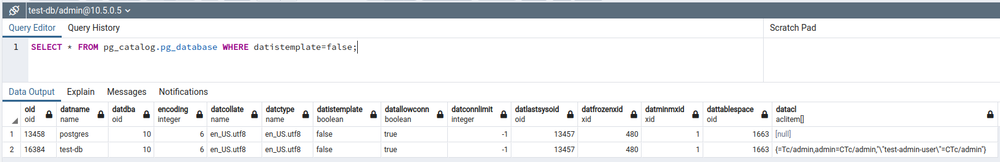

Описание таблиц схемы `public`:

````
SELECT * FROM information_schema.columns WHERE table_schema='public' ORDER BY table_name, ordinal_position;
````

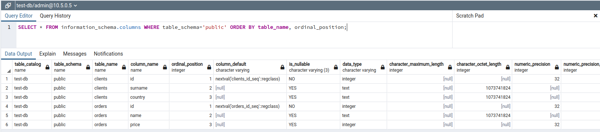

Список пользователей с правами над таблицами test_db может быть получен с помощью запроса:

````
SELECT * FROM pg_catalog.pg_user;
````

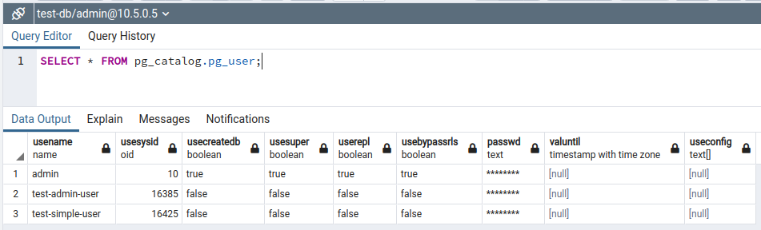

---

## Задача 3

Используя SQL синтаксис - наполните таблицы следующими тестовыми данными:

Таблица orders

|Наименование|цена|
|------------|----|
|Шоколад| 10 |
|Принтер| 3000 |
|Книга| 500 |
|Монитор| 7000|
|Гитара| 4000|

Таблица clients

|ФИО| Страна проживания |
|------------|-------------------|
|Иванов Иван Иванович| USA               |
|Петров Петр Петрович| Canada            |
|Иоганн Себастьян Бах| Japan             |
|Ронни Джеймс Дио| Russia            |
|Ritchie Blackmore| Russia            |

Используя SQL синтаксис:
- вычислите количество записей для каждой таблицы 
- приведите в ответе:
    - запросы 
    - результаты их выполнения.

===

**Решение:**

Вставляем набор данных в таблицу `orders`:

````
INSERT INTO orders(name,price)
VALUES
    ('Шоколад', 10),
    ('Принтер', 3000),
    ('Книга', 500),
    ('Монитор', 7000),
    ('Гитара', 4000);
````

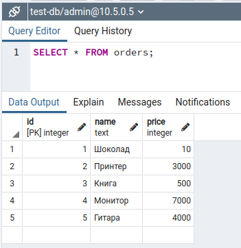

Вставляем набор данных в таблицу `clients`:

````
INSERT INTO clients(surname,country)
VALUES
    ('Иванов Иван Иванович', 'USA'),
    ('Петров Петр Петрович', 'Canada'),
    ('Иоганн Себастьян Бах', 'Japan'),
    ('Ронни Джеймс Дио', 'Russia'),
    ('Ritchie Blackmore', 'Russia');
````

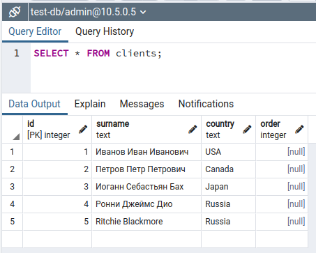

Количество записей в обеих таблицах:

````
SELECT 'Amount of clients' AS "Article", count(*) AS "Items" FROM clients
UNION
SELECT 'Amount of orders', count(*) FROM orders;
````

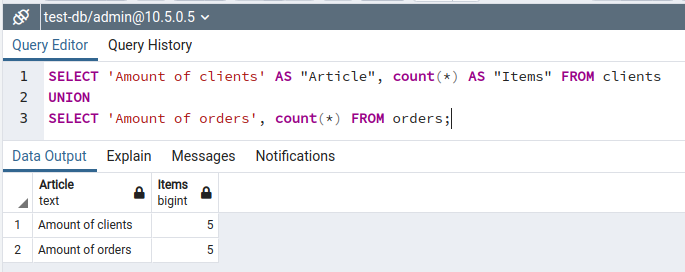

---

## Задача 4

Часть пользователей из таблицы clients решили оформить заказы из таблицы orders.

Используя foreign keys свяжите записи из таблиц, согласно таблице:

|ФИО|Заказ|
|------------|----|
|Иванов Иван Иванович| Книга | 3
|Петров Петр Петрович| Монитор | 4
|Иоганн Себастьян Бах| Гитара | 5

Приведите SQL-запросы для выполнения данных операций.

Приведите SQL-запрос для выдачи всех пользователей, которые совершили заказ, а также вывод данного запроса.
 
Подсказка - используйте директиву `UPDATE`.

===

**Решение:**

````
UPDATE clients
SET "order" = (SELECT id FROM orders WHERE name='Книга')
WHERE surname = 'Иванов Иван Иванович';

UPDATE clients
SET "order" = (SELECT id FROM orders WHERE name='Монитор')
WHERE surname = 'Петров Петр Петрович';

UPDATE clients
SET "order" = (SELECT id FROM orders WHERE name='Гитара')
WHERE surname = 'Иоганн Себастьян Бах';
````

Выводим результат запросом:
````
SELECT surname, orders.name
FROM clients
INNER JOIN orders
ON clients.order=orders.id;
````

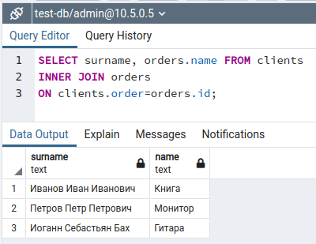


Список пользователей, совершивших заказы:

````
SELECT * FROM clients WHERE "order" IS NOT NULL;
````

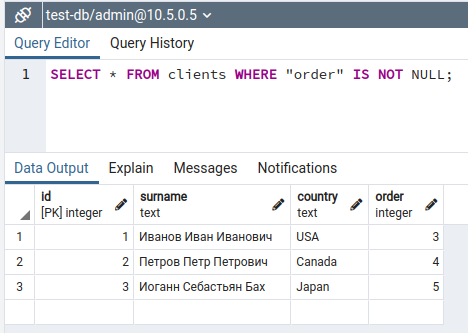

---

## Задача 5

Получите полную информацию по выполнению запроса выдачи всех пользователей из задачи 4 
(используя директиву EXPLAIN).

Приведите получившийся результат и объясните что значат полученные значения.

===

**Решение:**

Проанализируем план выполнения запроса получения пользователей и их заказов:

````
EXPLAIN (VERBOSE) SELECT surname, orders.name
FROM clients
INNER JOIN orders
ON clients.order=orders.id;
````

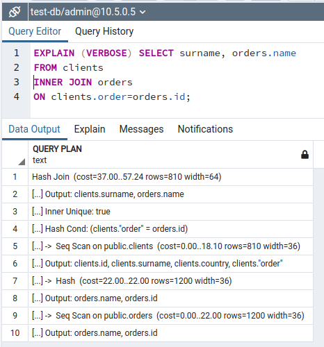

| Действие                                                              | Описание                                                                                                                                             |
|-----------------------------------------------------------------------|------------------------------------------------------------------------------------------------------------------------------------------------------|
| Hash Join  (cost=37.00..57.24 rows=810 width=64)                      | Загрузка строк-кандидатов на выборку с одной стороны соединения в хэш-таблицу для быстрого сопоставления с каждой строкой другой стороны соединения. |
| Output: clients.surname, orders.name                                  | Далее будет производится вывод полей `surname` и `name` таблиц `clients` и `orders` соответственно.                                                  |
| Inner Unique: true                                                    | Будет использоваться тип сопоставления "один-к-одному".                                                                                              |
| Hash Cond: (clients."order" = orders.id)                              | Сопоставление будет проводиться по условию равенства `client.order` и `orders.id`.                                                                   |
| Seq Scan on public.clients  (cost=0.00..18.10 rows=810 width=36)      | Для этого проходим по всей таблице `clients`...                                                                                                      |
| Output: clients.id, clients.surname, clients.country, clients."order" | ...выводя в результат поля таблицы `clients`.                                                                                                        |
| Hash  (cost=22.00..22.00 rows=1200 width=36)                          | Расчитываем хэши для связующего поля `order` таблицы `clients` и сопоставляем его с полем `id` таблицы `orders`...                                   |
| Output: orders.name, orders.id                                        | ...выводя в результат поля `name` и `id` найденных строк таблицы `orders`.                                                                           |
| Seq Scan on public.orders  (cost=0.00..22.00 rows=1200 width=36)      | Проходим по всей таблице `orders`...                                                                                                                 |
| Output: orders.name, orders.id                                        | ...выводя поля `name` и `id` таблицы `orders`.                                                                                                       |


---

## Задача 6

Создайте бэкап БД test_db и поместите его в volume, предназначенный для бэкапов (см. Задачу 1).

Остановите контейнер с PostgreSQL (но не удаляйте volumes).

Поднимите новый пустой контейнер с PostgreSQL.

Восстановите БД test_db в новом контейнере.

Приведите список операций, который вы применяли для бэкапа данных и восстановления. 

===

**Решение:**

Т.к. экземляр PostgreSQL запущен как сервис в контейнере, то создадим резервную копию базы данных `test-db` вызвав команду `pg_dump` через вызов `docker exec`:
````
docker exec -t pg12 pg_dump test-db -c -U admin -f /backup_vol/backup_`date +%d-%m-%Y"_"%H_%M_%S`.sql
````

В результате в директории `backup_vol` будет создан sql-файл `backup_20-02-2022_16_29_43.sql`, содержащий копию содержимого базы данных `test-db`.

Останавливаем контейнер с PostgreSQL и запускаем новый аналогичный контейнер с аналогичной конфигурацией, но другим именем сервиса. Т.о. будет создан новый точно такой же контейнер под имененм `pg12_2` PostgreSQL, но без данных.

Загрузим сохраненные данные в новый контейнер с помощью утилиты `psql`:

````
docker exec -t pg12_2 psql -U admin -d test-db -f /backup_vol/backup_20-02-2022_16_29_43.sql
````

То, что данные восстановлены, можно легко проверить, выведя, например, метаданные и содержимое таблиц:

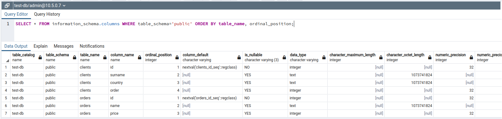

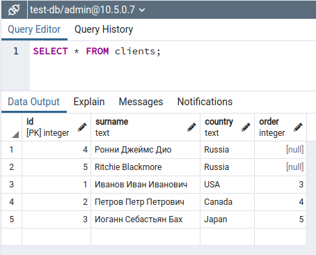

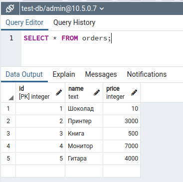

---
