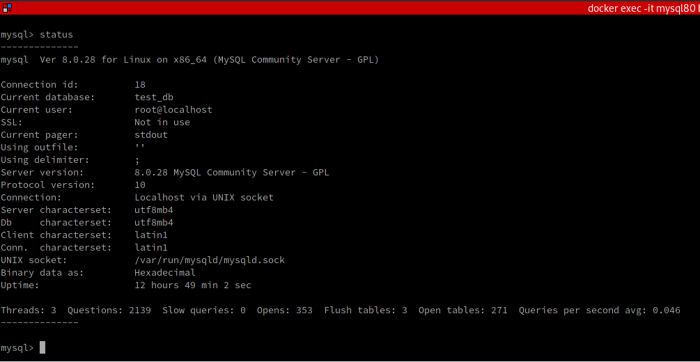
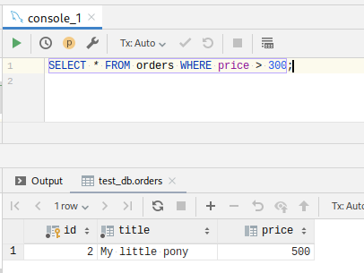
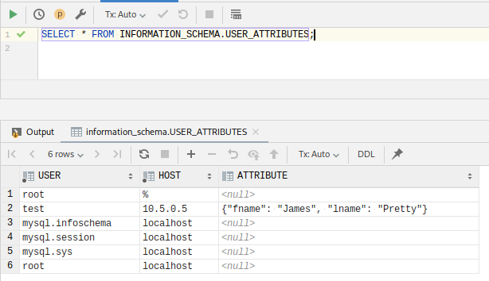
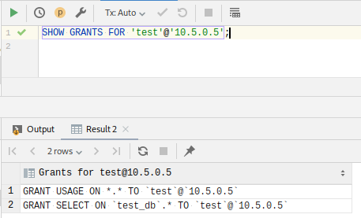
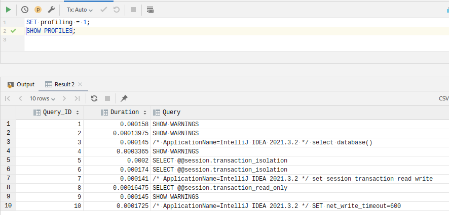
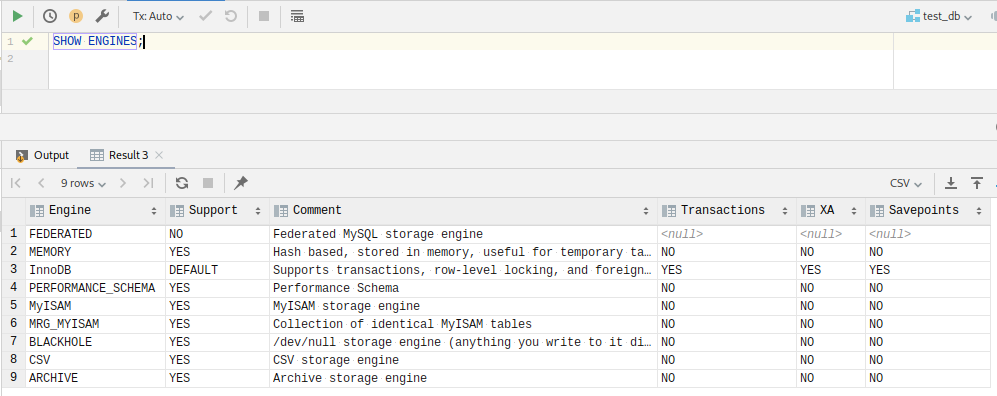
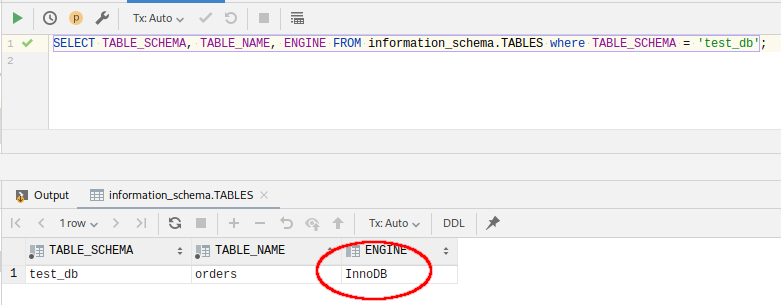
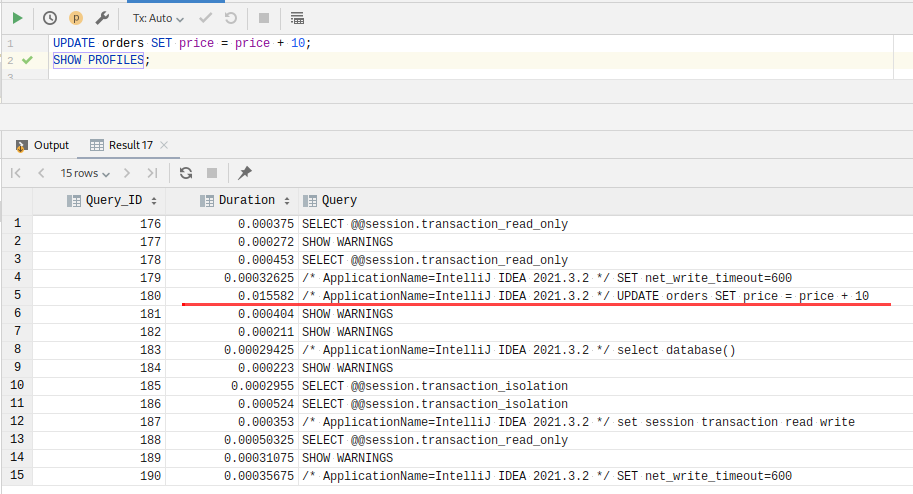
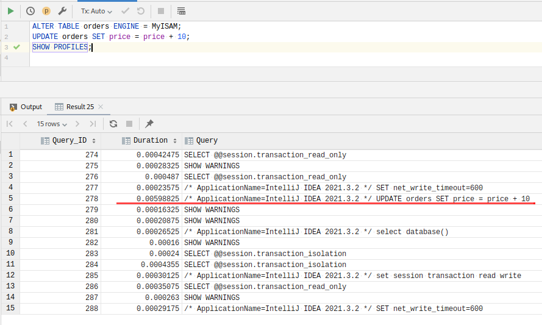

# Домашнее задание к занятию "6.3. MySQL"


## Задача 1

Используя docker поднимите инстанс MySQL (версию 8). Данные БД сохраните в volume.

Изучите [бэкап БД](https://github.com/netology-code/virt-homeworks/tree/master/06-db-03-mysql/test_data) и 
восстановитесь из него.

Перейдите в управляющую консоль `mysql` внутри контейнера.

Используя команду `\h` получите список управляющих команд.

Найдите команду для выдачи статуса БД и **приведите в ответе** из ее вывода версию сервера БД.

Подключитесь к восстановленной БД и получите список таблиц из этой БД.

**Приведите в ответе** количество записей с `price` > 300.

В следующих заданиях мы будем продолжать работу с данным контейнером.

===

**Решение:**

Создаём контейнер MySQL с помощью docker-compose:


````
version: "3.9"

services:
  mysql80:
    container_name: "mysql80"
    image: "mysql:8.0.28-debian"
    command: --default-authentication-plugin=mysql_native_password
    volumes:
      - ./test_data:/test_data
    environment:
      - MYSQL_ROOT_PASSWORD=${DB_PASSWORD}
    ports:
      - "3306:3306"
    networks:
      test_net:
        ipv4_address: ${DB_IPV4}
networks:
  test_net:
    driver: bridge
    ipam:
      config:
        - subnet: ${PGADM_SUBNET}
          gateway: ${PGADM_GATEWAY}
````

Залогинимся в контейнер и запустим утилиту `mysql` под пользователем `root`:

````
# docker exec -it mysql80 bash -p
root@8a6bf1afaf81:/# mysql -u root -p
````

Создаём БД под именем `test_db` и выполняем предоставленный файл `test_dump.sql` для её заполнения:

````
mysql> CREATE DATABASE test_db;
Query OK, 1 row affected (0.01 sec)
mysql> SHOW DATABASES;
+--------------------+
| Database           |
+--------------------+
| information_schema |
| mysql              |
| performance_schema |
| sys                |
| test_db            |
+--------------------+
5 rows in set (0.00 sec)
mysql> USE test_db;
Database changed
mysql> SHOW TABLES;
Empty set (0.00 sec)
mysql> SOURCE /test_data/test_dump.sql
Query OK, 5 rows affected (0.00 sec)
Records: 5  Duplicates: 0  Warnings: 0
mysql> SHOW TABLES;
+-------------------+
| Tables_in_test_db |
+-------------------+
| orders            |
+-------------------+
1 row in set (0.00 sec)
````

Команда `\h` позволяет получить подсказку:

````
mysql> \h

For information about MySQL products and services, visit:
   http://www.mysql.com/
For developer information, including the MySQL Reference Manual, visit:
   http://dev.mysql.com/
To buy MySQL Enterprise support, training, or other products, visit:
   https://shop.mysql.com/

List of all MySQL commands:
Note that all text commands must be first on line and end with ';'
?         (\?) Synonym for `help'.
clear     (\c) Clear the current input statement.
connect   (\r) Reconnect to the server. Optional arguments are db and host.
delimiter (\d) Set statement delimiter.
edit      (\e) Edit command with $EDITOR.
ego       (\G) Send command to mysql server, display result vertically.
exit      (\q) Exit mysql. Same as quit.
go        (\g) Send command to mysql server.
help      (\h) Display this help.
nopager   (\n) Disable pager, print to stdout.
notee     (\t) Don't write into outfile.
pager     (\P) Set PAGER [to_pager]. Print the query results via PAGER.
print     (\p) Print current command.
prompt    (\R) Change your mysql prompt.
quit      (\q) Quit mysql.
rehash    (\#) Rebuild completion hash.
source    (\.) Execute an SQL script file. Takes a file name as an argument.
status    (\s) Get status information from the server.
system    (\!) Execute a system shell command.
tee       (\T) Set outfile [to_outfile]. Append everything into given outfile.
use       (\u) Use another database. Takes database name as argument.
charset   (\C) Switch to another charset. Might be needed for processing binlog with multi-byte charsets.
warnings  (\W) Show warnings after every statement.
nowarning (\w) Don't show warnings after every statement.
resetconnection(\x) Clean session context.
query_attributes Sets string parameters (name1 value1 name2 value2 ...) for the next query to pick up.

For server side help, type 'help contents'
````

Команда `status` предназначена для вывода информации о БД:




Вывести список таблиц БД можно с помощью команды `SHOW TABLES`:

````
mysql> SHOW TABLES;
+-------------------+
| Tables_in_test_db |
+-------------------+
| orders            |
+-------------------+
1 row in set (0.00 sec)
````

Как видим, в БД создана таблица `orders`.

Запросы более удобно исполнять из какой-либо SQL-консоли. Воспользуемся консолью Intellij IDEA для извлечения из таблицы `orders` записей со значением поля `price` более 300:



---

## Задача 2

Создайте пользователя test в БД c паролем test-pass, используя:
- плагин авторизации mysql_native_password
- срок истечения пароля - 180 дней 
- количество попыток авторизации - 3 
- максимальное количество запросов в час - 100
- аттрибуты пользователя:
    - Фамилия "Pretty"
    - Имя "James"

Предоставьте привелегии пользователю `test` на операции SELECT базы `test_db`.
    
Используя таблицу INFORMATION_SCHEMA.USER_ATTRIBUTES получите данные по пользователю `test` и 
**приведите в ответе к задаче**.

===

**Решение:**

Создаём пользователя с именем "Pretty James" используя плагин авторизации `mysql_native_password`, реализующем встроенную аутентификацию, основанную на хэшировании пароля:

````
CREATE USER 'test'@'10.5.0.5' IDENTIFIED WITH mysql_native_password BY 'test'
    REQUIRE NONE WITH MAX_QUERIES_PER_HOUR 100
    PASSWORD EXPIRE INTERVAL 180 DAY
    FAILED_LOGIN_ATTEMPTS 3
    ATTRIBUTE '{"fname":"James","lname":"Pretty"}';
````

Также предоставим пользователю `test` привилегии на операции `SELECT` для всей БД `test_db`:

````
GRANT SELECT ON test_db.* TO 'test'@'10.5.0.5';
````

Получим сведения о пользователе `test`:



Также можно увидеть привилегии пользователя:



---

## Задача 3

Установите профилирование `SET profiling = 1`.
Изучите вывод профилирования команд `SHOW PROFILES;`.

Исследуйте, какой `engine` используется в таблице БД `test_db` и **приведите в ответе**.

Измените `engine` и **приведите время выполнения и запрос на изменения из профайлера в ответе**:
- на `MyISAM`
- на `InnoDB`

===

**Решение:**

Включим профилирование, установив значение переменной `profiling` в **1**, и воспользуемся устаревшей командой `SHOW PROFILES` для просмотра времени, затраченного на исполнение выражений, вызванных в рамках текущей сессии:



Увидеть список "движков" БД и их параметры можно командой `SHOW ENGINES`:



Выяснить, какой "движок" используется базой данных для конкретных таблиц можно запросом к служебной таблице `information_schema.TABLES`:



Как видим, единственная таблица нашей БД использует "движок" **InnoDB**, предоставляющий функциональность стандартных ACID-совместимых транзакций и поддержку внешних ключей.

Выполним запрос на обновление столбца `price` таблицы `orders` и выведем профилирующую информацию (текущий движок для этой таблицы - `InnoDB`):



Как видим, на исполнение `UPDATE`-запроса было потрачено 0.015582 секунды.

Проверим теперь работу другого движка - **MyISAM** - не являющегося ACID-совместимым, но имеющего возможности по сжатию данных и созданию полнотекстовых индексов.
Изменим "движок" для таблицы `orders` с `InnoDB` на `MyISAM` и выполним такой же запрос снова:



Теперь на исполнение такого же `UPDATE`-запроса было потрачено 0.00598825 секунды. Похоже, что за счет игнорирования требований ACID запросы на движке `MyISAM` выполняются почти в три раза быстрее.

---

## Задача 4 

Изучите файл `my.cnf` в директории /etc/mysql.

Измените его согласно ТЗ (движок InnoDB):
- Скорость IO важнее сохранности данных
- Нужна компрессия таблиц для экономии места на диске
- Размер буффера с незакомиченными транзакциями 1 Мб
- Буффер кеширования 30% от ОЗУ
- Размер файла логов операций 100 Мб

Приведите в ответе измененный файл `my.cnf`.

===

**Решение:**

Файл `/etc/mysql/my.cnf` содержит конфигурацию сервера, применяемую при запуске: 

````
root@2f5355c0a2ba:/etc/mysql# cat my.cnf
# The MySQL  Server configuration file.
[mysqld]
pid-file        = /var/run/mysqld/mysqld.pid
socket          = /var/run/mysqld/mysqld.sock
datadir         = /var/lib/mysql
secure-file-priv= NULL

# Custom config should go here
!includedir /etc/mysql/conf.d/
root@2f5355c0a2ba:/etc/mysql# 
````

Изменим его в соответствии с приведенным ТЗ:

При сбросе данных на диск скорость важнее сохранности:
innodb_flush_log_at_trx_commit = 2

Параметры для включения компрессии таблиц:

````
innodb_file_per_table = 1
innodb_file_format = Barracuda
````

Размер буфера незавершенных транзакций:

````
innodb_log_buffer_size = 1M
````

Размер буфера кэширования (рекомендуется 70-80% от размера ОЗУ):

````
innodb_buffer_pool_size = 25Gb
````

Размер файла логов операций:

````
innodb_log_file_size = 100M
````

Соответственно, файл `/etc/mysql/my.cnf` выглядит следующим образом:

````
# The MySQL  Server configuration file.
[mysqld]
pid-file        = /var/run/mysqld/mysqld.pid
socket          = /var/run/mysqld/mysqld.sock
datadir         = /var/lib/mysql
secure-file-priv= NULL

# Custom config should go here
innodb_flush_log_at_trx_commit = 2
innodb_file_per_table = 1
innodb_file_format = Barracuda
innodb_log_buffer_size = 1M
innodb_buffer_pool_size = 25Gb
innodb_log_file_size = 100M 
````

---
