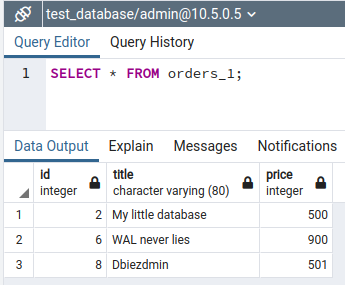

# Домашнее задание к занятию "6.4. PostgreSQL"

## Задача 1

Используя docker поднимите инстанс PostgreSQL (версию 13). Данные БД сохраните в volume.

Подключитесь к БД PostgreSQL используя `psql`.

Воспользуйтесь командой `\?` для вывода подсказки по имеющимся в `psql` управляющим командам.

**Найдите и приведите** управляющие команды для:
- вывода списка БД
- подключения к БД
- вывода списка таблиц
- вывода описания содержимого таблиц
- выхода из psql

===

**Решение:**

Создаём контейнер MySQL с помощью docker-compose:
````
version: "3.9"

services:
  data:
    container_name: "pg13"
    image: "postgres:13"
    volumes:
      - ./test_data:/test_data
    environment:
      - POSTGRES_USER=${DB_USER}
      - POSTGRES_PASSWORD=${DB_PASSWORD}
    ports:
      - "5432:5432"
    networks:
      pg_adm:
        ipv4_address: ${DB_IPV4}

networks:
  pg_adm:
    driver: bridge
    ipam:
      config:
        - subnet: ${PGADM_SUBNET}
          gateway: ${PGADM_GATEWAY}
````

Залогинимся в контейнер и запустим утилиту `psql` под пользователем `admin` (был задан при инициализации контейнера PostgreSQL в параметре `POSTGRES_USER`):

````
# docker exec -it pg13 bash -p
root@ea83ba28ee99:/# psql postgres -U admin
````
Команда `\?` позволяет получить подсказку:

````
postgres=# \?
General
  \q                     выход из psql

...

Informational
  (options: S = show system objects, + = additional detail)
  \d[S+]                 список таблиц, представлений и последовательностей
  \d[S+]  NAME           описание таблицы, представления, последовательности или индекса
  \dg[S+] [PATTERN]      список ролей
  \dt[S+] [PATTERN]      список таблиц
  \l[+]   [PATTERN]      список баз данных

...

Connection
  \c[onnect] {[DBNAME|- USER|- HOST|- PORT|-] | conninfo}
                         подключение к новой базе данных (изначально - "postgres")
  \conninfo              вывод информации о текущем соединении

...
````

---

## Задача 2

Используя `psql` создайте БД `test_database`.

Изучите [бэкап БД](https://github.com/netology-code/virt-homeworks/tree/master/06-db-04-postgresql/test_data).

Восстановите бэкап БД в `test_database`.

Перейдите в управляющую консоль `psql` внутри контейнера.

Подключитесь к восстановленной БД и проведите операцию ANALYZE для сбора статистики по таблице.

Используя таблицу [pg_stats](https://postgrespro.ru/docs/postgresql/12/view-pg-stats), найдите столбец таблицы `orders` 
с наибольшим средним значением размера элементов в байтах.

**Приведите в ответе** команду, которую вы использовали для вычисления и полученный результат.

===

**Решение:**

Создадим базу данных под именем `test_database`:
````
postgres=# CREATE DATABASE test_database;
CREATE DATABASE
postgres=# \l
                               List of databases
     Name      | Owner | Encoding |  Collate   |   Ctype    | Access privileges 
---------------+-------+----------+------------+------------+-------------------
 postgres      | admin | UTF8     | en_US.utf8 | en_US.utf8 | 
 template0     | admin | UTF8     | en_US.utf8 | en_US.utf8 | =c/admin         +
               |       |          |            |            | admin=CTc/admin
 template1     | admin | UTF8     | en_US.utf8 | en_US.utf8 | =c/admin         +
               |       |          |            |            | admin=CTc/admin
 test_database | admin | UTF8     | en_US.utf8 | en_US.utf8 | 
(4 rows)
````

Изучим предоставленный файл `test_dump.sql` и обнаружим, что в нём упоминается владелец `postgres`. Проверим наличие такой роли:
````
test_database-# \dg
                                   List of roles
 Role name |                         Attributes                         | Member of 
-----------+------------------------------------------------------------+-----------
 admin     | Superuser, Create role, Create DB, Replication, Bypass RLS |
````

Как видим, роли `postgres` у нас нет. Создадим её:
````
test_database=# CREATE ROLE postgres WITH Superuser CreateDB CreateRole Login;
CREATE ROLE
test_database=# \dg
                                   List of roles
 Role name |                         Attributes                         | Member of 
-----------+------------------------------------------------------------+-----------
 admin     | Superuser, Create role, Create DB, Replication, Bypass RLS | {}
 postgres  | Superuser, Create role, Create DB                          | {}
````

Заполним базу данных содержимым из предоставленного файла `test_dump.sql`. Для этого выйдем из консоли утилиты `psql` и выполним команду `psql`:
````
root@f8148c181f02:/test_data# psql -U admin test_database < /test_data/test_dump.sql
SET
SET
SET
SET
SET
 set_config 
------------
 
(1 row)

SET
SET
SET
SET
SET
SET
CREATE TABLE
ALTER TABLE
CREATE SEQUENCE
ALTER TABLE
ALTER SEQUENCE
ALTER TABLE
COPY 8
 setval 
--------
      8
(1 row)

ALTER TABLE
````
У нас появилась таблица `orders`:


Соберём статистику по таблице `orders`. Для этого снова залогинимся в консоль `psql` и выполним команду `ANALYZE`:

````
root@f8148c181f02:/test_data# psql postgres -U admin
psql (13.6 (Debian 13.6-1.pgdg110+1))
Type "help" for help.

test_database=# ANALYZE 
````

Команда `ANALYZE` инициирует заполнение служебного каталога `pg_statistics`, содержимое которого можно просмотреть через представление `pg_stats`:


Статистическими являются столбцы:

`null_frac` - Доля записей, в которых этот столбец содержит NULL. Здесь таких строк нет;

`avg_width` - Средний размер элементов в столбце, в байтах. Здесь столбец `title` обладает наибольшим размером;

`n_distinct` - Оценка значений в столбце:
  - **-1**: столбец с уникальным содержимым (количество значений совпадает с количеством строк);
  - **меньше 0**: отношение количества значений к количеству строк (по мере увеличения количества строк предполагается увеличение разнообразия значений);
  - **больше 0**: отношение количества значений к количеству строк (по мере увеличения количества строк предполагается увеличение однородности значений);

`most_common_vals` - Список самых частых значений (NULL, если таковых нет). Здесь в столбце price значение `300` встречается два раза, а все остальные значения появляются только по одному разу, поэтому в данном столбце статистики мы видим `{300}`.

---

## Задача 3

Архитектор и администратор БД выяснили, что ваша таблица orders разрослась до невиданных размеров и
поиск по ней занимает долгое время. Вам, как успешному выпускнику курсов DevOps в нетологии предложили
провести разбиение таблицы на 2 (шардировать на orders_1 - price>499 и orders_2 - price<=499).

Предложите SQL-транзакцию для проведения данной операции.

Можно ли было изначально исключить "ручное" разбиение при проектировании таблицы orders?

===

**Решение:**

Так как таблица `orders` имеет относительно простую структуру, то применим вертикальное шардирование. Кроме того, мы не хотим менять существующий код приложения, использующего данную таблицу.

Для этого сначала создадим набор таблиц с шардированием (разбиением строк) по значению `price`:

````
CREATE TABLE public.orders_master (
    id integer NOT NULL,
    title character varying(80) NOT NULL,
    price integer DEFAULT 0
)
PARTITION BY RANGE (price);

CREATE TABLE orders_1
    PARTITION OF orders_master
    FOR VALUES FROM (500) TO (MAXVALUE);

CREATE TABLE orders_2
    PARTITION OF orders_master
    FOR VALUES FROM (MINVALUE) TO (500);
````

Теперь все данные, отправляемые в таблицу orders_master будут автоматически распределяться на основе значения в колонке `price`.
Перенесем существующие данные в созданную структуру таблиц:

````
INSERT INTO orders_master SELECT * FROM orders;
````

Убедимся, что данные корректно распределились:



Как видим, в таблице `orders_1` оказались строки со значением больше или равно 500. 


В таблице `orders_2`, соответственно, оказались строки со значением меньше 500.

Тем не менее, можно получить все записи, обратившись к таблице `orders_master`:


Иначе говоря, теперь все CRUD-операции, применяемые к мастер-таблице будут распространяться на дочерние таблицы.
Чтобы сохранить работоспособность приложения, старую таблицу `orders` удалим, а созданную таблицу `orders_master` переименуем в `orders`.

````
DROP TABLE orders;
ALTER TABLE orders_master RENAME TO orders;
````

Проверим работоспособность, добавив новые строки в таблицу `orders`:

````
INSERT INTO orders(id, title, price) VALUES (9, 'test1', 200);
INSERT INTO orders(id, title, price) VALUES (10, 'test2', 2000);
````

Проверим результат:


Как видим, как и предполагалось, значение с `price=2000` добавилось в первую таблицу, а `price=200` - во вторую. 

Чтобы не заниматься ручным распределением данных, можно было изначально объявить таблицу вместо:

````
CREATE TABLE public.orders (
    id integer NOT NULL,
    title character varying(80) NOT NULL,
    price integer DEFAULT 0
);
````

как вышеописанную структуру таблиц. 

---

## Задача 4

Используя утилиту `pg_dump` создайте бекап БД `test_database`.

Как бы вы доработали бэкап-файл, чтобы добавить уникальность значения столбца `title` для таблиц `test_database`?

===

**Решение:**

Подключимся к Docker-контейнеру c PostgreSQL и создадим файл дампа `test_dump_new.sql` с помощью утилиты `pg_dump`:

````
$ docker exec -it pg13 bash -p
root@f8148c181f02:/# pg_dump -U admin test_database > /test_data/test_dump_new.sql
````

Чтобы сделать столбец `title` уникальным, достаточно объявить его в дополнительной конструкци `UNIQUE`:

````
CREATE TABLE public.orders (
    id integer NOT NULL,
    title character varying(80) NOT NULL,
    price integer DEFAULT 0,
    UNIQUE(title)
)
````

В такой таблице при попытке вставить в поле `title` неуникальное значение будет выдана ошибка вида:

````
ERROR:  duplicate key value violates unique constraint "orders_title_key"
DETAIL:  Key (title)=(War and peace) already exists.
SQL state: 23505
````

---
