# Домашнее задание к занятию "6.5. Elasticsearch"

## Задача 1

В этом задании вы потренируетесь в:
- установке elasticsearch
- первоначальном конфигурировании elastcisearch
- запуске elasticsearch в docker

Используя докер образ [centos:7](https://hub.docker.com/_/centos) как базовый и 
[документацию по установке и запуску Elastcisearch](https://www.elastic.co/guide/en/elasticsearch/reference/current/targz.html):

- составьте Dockerfile-манифест для elasticsearch
- соберите docker-образ и сделайте `push` в ваш docker.io репозиторий
- запустите контейнер из получившегося образа и выполните запрос пути `/` c хост-машины

Требования к `elasticsearch.yml`:
- данные `path` должны сохраняться в `/var/lib`
- имя ноды должно быть `netology_test`

В ответе приведите:
- текст Dockerfile манифеста
- ссылку на образ в репозитории dockerhub
- ответ `elasticsearch` на запрос пути `/` в json виде

Подсказки:
- возможно вам понадобится установка пакета perl-Digest-SHA для корректной работы пакета shasum
- при сетевых проблемах внимательно изучите кластерные и сетевые настройки в elasticsearch.yml
- при некоторых проблемах вам поможет docker директива ulimit
- elasticsearch в логах обычно описывает проблему и пути ее решения

Далее мы будем работать с данным экземпляром elasticsearch.

===

**Решение:**

Создадим `Dockerfile`, для сборки контейнера:
````
FROM centos:7
RUN yum -y update && \
    yum -y install wget && \
    yum -y install perl-Digest-SHA &&  \
    yum -y install less && \
    yum -y install vim-enhanced && \
    yum -y clean all && \
    rm -rf /var/cache &&  \
    wget https://download.java.net/java/GA/jdk17/0d483333a00540d886896bac774ff48b/35/GPL/openjdk-17_linux-x64_bin.tar.gz && \
    tar xvf openjdk-17_linux-x64_bin.tar.gz && \
    rm -f openjdk-17_linux-x64_bin.tar.gz && \
    wget https://artifacts.elastic.co/downloads/elasticsearch/elasticsearch-8.0.1-darwin-x86_64.tar.gz && \
    wget https://artifacts.elastic.co/downloads/elasticsearch/elasticsearch-8.0.1-darwin-x86_64.tar.gz.sha512 && \
    shasum -a 512 -c elasticsearch-8.0.1-darwin-x86_64.tar.gz.sha512 && \
    tar -xzf elasticsearch-8.0.1-darwin-x86_64.tar.gz && \
    rm -f elasticsearch-8.0.1-darwin-x86_64.tar.gz && \
    rm -f elasticsearch-8.0.1-darwin-x86_64.tar.gz.sha512 && \
    groupadd elasticsearch && \
    useradd elasticsearch -g elasticsearch -p elasticsearch && \
    mkdir /var/lib/elasticsearch && \
    chown elasticsearch:elasticsearch -R elasticsearch-8.0.1 && \
    chown elasticsearch:elasticsearch -R /var/lib/elasticsearch && \
    echo 'cluster.name: netology_claster' >> /elasticsearch-8.0.1/config/elasticsearch.yml && \
    echo 'node.name: netology_test' >> /elasticsearch-8.0.1/config/elasticsearch.yml && \
    echo 'path.data: /var/lib/elasticsearch' >> /elasticsearch-8.0.1/config/elasticsearch.yml && \
    echo 'xpack.ml.enabled: false' >> /elasticsearch-8.0.1/config/elasticsearch.yml;
ENV JAVA_HOME /jdk-17
ENV ES_JAVA_HOME /jdk-17
VOLUME [ "./test_data" ]
ENTRYPOINT runuser -u elasticsearch -- /elasticsearch-8.0.1/bin/elasticsearch
````

Здесь мы декларируем установку необходимых приложений, в частности:

- `wget` и `perl-Digest-SHA` для скачивания архивов;
- `less` и `vim-enhanced` для удобства дальнейшей настройки Elastic Search;
- `JDK` версии 17, требуемой для работы Elastic Search.

Кроме того, т.к. Elastic Search не м.б. запущен под root пользователем (ограничение безопасности самого ES),
то следует создать группу elasticsearch и пользователя elasticsearch:

````
$ groupadd elasticsearch
$ useradd elasticsearch -g elasticsearch -p elasticsearch
````

Наличие пользователя в группе можно проверить командами:

````
$ less /etc/passwd | grep "elasticsearch"
$ less /etc/group | grep "elasticsearch"
````

Также создадим директорию для `path` и предоставим на неё права пользователю `elasticsearch`.
Также пользователь `elasticsearch` должен иметь права на сам каталог установки `elasticsearch`:

````
$ mkdir /var/lib/elasticsearch
$ chown elasticsearch:elasticsearch -R elasticsearch-8.0.1 && \
$ chown elasticsearch:elasticsearch -R /var/lib/elasticsearch && \
````

Кроме того, настроим конфигурационный файл `elasticsearch.yml`:
````
cluster.name: netology_claster
node.name: netology_test
path.data: /var/lib/elasticsearch
xpack.ml.enabled: false
````

И, в завершение, сделаем наш контейнер самозапускемым, чтобы при старте контейнера Elastic Search автоматически запускался от имени пользователя `elasticsearch`:

````
ENTRYPOINT runuser -u elasticsearch -- /elasticsearch-8.0.1/bin/elasticsearch
````

Соберем образ контейнера с помощью команды `docker build -t olezhuravlev/centes` и сохраним его в репозитории:

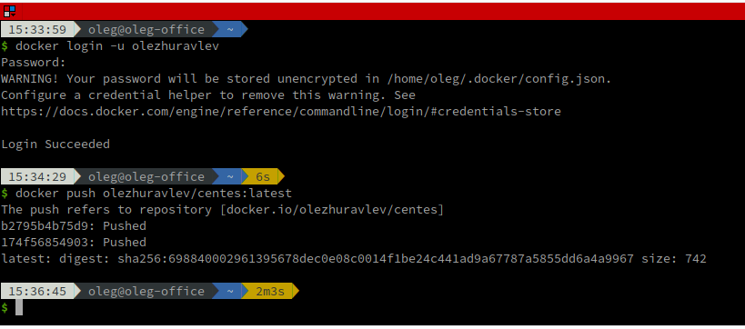

После размещения в репозитории образ можно наблюдать через веб-интерфейс по адресу
https://hub.docker.com/repository/docker/olezhuravlev/centes:

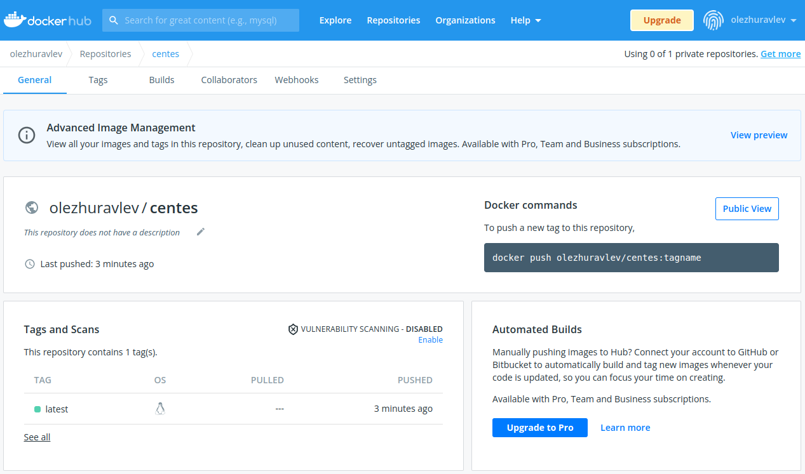

Для чистоты эксперимента удалим локальный экземпляр образа:

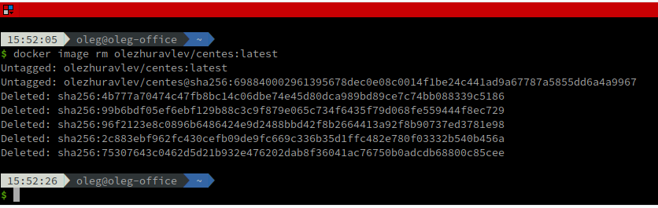

При запуске контейнера он сначала будет скачан из репозитория (команду на исполнение указывать не нужно, потому что наш контейнер запустится автоматически):
````
$ docker run -it --name centes -p 9200:9200 olezhuravlev/centes:latest
````

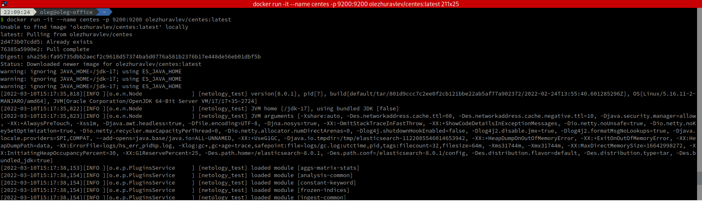

Контейнер запустился и начал выводить свой лог в `STDOUT`. Здесь следует обратить внимание, что при первом запуске в лог будет выведен сгенерированный пароль для пользователя `elastic`:

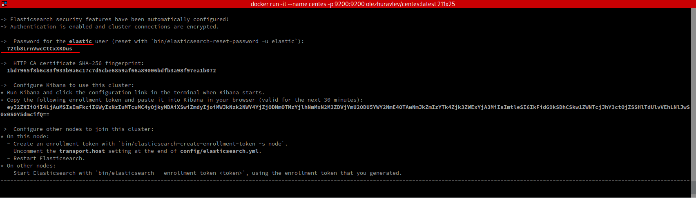

Так, например, здесь для пользователя `elastic` был сгенерирован пароль `72tb8LrnVwcCtCxXKDus`.

Если контейнер нужно перезапустить, то пароль можно выяснить командой `docker logs <ИмяКонтейнера>`.

После запуска и авторизации можно просмотреть данные о ноде, обратившись по адресу `https://<IP-Адрес-Контейнера>:9200/`:

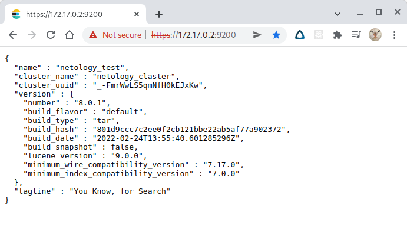

Аналогичным образом, данные можно получить с помощью утилиты `curl`:

````
curl -u elastic:72tb8LrnVwcCtCxXKDus -k https://172.17.0.2:9200
````

где `-k` - это флаг, отключающий верификацию сертификата безопасности.

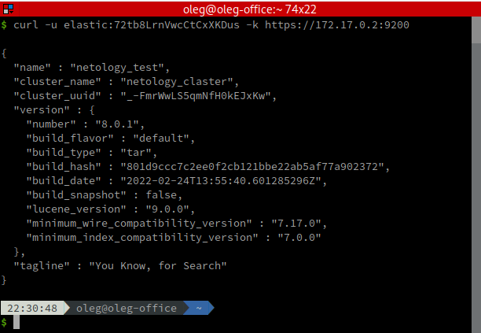

---

## Задача 2

В этом задании вы научитесь:
- создавать и удалять индексы
- изучать состояние кластера
- обосновывать причину деградации доступности данных

Ознакомтесь с [документацией](https://www.elastic.co/guide/en/elasticsearch/reference/current/indices-create-index.html) 
и добавьте в `elasticsearch` 3 индекса, в соответствии со таблицей:

| Имя | Количество реплик | Количество шард |
|-----|-------------------|-----------------|
| ind-1| 0 | 1 |
| ind-2 | 1 | 2 |
| ind-3 | 2 | 4 |

Получите список индексов и их статусов, используя API и **приведите в ответе** на задание.

Получите состояние кластера `elasticsearch`, используя API.

Как вы думаете, почему часть индексов и кластер находится в состоянии yellow?

Удалите все индексы.

**Важно**

При проектировании кластера elasticsearch нужно корректно рассчитывать количество реплик и шард,
иначе возможна потеря данных индексов, вплоть до полной, при деградации системы.

===

**Решение:**

Создадим требуемые индексы, используя утилиту `curl`:
````
$ curl -X PUT -u elastic:72tb8LrnVwcCtCxXKDus -k https://172.17.0.2:9200/ind-1
{'settings': {'index': {'number_of_replicas': 0,'number_of_shards': 1}}}
{"acknowledged":true,"shards_acknowledged":true,"index":"ind-1"}

$ curl -X PUT -u elastic:72tb8LrnVwcCtCxXKDus -k https://172.17.0.2:9200/ind-2
{'settings': {'index': {'number_of_replicas': 1'number_of_shards': 2}}
{"acknowledged":true,"shards_acknowledged":true,"index":"ind-2"}

$ curl -X PUT -u elastic:72tb8LrnVwcCtCxXKDus -k https://172.17.0.2:9200/ind-3
{'settings': {'index': {'number_of_replicas': 2'number_of_shards': 4}
{"acknowledged":true,"shards_acknowledged":true,"index":"ind-3"}

````

Получим список индексов и их статусы с помощью утилиты `curl`:

````
$ curl -X GET -u elastic:72tb8LrnVwcCtCxXKDus -k https://172.17.0.2:9200/_cat/indices
````

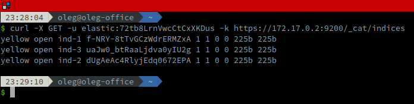

Как видим, индексы находятся в состоянии `yellow`.

Получим статус кластера:

````
$ curl -X GET -u elastic:72tb8LrnVwcCtCxXKDus -k https://172.17.0.2:9200/_cluster/health\?pretty\=true
````

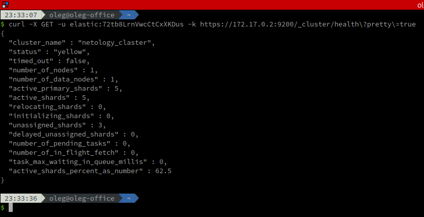

Помимо утилиты `curl`, существует более наглядный способ увидеть состояние кластера и индексов - браузерным плагином **Elasticsearch**:

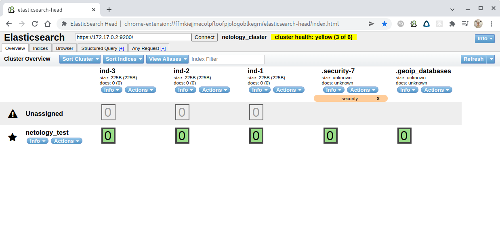

Индексы и кластер находятся в состоянии **yellow** по причине того, что индексы не привязаны к нодам. Это можно увидеть командой:

````
$ curl -X GET -u elastic:72tb8LrnVwcCtCxXKDus -k https://172.17.0.2:9200/_cat/shards\?pretty\=true
````

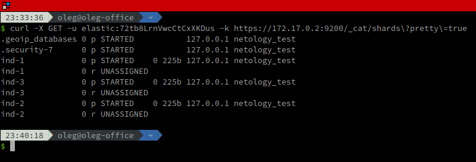

Как видим, индексы `ind-1`, `ind-2` и `ind-3` хотя и запущены, но имеют статус `UNASSIGNED`. 

Удаляем все индексы командами:

````
$ curl -X DELETE -u elastic:72tb8LrnVwcCtCxXKDus -k https://172.17.0.2:9200/ind-1           
$ curl -X DELETE -u elastic:72tb8LrnVwcCtCxXKDus -k https://172.17.0.2:9200/ind-2
$ curl -X DELETE -u elastic:72tb8LrnVwcCtCxXKDus -k https://172.17.0.2:9200/ind-3
````

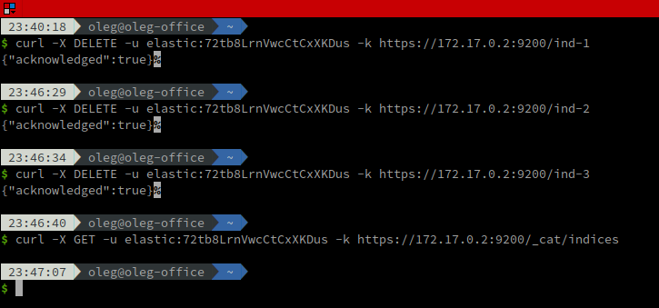

Как видим, индексов больше нет.

---

## Задача 3

В данном задании вы научитесь:
- создавать бэкапы данных
- восстанавливать индексы из бэкапов

Создайте директорию `{путь до корневой директории с elasticsearch в образе}/snapshots`.

Используя API [зарегистрируйте](https://www.elastic.co/guide/en/elasticsearch/reference/current/snapshots-register-repository.html#snapshots-register-repository) 
данную директорию как `snapshot repository` c именем `netology_backup`.

**Приведите в ответе** запрос API и результат вызова API для создания репозитория.

Создайте индекс `test` с 0 реплик и 1 шардом и **приведите в ответе** список индексов.

[Создайте `snapshot`](https://www.elastic.co/guide/en/elasticsearch/reference/current/snapshots-take-snapshot.html) 
состояния кластера `elasticsearch`.

**Приведите в ответе** список файлов в директории со `snapshot`ами.

Удалите индекс `test` и создайте индекс `test-2`. **Приведите в ответе** список индексов.

[Восстановите](https://www.elastic.co/guide/en/elasticsearch/reference/current/snapshots-restore-snapshot.html) состояние
кластера `elasticsearch` из `snapshot`, созданного ранее. 

**Приведите в ответе** запрос к API восстановления и итоговый список индексов.

Подсказки:
- возможно вам понадобится доработать `elasticsearch.yml` в части директивы `path.repo` и перезапустить `elasticsearch`

===

**Решение:**

Подключившись к контейнеру, создадим директорию `snapshots` и дадим на нее права пользователю `elasticsearch`:

````
$ mkdir /snapshots
$ chown elasticsearch:elasticsearch snapshots
````

Теперь необходимо указать параметр path.repo в конфигурационном файле `config/elasticsearch.yml`:

````
path.repo: ["/snapshots"]
````

После внесения изменений в конфигурационный файл экземпляр Elasticsearch необходимо перезапустить,
чтобы изменения вступили в силу:

````
$ docker restart centes
````

Теперь, используя `PUT`-запрос, можно зарегистрировать созданную директорию в качестве директории снимков базы данных:

````
$ curl -X PUT -u elastic:72tb8LrnVwcCtCxXKDus -k "https://172.17.0.2:9200/_snapshot/netology_backup?pretty" -H 'Content-Type: application/json' -d'
{
  "type": "fs",
  "settings": {
    "location": "/snapshots" 
  }
}
'
````

Ответом на вызов будет `"acknowledged": true`, что говорит о том, что директория снимков была успешно зарегистрирована:

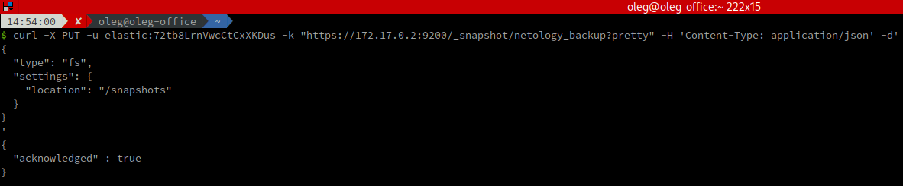

Проверить это можно вызвав:

````
$ curl -X GET -u elastic:72tb8LrnVwcCtCxXKDus -k "https://172.17.0.2:9200/_cat/repositories"            
netology_backup fs
````

или:

````
$ curl -X GET -u elastic:72tb8LrnVwcCtCxXKDus -k "https://172.17.0.2:9200/_snapshot/netology_backup" 
{"netology_backup":{"type":"fs","settings":{"location":"/snapshots"}}}     
````

Как видим, присутствует репозиторий типа `fs` (**Shared File System**) с именем `netology_backup` и расположением в папке `"snapshots"` корневой директории.

Создадим индекс с именем `test`, без реплик и с одним шардом:

````
$ curl -X PUT -u elastic:72tb8LrnVwcCtCxXKDus -k https://172.17.0.2:9200/test -H 'Content-Type: application/json' -d'
{
  "settings": {
    "index": {
      "number_of_replicas": 0, 
      "number_of_shards": 1  
    }
  }
}
'
````

Индекс создан и можно получить список индексов и их статусы с помощью утилиты `curl`:

````
$ curl -X GET -u elastic:72tb8LrnVwcCtCxXKDus -k https://172.17.0.2:9200/_cat/indices
````

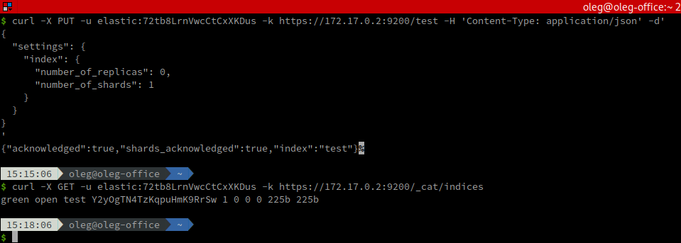

Как видим, созданный индекс `test` присутствует в списке и находится в состоянии `green`.

Теперь создадим снимок состояния кластера `netology_claster` с сохранением его в репозиторий `netology_backup`.
Снимку присвоим имя `snapshot_1`:

````
$ curl -X PUT -u elastic:72tb8LrnVwcCtCxXKDus -k "https://172.17.0.2:9200/_snapshot/netology_backup/snapshot_1?wait_for_completion=true&pretty"
````

Список имеющихся снимков можно просмотреть командой:

````
$ curl -X GET -u elastic:72tb8LrnVwcCtCxXKDus -k "https://172.17.0.2:9200/_snapshot"
````

или:

````
$ curl -X GET -u elastic:72tb8LrnVwcCtCxXKDus -k "https://172.17.0.2:9200/_cat/snapshots"
````

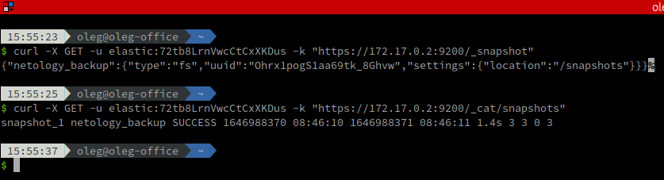

В директории `snapshots` оказалась создана некоторая структура файлов, содержащая содержимое снимка:

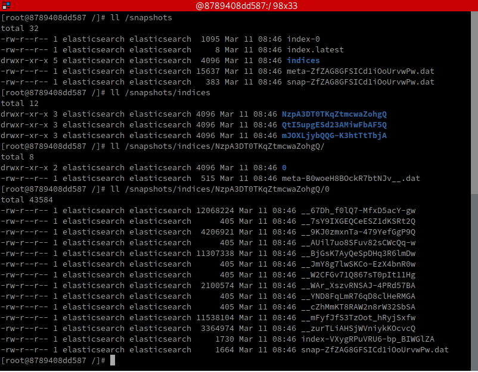

Удалим индекс `test` и создадим новый индекс `test-2`:

````
$ curl -X DELETE -u elastic:72tb8LrnVwcCtCxXKDus -k https://172.17.0.2:9200/test
$ curl -X PUT -u elastic:72tb8LrnVwcCtCxXKDus -k https://172.17.0.2:9200/test-2
{'settings': {'index': {'number_of_replicas': 0,'number_of_shards': 1}}}
````

Индекс создан и он имеет статус `yellow` потому что не привязан ни к одной ноде:

````
$ curl -X GET -u elastic:72tb8LrnVwcCtCxXKDus -k https://172.17.0.2:9200/_cat/indices
````

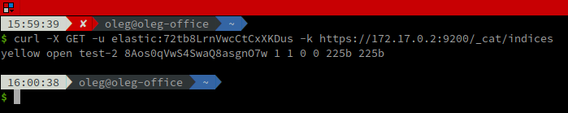

Восстановим состояние кластера из ранее созданного снимка `snapshot_1`:

````
$ curl -X POST -u elastic:72tb8LrnVwcCtCxXKDus -k "https://172.17.0.2:9200/_snapshot/netology_backup/snapshot_1/_restore"
````

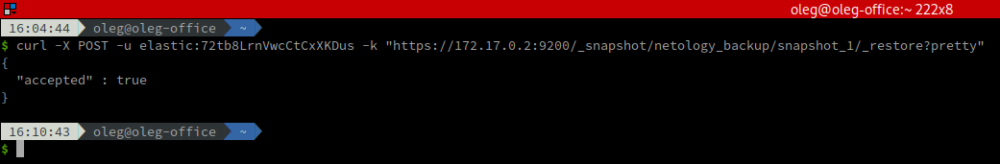

Получим результирующий список индексов:

````
$ curl -X GET -u elastic:72tb8LrnVwcCtCxXKDus -k https://172.17.0.2:9200/_cat/indices
````

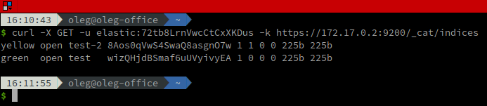

Как видим, помимо индекса `test-2` наш кластер снова содержит ранее удалённый индекс `test` и находится он в состоянии `green`, а весь кластер из-за индекса `test-2` - в состоянии `yellow`:

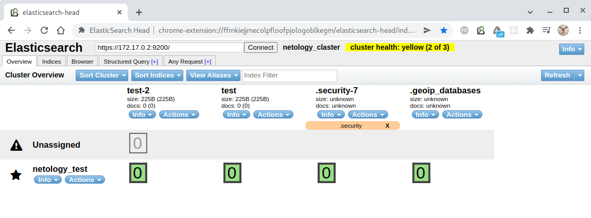

Т.о. состояние индекса `test` нашего кластера было возвращено к состоянию, которое он имел на момент создания снимка.

---