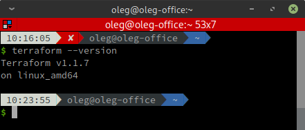
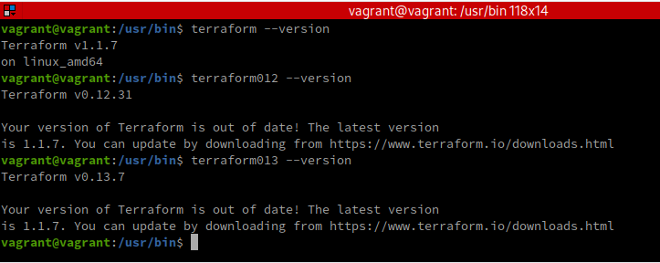

# Домашнее задание к занятию "7.1. Инфраструктура как код"

## Задача 1. Выбор инструментов. 
 
### Легенда
 
Через час совещание на котором менеджер расскажет о новом проекте. Начать работу над которым надо 
будет уже сегодня. 
На данный момент известно, что это будет сервис, который ваша компания будет предоставлять внешним заказчикам.
Первое время, скорее всего, будет один внешний клиент, со временем внешних клиентов станет больше.

Так же по разговорам в компании есть вероятность, что техническое задание еще не четкое, что приведет к большому
количеству небольших релизов, тестирований интеграций, откатов, доработок, то есть скучно не будет.  
   
Вам, как девопс инженеру, будет необходимо принять решение об инструментах для организации инфраструктуры.
На данный момент в вашей компании уже используются следующие инструменты: 
- остатки Сloud Formation, 
- некоторые образы сделаны при помощи Packer,
- год назад начали активно использовать Terraform, 
- разработчики привыкли использовать Docker, 
- уже есть большая база Kubernetes конфигураций, 
- для автоматизации процессов используется Teamcity, 
- также есть совсем немного Ansible скриптов, 
- и ряд bash скриптов для упрощения рутинных задач.  

Для этого в рамках совещания надо будет выяснить подробности о проекте, что бы в итоге определиться с инструментами:

1. Какой тип инфраструктуры будем использовать для этого проекта: изменяемый или не изменяемый?
1. Будет ли центральный сервер для управления инфраструктурой?
1. Будут ли агенты на серверах?
1. Будут ли использованы средства для управления конфигурацией или инициализации ресурсов? 
 
В связи с тем, что проект стартует уже сегодня, в рамках совещания надо будет определиться со всеми этими вопросами.

### В результате задачи необходимо

1. Ответить на четыре вопроса представленных в разделе "Легенда". 
1. Какие инструменты из уже используемых вы хотели бы использовать для нового проекта? 
1. Хотите ли рассмотреть возможность внедрения новых инструментов для этого проекта? 

Если для ответа на эти вопросы недостаточно информации, то напишите какие моменты уточните на совещании.

===

**Ответ:**

Имеем наследие:

| Инструмент      | Назначение                                                   |
|-----------------|--------------------------------------------------------------|
| Cloud Formation | Инициализация ресурсов                                       |
| Packer          | Шаблонизации серверов                                        |
| Terraform       | Инициализация ресурсов, управление облачной инфраструктурой. |
| Docker          | Контейнеризация и оркестрация                                |
| Kubernetes      | Контейнеризация и оркестрация                                |
| Teamcity        | Сервер CI                                                    |
| Ansible         | Управление конфигурацией                                     |
| bash script     | Различные задачи автоматизации                               |

Следует упростить номенклатуру применяемых технологий и свести её к чему-то более логичному.
Связка Docker + Packer + Terraform вполне подходит для покрытия всех потребностей разработки и эксплуатации.

**Соответственно:**

1. Какой тип инфраструктуры будем использовать для этого проекта: изменяемый или неизменяемый?

Будет применяться неизменяемый тип инфраструктуры, свойственный для Terraform и избежим проблем с дрейфом конфигураций.

2. Будет ли центральный сервер для управления инфраструктурой?

Центральный сервер для Terraform не требуется, что сэкономит затраты на инфраструктуру.

3. Будут ли агенты на серверах?

Terraform не использует агентов.

5. Будут ли использованы средства для управления конфигурацией или инициализации ресурсов?

Terraform использует инициализацию ресурсов.

6. Какие инструменты из уже используемых вы хотели бы использовать для нового проекта?

Как уже сказано, будут использоваться только Docker, Packer и Terraform.

7. Хотите ли рассмотреть возможность внедрения новых инструментов для этого проекта?
 
Достаточно и существующих инструментов, новые внедрять и, соответственно, нести издержки не обязательно. 

---

## Задача 2. Установка терраформ. 

Официальный сайт: https://www.terraform.io/

Установите терраформ при помощи менеджера пакетов используемого в вашей операционной системе.
В виде результата этой задачи приложите вывод команды `terraform --version`.

===

**Решение:**



Как видим, текущая версия Terraform `1.1.7`.

---

## Задача 3. Поддержка легаси кода. 

В какой-то момент вы обновили терраформ до новой версии, например с 0.12 до 0.13. 
А код одного из проектов настолько устарел, что не может работать с версией 0.13. 
В связи с этим необходимо сделать так, чтобы вы могли одновременно использовать последнюю версию терраформа установленную при помощи
штатного менеджера пакетов и устаревшую версию 0.12. 

В виде результата этой задачи приложите вывод `--version` двух версий терраформа доступных на вашем компьютере 
или виртуальной машине.

===

**Решение:**

Скачиваем архивы любых (в т.ч. и устаревших) версий Terraform с любезно предоставленного Яндекс-зеркала:

````
$ sudo wget https://hc-mirror.express42.net/terraform/1.1.7/terraform_1.1.7_linux_amd64.zip
$ sudo wget https://hc-mirror.express42.net/terraform/0.13.7/terraform_0.13.7_linux_amd64.zip
$ sudo wget https://hc-mirror.express42.net/terraform/0.12.31/terraform_0.12.31_linux_amd64.zip
````

Создаём папки для хранения этих версий `Terraform`:

````
$ sudo mkdir /usr/local/tf
$ sudo mkdir /usr/local/tf/0_13
$ sudo mkdir /usr/local/tf/0_12
````

Распаковываем скачанные архивы в соответствующие папки:

````
$ sudo unzip terraform_1.1.7_linux_amd64.zip -d /usr/local/tf
$ sudo unzip terraform_0.13.7_linux_amd64.zip -d /usr/local/tf/0_13
$ sudo unzip terraform_0.12.31_linux_amd64.zip -d /usr/local/tf/0_12
````

Создаём в папке `/usr/bin/` симлинки для всех версий `Terraform`:

````
$ sudo ln -s /usr/local/tf/terraform /usr/bin/terraform
$ sudo ln -s /usr/local/tf/0_13/terraform /usr/bin/terraform013
$ sudo ln -s /usr/local/tf/0_12/terraform /usr/bin/terraform012
````

Теперь можно вызывать любую из них:



Как видим, при вызове устаревшей версии Terraform генерируется предупреждение об этом.

---
