# Домашнее задание к занятию "7.2. Облачные провайдеры и синтаксис Terraform."

## Задача 1 (вариант с AWS). Регистрация в aws и знакомство с основами (необязательно, но крайне желательно).

Остальные задания можно будет выполнять и без этого аккаунта, но с ним можно будет увидеть полный цикл процессов. 

AWS предоставляет достаточно много бесплатных ресурсов в первый год после регистрации, подробно описано [здесь](https://aws.amazon.com/free/).
1. Создайте аккаут aws.
1. Установите c aws-cli https://aws.amazon.com/cli/.
1. Выполните первичную настройку aws-sli https://docs.aws.amazon.com/cli/latest/userguide/cli-configure-quickstart.html.
1. Создайте IAM политику для терраформа c правами
    * AmazonEC2FullAccess
    * AmazonS3FullAccess
    * AmazonDynamoDBFullAccess
    * AmazonRDSFullAccess
    * CloudWatchFullAccess
    * IAMFullAccess
1. Добавьте переменные окружения 
    ```
    export AWS_ACCESS_KEY_ID=(your access key id)
    export AWS_SECRET_ACCESS_KEY=(your secret access key)
    ```
1. Создайте, остановите и удалите ec2 инстанс (любой с пометкой `free tier`) через веб интерфейс. 

В виде результата задания приложите вывод команды `aws configure list`.

===

**Решение:**

####1. Используя веб-интерфейс, создадим аккаунт AWS. Изначально ресурсы предоставляются по квотам:

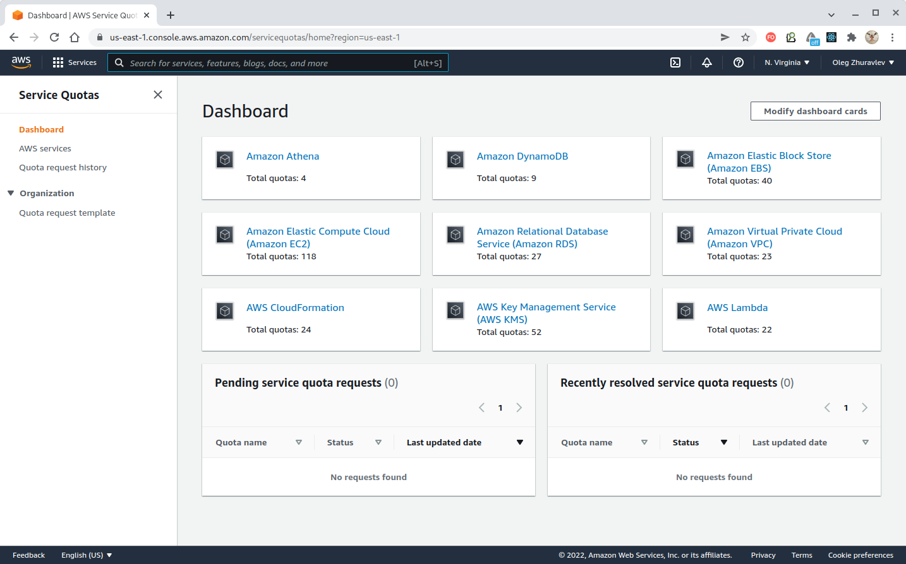

####2. Далее, локально установим CLI для работы с AWS.

Для работы AWS CLI требуется Python v.3. 
Проверяем версию Python, устанавливаем `python-pip` и сам AWS CLI:

````
$ python --version 
Python 3.10.2
$ sudo pacman -S python-pip
$ pip install awscli --upgrade --user
$ aws --version                                        
aws-cli/1.22.77 Python/3.10.2 Linux/5.16.14-1-MANJARO botocore/1.24.22
````

Т.о. была установлена версия `aws-cli/1.22.77`.

####3. Выполним первичную настройку aws-cli, указав регион `US East (N. Virginia)`:

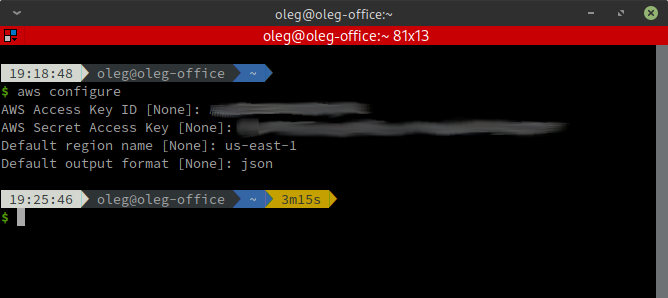

>Данные параметры хранятся в папке `~/.aws` в файлах `config` и `credentials`.

####4. Создадим пользователя AWS и настроим политики:

Создадим группу `netology-group`:

````
$ aws iam create-group --group-name netology-group
````

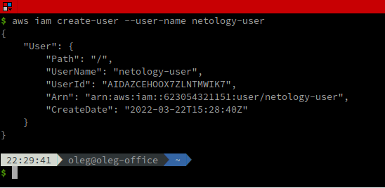

Создадим пользователя `netology-user`:
````
$ aws iam create-user --user-name netology-user
````

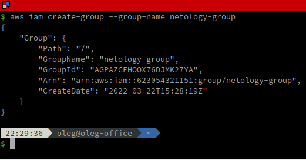

Добавим пользователя `netology-user` в группу `netology-group` и проверим наличие пользователя в группе:
````
$ aws iam add-user-to-group --user-name netology-user --group-name netology-group
$ aws iam get-group --group-name netology-group
````

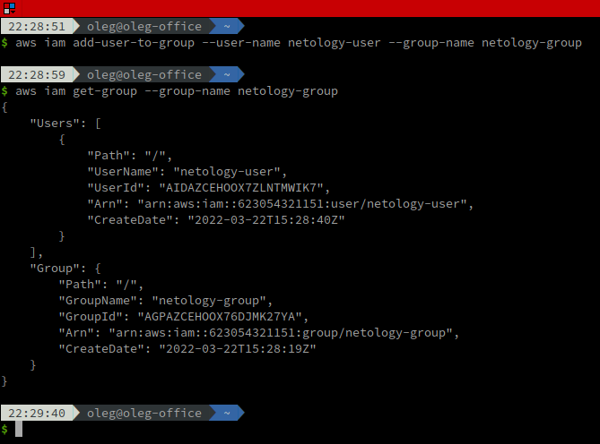

Требуется назначить ряд IAM-политик пользователю `netology-user`. Для назначения политик нужно знать их имена (ARN),
которые можно получить с помощью команды `aws iam list-policies`:
````
echo $(aws iam list-policies --query 'Policies[?PolicyName==`AmazonEC2FullAccess`].{ARN:Arn}' --output text)
echo $(aws iam list-policies --query 'Policies[?PolicyName==`AmazonS3FullAccess`].{ARN:Arn}' --output text)
echo $(aws iam list-policies --query 'Policies[?PolicyName==`AmazonDynamoDBFullAccess`].{ARN:Arn}' --output text)
echo $(aws iam list-policies --query 'Policies[?PolicyName==`AmazonRDSFullAccess`].{ARN:Arn}' --output text)
echo $(aws iam list-policies --query 'Policies[?PolicyName==`CloudWatchFullAccess`].{ARN:Arn}' --output text)
echo $(aws iam list-policies --query 'Policies[?PolicyName==`IAMFullAccess`].{ARN:Arn}' --output text)
````

>**Identity and Access Management (IAM)** - это веб-сервис доступа к ресурсам AWS. Позволяет контролировать аутентификацию и авторизацию.
>**Amazon Resource Names (ARN)** - имена ресурсов, используемые в AWS.

| IAM-политика                | Полномочия для консоли AWS                            | ARN политики                                     |
|-----------------------------|-------------------------------------------------------|--------------------------------------------------|
| `AmazonEC2FullAccess`       | Полный доступ к Amazon EC2                            | arn:aws:iam::aws:policy/AmazonEC2FullAccess      |
| `AmazonS3FullAccess`        | Полный доступ к всем хранилищам S3                    | arn:aws:iam::aws:policy/AmazonS3FullAccess       |
| `AmazonDynamoDBFullAccess`  | Полный доступ к ресурсам DynamoDB                     | arn:aws:iam::aws:policy/AmazonDynamoDBFullAccess |
| `AmazonRDSFullAccess`       | Полный доступ ко всем ресурсам Amazon RDS             | arn:aws:iam::aws:policy/AmazonRDSFullAccess      |
| `CloudWatchFullAccess`      | Полный доступ ко всем действиям и ресурсам CloudWatch | arn:aws:iam::aws:policy/CloudWatchFullAccess     |
| `IAMFullAccess`             | Доступ ко всем действиям IAM                          | arn:aws:iam::aws:policy/IAMFullAccess            |

Выполним присвоение политик пользователю командой `aws iam attach-user-policy`:

````
$ aws iam attach-user-policy --user-name netology-user --policy-arn arn:aws:iam::aws:policy/AmazonEC2FullAccess
$ aws iam attach-user-policy --user-name netology-user --policy-arn arn:aws:iam::aws:policy/AmazonS3FullAccess
$ aws iam attach-user-policy --user-name netology-user --policy-arn arn:aws:iam::aws:policy/AmazonDynamoDBFullAccess
$ aws iam attach-user-policy --user-name netology-user --policy-arn arn:aws:iam::aws:policy/AmazonRDSFullAccess
$ aws iam attach-user-policy --user-name netology-user --policy-arn arn:aws:iam::aws:policy/CloudWatchFullAccess
$ aws iam attach-user-policy --user-name netology-user --policy-arn arn:aws:iam::aws:policy/IAMFullAccess
````

Проверим назначение политик:

````
aws iam list-attached-user-policies --user-name netology-user
````

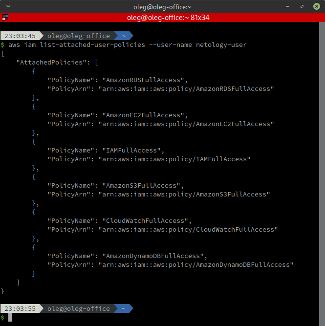

Как видим, все требуемые политики назначены пользователю.

####5. Добавим переменные окружения: 

Для этого объявим их в файле `.bashrc` (`.zshrc` и т.п.):

````
export AWS_ACCESS_KEY_ID=<КлючДоступа>
export AWS_SECRET_ACCESS_KEY=<СекретныйКлюч>
````

####6. Проверим создание, остановку и удаление экземпляров ВМ в AWS:

Для этого через веб-интерфейс создадим экземпляр ES2 бесплатного уровня (`free tier`) из образа Ubuntu 20.04 LTS:

Выбираем образ:

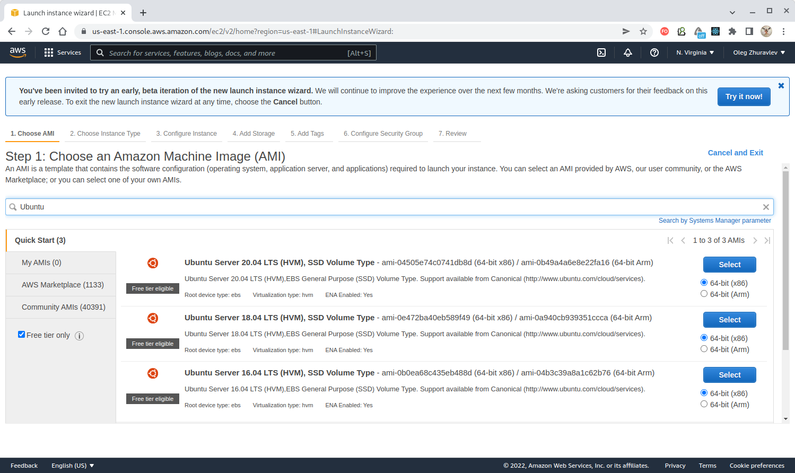

Выбираем тип t2.micro, доступный для бесплатного уровня:

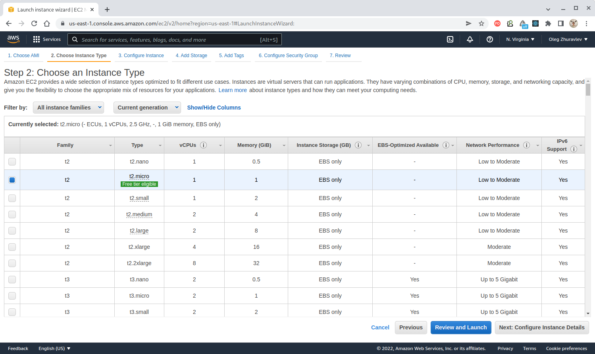

Соглашаемся на использовании автоматически созданной группы безопасности:

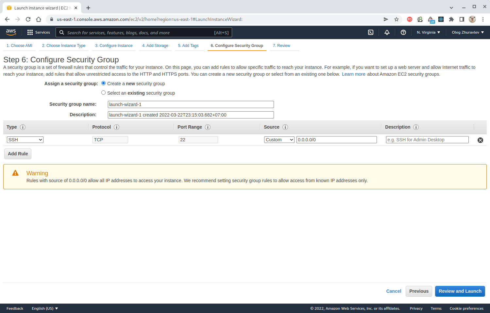

Предлагается проверить результирующие характеристики создаваемого экземпляра:

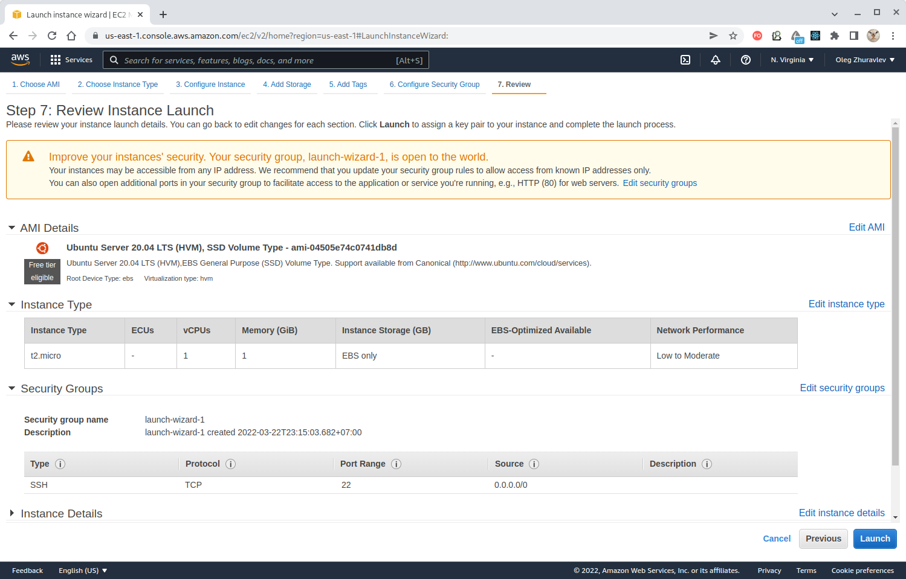

Генерируем и скачиваем пару ключей под именем `netology_aws_key` (pem-файлы сохраняем в папке `/etc/ssl/certs`):

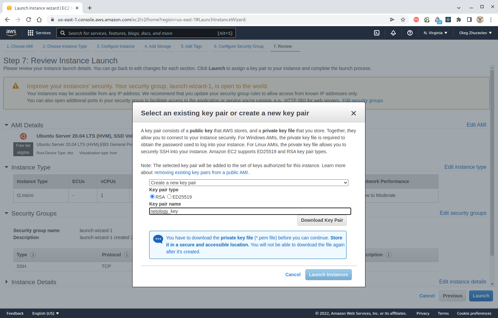

После запуска экземпляра, его можно наблюдать в веб-интерфейсе:

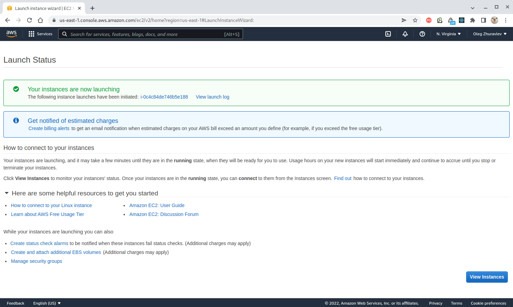

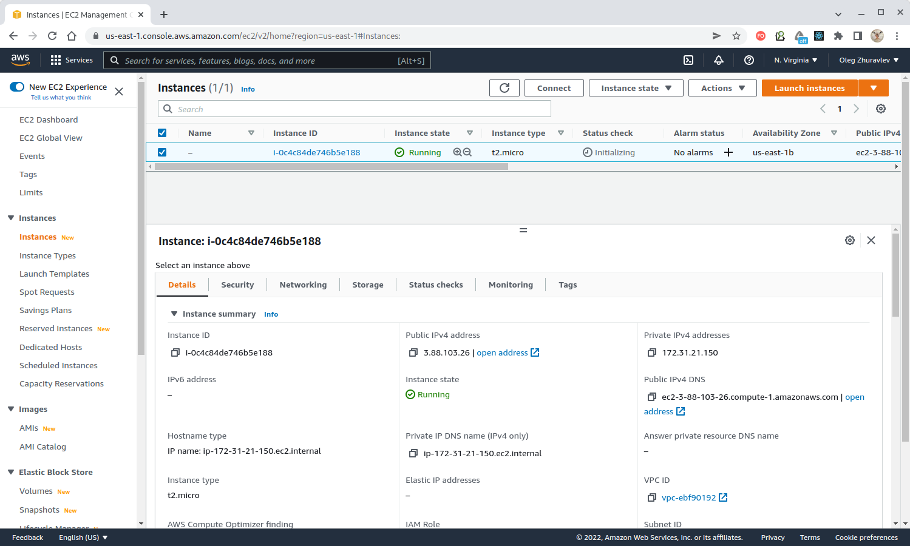

Сведение об экземляре можно получить также через CLI командой `aws ec2 describe-instances --filters "Name=instance-type,Values=t2.micro"`:

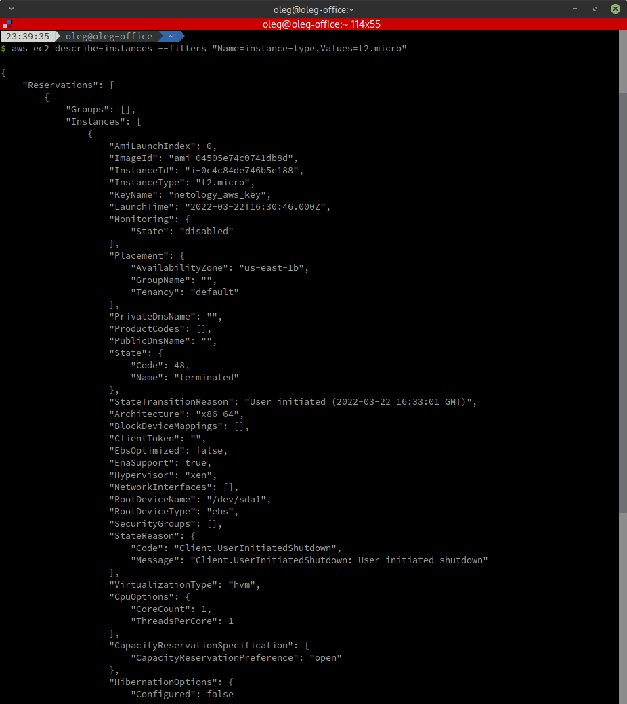

Остановим и удалим созданный экземпляр. При попытке остановки выводится предупреждение:

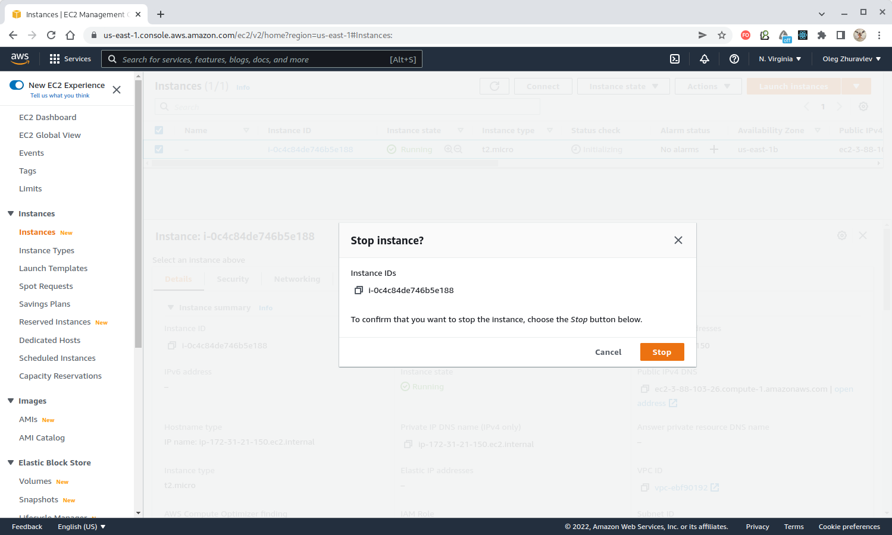

И выводится сообщение, что экземпляр ВМ успешно остановлен:

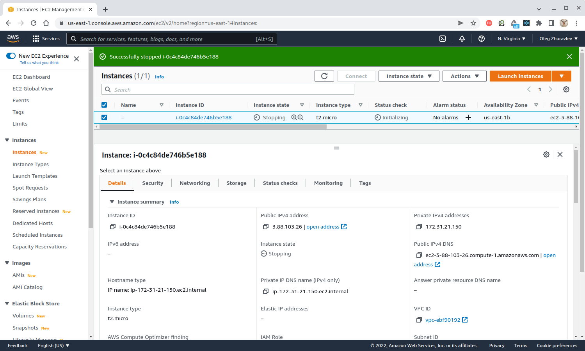

Перед удалением экземпляра также выводится предупреждение:

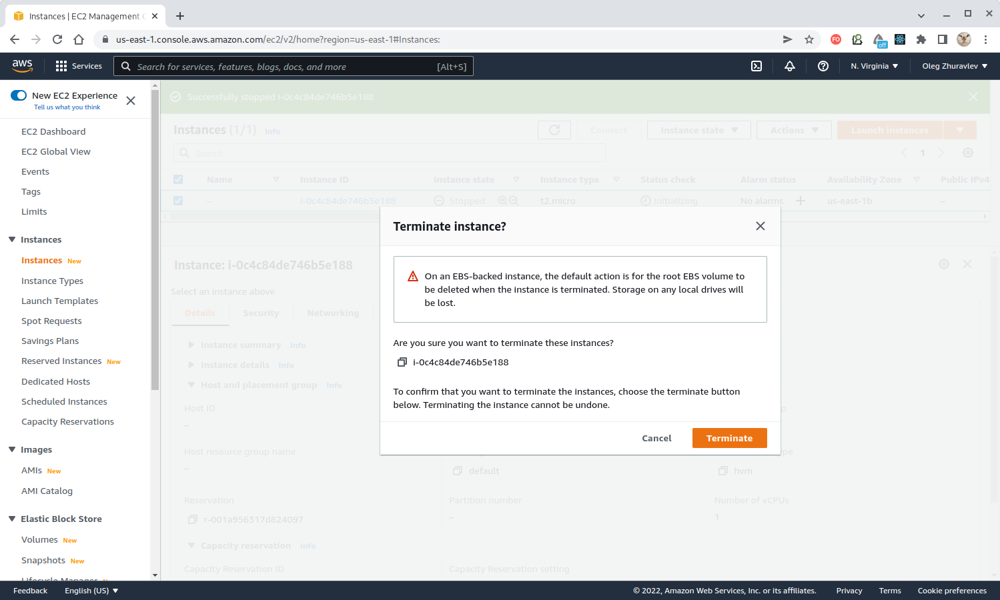

И выводится сообщение, что работа экземпляра ВМ успешно прекращена (terminated):

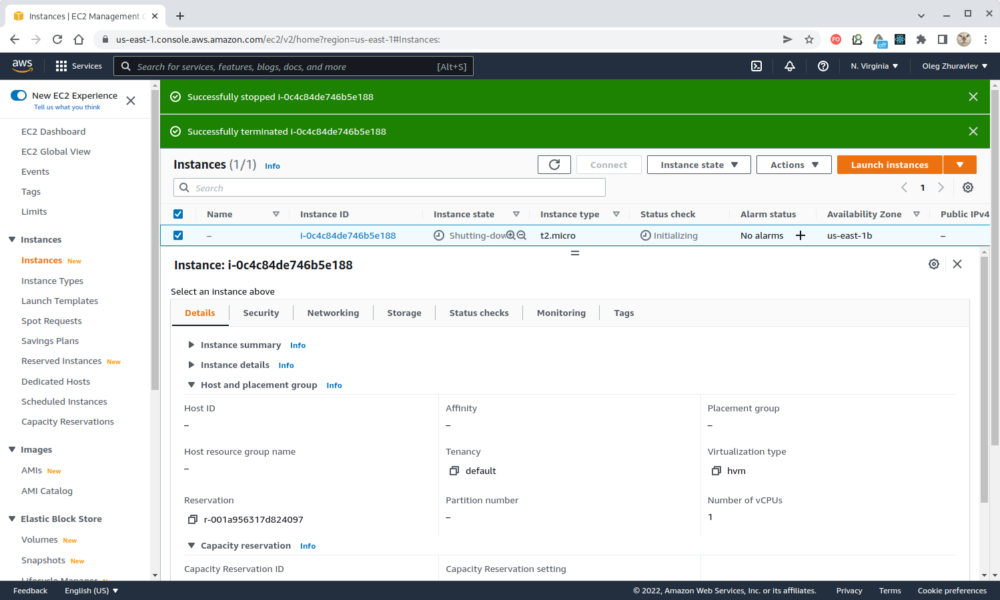

При удалении экземпляра он не исчезает немедленно, а будет еще какое-то время существовать, пока система не удалит его окончательно.

Результат вывода команды `aws configure list` приведен на скриншоте:

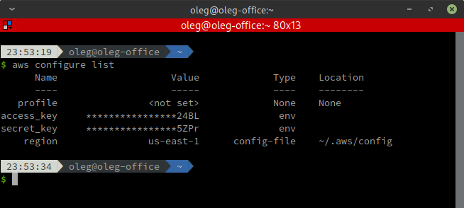

---

## Задача 1 (Вариант с Yandex.Cloud). Регистрация в ЯО и знакомство с основами (необязательно, но крайне желательно).

1. Подробная инструкция на русском языке содержится [здесь](https://cloud.yandex.ru/docs/solutions/infrastructure-management/terraform-quickstart).
2. Обратите внимание на период бесплатного использования после регистрации аккаунта. 
3. Используйте раздел "Подготовьте облако к работе" для регистрации аккаунта. Далее раздел "Настройте провайдер" для подготовки
базового терраформ конфига.
4. Воспользуйтесь [инструкцией](https://registry.terraform.io/providers/yandex-cloud/yandex/latest/docs) на сайте терраформа, что бы 
не указывать авторизационный токен в коде, а терраформ провайдер брал его из переменных окружений.

===

**Решение:**

####1. Подготовили облако:

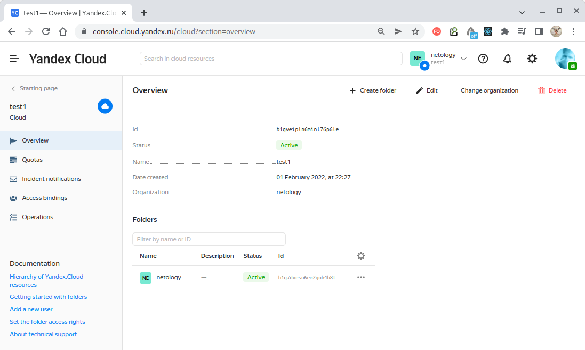

####2. Инициализируем CLI:

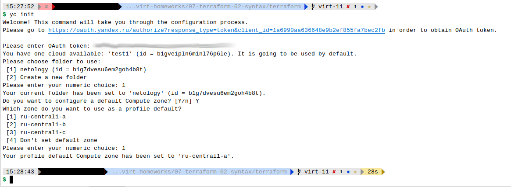

Теперь удобно получить требуемые идентификаторы из CLI командой `yc config list`:

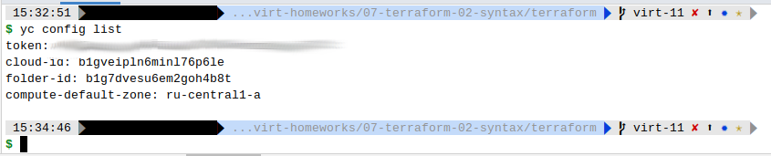

####3. Сохраняем токен в переменной окружения `YC_TOKEN`:

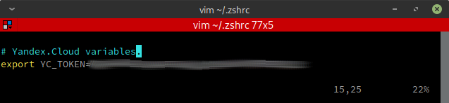

---

## Задача 2. Создание aws ec2 или yandex_compute_instance через терраформ. 

1. В каталоге `terraform` вашего основного репозитория, который был создан в начале курсе, создайте файл `main.tf` и `versions.tf`.
2. Зарегистрируйте провайдер 
   1. для [aws](https://registry.terraform.io/providers/hashicorp/aws/latest/docs). В файл `main.tf` добавьте
   блок `provider`, а в `versions.tf` блок `terraform` с вложенным блоком `required_providers`. Укажите любой выбранный вами регион 
   внутри блока `provider`.
   2. либо для [yandex.cloud](https://registry.terraform.io/providers/yandex-cloud/yandex/latest/docs). Подробную инструкцию можно найти 
   [здесь](https://cloud.yandex.ru/docs/solutions/infrastructure-management/terraform-quickstart).
3. Внимание! В гит репозиторий нельзя пушить ваши личные ключи доступа к аккаунту. Поэтому в предыдущем задании мы указывали
их в виде переменных окружения. 
4. В файле `main.tf` воспользуйтесь блоком `data "aws_ami` для поиска ami образа последнего Ubuntu.  
5. В файле `main.tf` создайте рессурс 
   1. либо [ec2 instance](https://registry.terraform.io/providers/hashicorp/aws/latest/docs/resources/instance).
   Постарайтесь указать как можно больше параметров для его определения. Минимальный набор параметров указан в первом блоке 
   `Example Usage`, но желательно, указать большее количество параметров.
   2. либо [yandex_compute_image](https://registry.terraform.io/providers/yandex-cloud/yandex/latest/docs/resources/compute_image).
6. Также в случае использования aws:
   1. Добавьте data-блоки `aws_caller_identity` и `aws_region`.
   2. В файл `outputs.tf` поместить блоки `output` с данными об используемых в данный момент: 
       * AWS account ID,
       * AWS user ID,
       * AWS регион, который используется в данный момент, 
       * Приватный IP ec2 инстансы,
       * Идентификатор подсети в которой создан инстанс.  
7. Если вы выполнили первый пункт, то добейтесь того, что бы команда `terraform plan` выполнялась без ошибок. 


В качестве результата задания предоставьте:
1. Ответ на вопрос: при помощи какого инструмента (из разобранных на прошлом занятии) можно создать свой образ ami?
1. Ссылку на репозиторий с исходной конфигурацией терраформа.  

===

**Решение:**

###2. Создадим средствами `terraform` виртуальную машину в AWS.

Создадим файл `main.tf` с настройками и `variables.tf` с переменными:

Провайдер AWS:

````
terraform {
  required_providers {
    aws = {
      source = "terraform-registry.storage.yandexcloud.net/hashicorp/aws"
    }
  }
}
provider "aws" {
  region = "us-east-1"
}
````

Настройки сети с доступом для ssh-соединения:

````
resource "aws_security_group" "vm-security" {
  name = var.security_group_name
  ingress {
    from_port = 22
    protocol  = "tcp"
    to_port   = 22
    cidr_blocks = ["0.0.0.0/0"]
  }
  egress {
    from_port = 0
    protocol  = "-1"
    to_port   = 0
    cidr_blocks = ["0.0.0.0/0"]
  }
}
````

Параметры экземпляра виртуальной машины (идентификатор `node01` хранится в переменной `instance_name`):
````
resource "aws_instance" "vm" {
  ami = data.aws_ami.ubuntu.id
  instance_type = var.instance_type
  user_data = file("init-script.sh")

  key_name = aws_key_pair.login.id

  vpc_security_group_ids = [aws_security_group.vm-security.id]

  tags = {
    Name = var.instance_name
  }
}
````

Количество ядер и объём памяти специализируются типом экземпляра виртуальной машины - здесь мы используем `t2.micro`,
что соответствует минимальной конфигурации с 1 ядром и 1 Гб RAM:

Образ системы `Ubuntu 20.04 LTS`:

````
data "aws_ami" "ubuntu" {
  most_recent = true

  filter {
    name   = "name"
    values = ["ubuntu/images/hvm-ssd/ubuntu-focal-20.04-amd64-server-*"]
  }

  filter {
    name   = "virtualization-type"
    values = ["hvm"]
  }

  owners = ["099720109477"] # Canonical
}

resource "aws_instance" "vm" {
  # Ubuntu 20.04 for us-east-1.
  ami = data.aws_ami.ubuntu.id
  instance_type = "t2.micro"
  user_data = file("init-script.sh")

  key_name = aws_key_pair.login.id

  vpc_security_group_ids = [aws_security_group.vm-security.id]

  tags = {
    Name = var.instance_name
  }
}
````

Публичный ключ:

````
resource "aws_key_pair" "login" {
  key_name   = "login"
  public_key = file("~/.ssh/id_rsa.pub")
}
````

Настройка закончена, теперь инициализируем и провалидируем конфигурацию `terraform`:

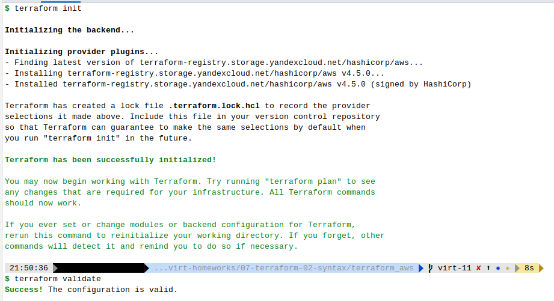

Применим настройки командой `terraform apply`:

````
$ terraform apply -auto-approve

Terraform used the selected providers to generate the following execution plan. Resource actions are indicated with the following symbols:
  + create

Terraform will perform the following actions:

  # aws_instance.vm will be created
  + resource "aws_instance" "vm" {
      + ami                                  = "ami-000722651477bd39b"
      + arn                                  = (known after apply)
      + associate_public_ip_address          = (known after apply)
...
aws_instance.vm: Creation complete after 35s [id=i-099d5f8062ecdb36b]

Apply complete! Resources: 3 added, 0 changed, 0 destroyed.
````

В результате будет создан экземпляр виртуальной машины, что можно наглядно увидеть в веб-интерфейсе:

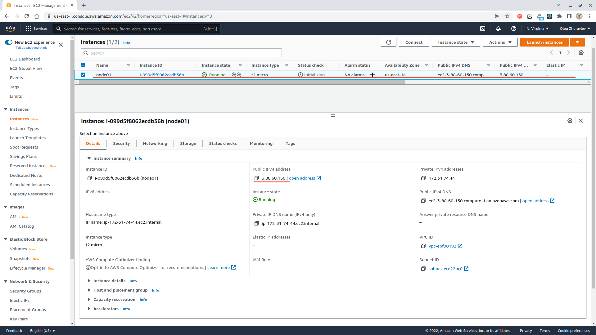

К созданной виртуальной машине можно подключиться по `ssh` (публичный `ip`-адрес можно видеть на предыдущем скриншоте,
а также можно получить, например, командой `aws ec2 describe-instances --filters "Name=instance-type,Values=t2.micro"`):

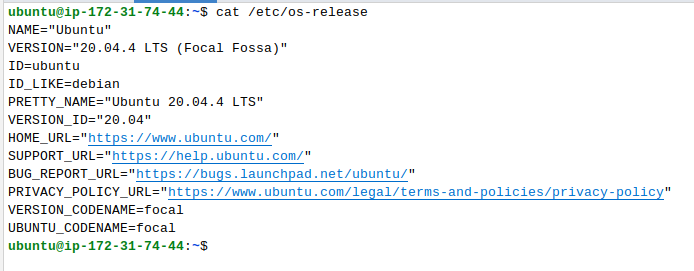

Виртуальную машину можно удалить командой `terraform destroy`:

````
$ terraform destroy -auto-approve
aws_key_pair.login: Refreshing state... [id=login]
aws_security_group.vm-security: Refreshing state... [id=sg-0cb0933d8f3e1239a]
aws_instance.vm: Refreshing state... [id=i-099d5f8062ecdb36b]

Terraform used the selected providers to generate the following execution plan. Resource actions are indicated with the following symbols:
  - destroy

Terraform will perform the following actions:

  # aws_instance.vm will be destroyed
  - resource "aws_instance" "vm" {
      - ami                                  = "ami-000722651477bd39b" -> null
      - arn                                  = "arn:aws:ec2:us-east-1:623054321151:instance/i-099d5f8062ecdb36b" -> null
...
Plan: 0 to add, 0 to change, 3 to destroy.
aws_instance.vm: Destroying... [id=i-099d5f8062ecdb36b]
aws_instance.vm: Still destroying... [id=i-099d5f8062ecdb36b, 10s elapsed]
aws_instance.vm: Destruction complete after 41s
aws_key_pair.login: Destroying... [id=login]
aws_security_group.vm-security: Destroying... [id=sg-0cb0933d8f3e1239a]
aws_key_pair.login: Destruction complete after 0s
aws_security_group.vm-security: Destruction complete after 1s

Destroy complete! Resources: 3 destroyed.
````

>В AWS виртуальная машина не удаляется сразу - это произойдет через некоторый интервал времени.
 
**Таким образом, мы смогли сконфигурировать, создать, использовать и удалить виртуальную машину в AWS.**

>####Папка `terraform`, использованная для создания экземпляра ВМ в AWS, находится [здесь](terraform_aws).

---

###2. Создадим средствами `terraform` виртуальную машину в Yandex.Cloud.

Создадим файл `main.tf` с настройками и `variables.tf` с переменными:

Провайдер Yandex.Cloud:

````
terraform {
  required_providers {
    yandex = {
      source = "yandex-cloud/yandex"
    }
  }
}
# Authorization in Yandex.Cloud.
provider "yandex" {
  #token    = <Stored in env variable YC_TOKEN>
  cloud_id  = "${var.yandex_cloud_id}"
  folder_id = "${var.yandex_folder_id}"
}
````

>Параметр `token` был сохранен в переменной окружения, что и было продемонстрировано в предыдущем задании.

Настройки сети и подсети:

````
resource "yandex_vpc_network" "network-1" {
  name = "network1"
}
resource "yandex_vpc_subnet" "subnet-1" {
  name       = "subnet1"
  zone       = "ru-central1-a"
  network_id     = "${yandex_vpc_network.network-1.id}"
  v4_cidr_blocks = ["192.168.101.0/24"]
}
````

Параметры экземпляра виртуальной машины с идентификатором `node01`:

````
resource "yandex_compute_instance" "node01" {
  name = "node01"
  zone                      = "ru-central1-a"
  hostname                  = "node01.netology.cloud"
  allow_stopping_for_update = true
  platform_id = "standard-v3"
````

Количество ядер и объём памяти в Гб:
````
  resources {
    cores  = 2
    memory = 2
  }
````

Параметры используемого диска и образ системы:
````
  boot_disk {
    initialize_params {
      image_id    = "${var.ubuntu-20-04-lts}"
      name        = "root-node01"
      type        = "network-nvme"
      size        = "50"
    }
  }
````

Сетевой интерфейс:

````
  network_interface {
    subnet_id = "${yandex_vpc_subnet.subnet-1.id}"
    nat       = true
  }
````

Публичный ключ:

````
  metadata = {
    ssh-keys = "ubuntu:${file("~/.ssh/id_rsa.pub")}"
  }
````

>Можно создавать несколько `tf`-файлов, распределяя настройки между ними удобным образом.

Получим id желаемого образа командой `yc compute image list` и выберем оттуда какой-нибудь
образ, например, `Ubuntu 20.04 LTS`:
````
$ yc compute image list --folder-id standard-images | grep ubuntu-20-04-lts
+----------------------+-------------------------------------+-----------------------+-----------------------+--------+
|          ID          |               NAME                  |      FAMILY           |     PRODUCT IDS       | STATUS |
+----------------------+-------------------------------------+-----------------------+-----------------------+--------+
| fd83n3uou8m03iq9gavu | ubuntu-20-04-lts-v20220207          | ubuntu-2004-lts       | f2e7dln09c42avcbtirs  | READY  |
| fd84qiqr0qmk4os9fglm | ubuntu-20-04-lts-vgpu-v20211213     | ubuntu-2004-lts-vgpu  | f2eprq7d1umusvi1ffqu  | READY  |
...
| fd8htuc6bfu35rt5476e | ubuntu-20-04-lts-gpu-v20220131      | ubuntu-2004-lts-gpu   | f2e2sbvutehci7edhkgp  | READY  |
| fd8k5ht4qqdm75v8o8js | ubuntu-20-04-lts-gpu-a100-v20211013 | ubuntu-2004-lts-a100  | f2eme7hb8a9lb1kmtvtn  | READY  |
| fd8lbi4hr72am1eb2kmf | ubuntu-20-04-lts-v20211027          | ubuntu-2004-lts       | f2ej3v69sukaa9c7p0vt  | READY  |
+----------------------+-------------------------------------+-----------------------+-----------------------+--------+
````

Укажем ID этого образа в файле `variables.tf`:
````
variable "ubuntu-20-04-lts" {
  default = "fd83n3uou8m03iq9gavu"
}
````

Также в файле `variables.tf` укажем идентификаторы `cloud_id` и `folder_id`, которые м.б. получены командой `yc config list`,
что и было продемонстрировано в предыдущем задании.

Настройка закончена, теперь инициализируем и провалидируем конфигурацию `terraform`:

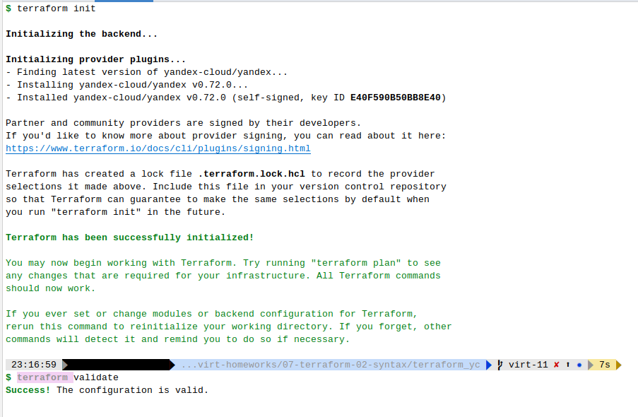

Применим настройки командой `terraform apply`:

````
$ terraform apply -auto-approve

Terraform used the selected providers to generate the following execution plan. Resource actions are indicated with the following symbols:
  + create

Terraform will perform the following actions:

  # yandex_compute_instance.node01 will be created
  + resource "yandex_compute_instance" "node01" {
      + allow_stopping_for_update = true
      + created_at                = (known after apply)
      + folder_id                 = (known after apply)
...
yandex_compute_instance.node01: Creation complete after 48s [id=fhmb6als34ruprbbes7a]

Apply complete! Resources: 3 added, 0 changed, 0 destroyed.
````

В результате будет создан экземпляр виртуальной машины, что можно наглядно увидеть в веб-интерфейсе:

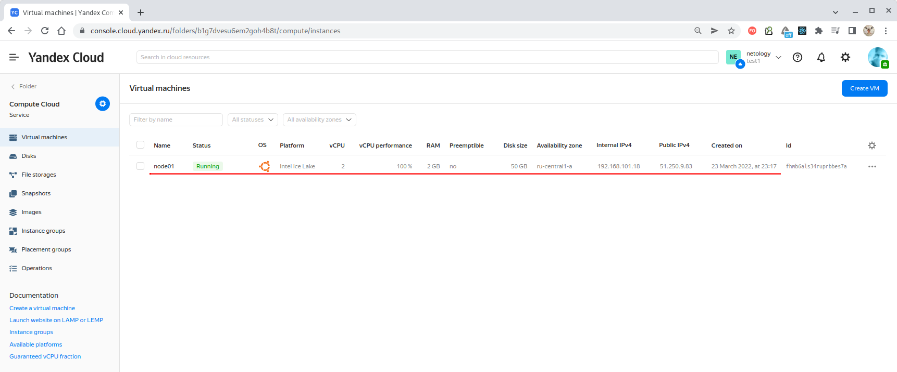

К созданной виртуальной машине можно подключиться по `ssh`:

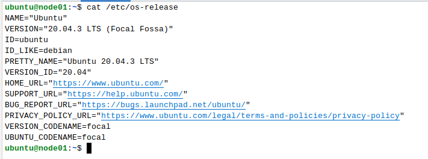

Виртуальную машину можно удалить командой `terraform destroy`:

````
$ terraform destroy -auto-approve
yandex_vpc_network.network-1: Refreshing state... [id=enp218ikrl6bmo0ffrsc]
yandex_vpc_subnet.subnet-1: Refreshing state... [id=e9b1rbj7uddloadjv0ie]
yandex_compute_instance.node01: Refreshing state... [id=fhmb6als34ruprbbes7a]

Terraform used the selected providers to generate the following execution plan. Resource actions are indicated with the following symbols:
  - destroy

Terraform will perform the following actions:

  # yandex_compute_instance.node01 will be destroyed
  - resource "yandex_compute_instance" "node01" {
      - allow_stopping_for_update = true -> null
...
yandex_compute_instance.node01: Destroying... [id=fhmb6als34ruprbbes7a]
yandex_compute_instance.node01: Still destroying... [id=fhmb6als34ruprbbes7a, 10s elapsed]
yandex_compute_instance.node01: Destruction complete after 12s
yandex_vpc_subnet.subnet-1: Destroying... [id=e9b1rbj7uddloadjv0ie]
yandex_vpc_subnet.subnet-1: Destruction complete after 6s
yandex_vpc_network.network-1: Destroying... [id=enp218ikrl6bmo0ffrsc]
yandex_vpc_network.network-1: Destruction complete after 0s

Destroy complete! Resources: 3 destroyed.
````

>Виртуальная машина удаляется сразу, в отличие от AWS, где это происходит через некоторый интервал времени.

**Таким образом, мы смогли сконфигурировать, создать, использовать и удалить виртуальную машину в Yandex.Cloud.**

>####Папка `terraform`, использованная для создания экземпляра ВМ в Yandex.Cloud, находится [здесь](terraform_yc). 

---

####Ответы на вопросы:

1. При помощи какого инструмента (из разобранных на прошлом занятии) можно создать свой образ ami?

Собственные AMI-образы м.б. созданы с помощью таких рассмотренных инструментов, как **Packer** и **Ansible**.
Также существует возможность создавать образы с помощью **шаблонов CloudFormation** через применение
пользовательских ресурсов (Custom Resource) с вызовом CreateImage API.

2. Репозитории с исходной конфигурацией `terraform` находятся здесь:
- [AWS](terraform_yc)
- [Yandex.Cloud](terraform_yc)

---