# Домашнее задание к занятию "7.3. Основы и принцип работы Терраформ"

## Задача 1. Создадим бэкэнд в S3 (необязательно, но крайне желательно).

Если в рамках предыдущего задания у вас уже есть аккаунт AWS, то давайте продолжим знакомство со взаимодействием
терраформа и aws. 

1. Создайте s3 бакет, iam роль и пользователя от которого будет работать терраформ. Можно создать отдельного пользователя,
а можно использовать созданного в рамках предыдущего задания, просто добавьте ему необходимые права, как описано 
[здесь](https://www.terraform.io/docs/backends/types/s3.html).
1. Зарегистрируйте бэкэнд в терраформ проекте, как описано по ссылке выше. 

===

**Решение:**

Доступ к AWS заблокирован. Все делаем в Yandex.Cloud. Начнём с самого начала.

###1. Первоначальная настройка инфраструктуры

Имея аккаунт создадим облако с именем `netology-cloud` из веб-интерфейса:

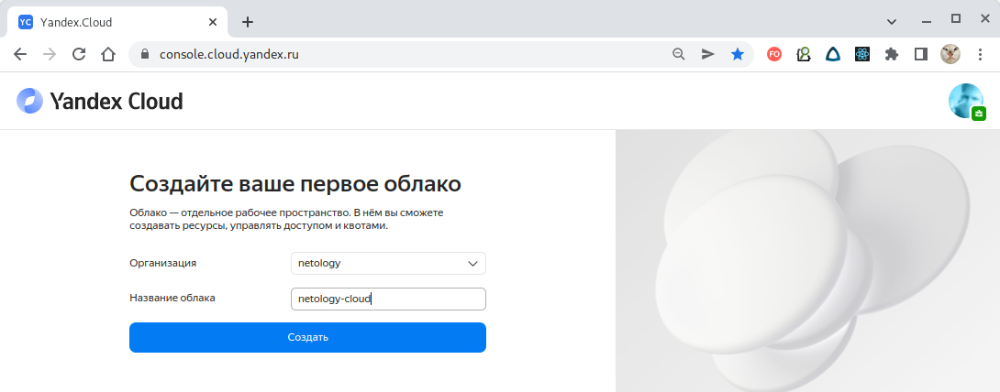

По окончании Облако будет создано вместе с каталогом по умолчанию:

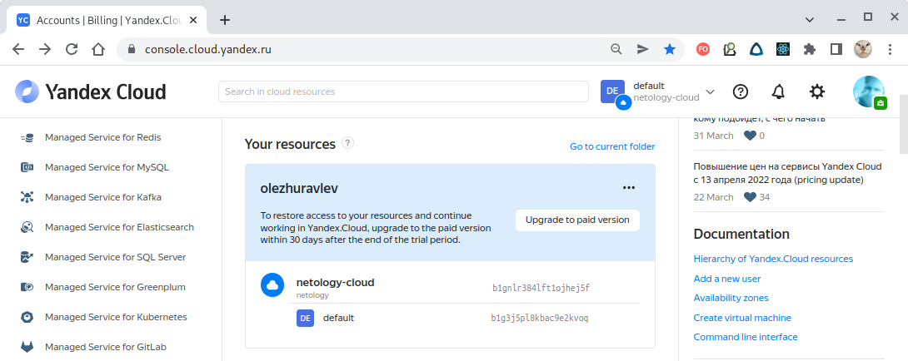

Когда облако будет создано его следует привязать к платёжному аккаунту (выполняется через веб-интерфейс).

Каталог по умолчанию мы использовать не будем, а объявим его создание в конфигурационном файле `Terraform`,
указав в нём идентификатор облака (виден через веб-интерфейс). Причём наименование каталога будет использовать
имя текущего рабочего пространства (`workspace`):
````
resource "yandex_resourcemanager_folder" "netology-folder" {
  cloud_id    = var.yandex-cloud-id
  name        = "netology-folder-${terraform.workspace}"
  description = "Netology test folder"
}
````
Рабочих пространств по условию нам нужно два - `stage` и `prod`. Создадим их:
````
$ terraform workspace new stage;terraform workspace new prod;terraform workspace list
Created and switched to workspace "stage"!

You're now on a new, empty workspace. Workspaces isolate their state,
so if you run "terraform plan" Terraform will not see any existing state
for this configuration.
Created and switched to workspace "prod"!

You're now on a new, empty workspace. Workspaces isolate their state,
so if you run "terraform plan" Terraform will not see any existing state
for this configuration.
  default
* prod
  stage
````

Как видим, кроме `default`, существующего по-умолчанию, создано еще два рабочих пространства - `prod` и `stage`
причем `prod` назначено текущим (помечено звёздочкой).

###2. Создание сервисного IAM-аккаунта

Чтобы через `Terraform` управлять ресурсами Yandex.Cloud следует создать для него сервисный аккаунт.

>**Сервисный аккаунт** — аккаунт, от имени которого программы могут управлять ресурсами в Yandex Cloud.

Сервисный аккаунт для Yandex.Cloud создается одним из четырех способов:
 - из веб-интерфейса;
 - через консоль Yandex.Cloud;
 - вызовом API через POST-запрос;
 - через конфигурацию `Terraform`.

Будем создавать сервисный аккаунт через конфигурацию `Terraform`.

Объявим сервисный аккаунт с именем `terraform-netology-sa`:
````
resource "yandex_iam_service_account" "terraform-netology-sa" {
  folder_id   = yandex_resourcemanager_folder.netology-folder.id
  name        = "terraform-netology-sa-${terraform.workspace}"
  description = "Service account to be used by Terraform"
}
````

>**В Yandex.Cloud существует роль `storage.admin` позволяющая выполнять любые операции с бакетами и объектами в них в каталоге**:
>создавать, удалять и изменять их, в том числе управлять веб-сайтами бакета и настраивать прочие
> параметры, включая списки управления доступом (ACL).

Назначим сервисному аккаунту роль `storage.admin` на каталог:
````
resource "yandex_resourcemanager_folder_iam_member" "terraform-netology-storage-editor" {
  folder_id = yandex_resourcemanager_folder.netology-folder.id
  role      = "storage.admin"
  member    = "serviceAccount:${yandex_iam_service_account.terraform-netology-sa.id}"
}
````

Таким образом мы имеем специальный сервисный аккаунт под именем `terraform-netology-sa`,
используя который `Terraform` сможет в пределах полномочий роли `storage.editor` управлять сервисом `Object Storage`
назначенного каталога. 


###3. Создание экземпляра Object Storage (бакета)

В Yandex.Cloud для аутентификации сервисного аккаунта в `Object Storage` используются статические ключи доступа.

>**Статические ключи доступа** — секретный ключ и идентификатор ключа, используемые для аутентификации в сервисах
> с AWS-совместимым API, например в Object Storage, Message Queue и Yandex Database при использовании Document API.
>
>Статические ключи доступа используются только для сервисного аккаунта.

Объявим статический ключ:
````
resource "yandex_iam_service_account_static_access_key" "terraform-sa-static-key" {
  service_account_id = yandex_iam_service_account.terraform-netology-sa.id
  description        = "Static access key for service account"
}
````

Кроме статического ключа для созданного `Object Storage` можно задавать АСL.

>**Access Control List (ACL)** — список управления доступом, который определяет, кто или что может получать доступ к объекту
>(программе, процессу или файлу), и какие именно операции разрешено или запрещено выполнять субъекту
>(пользователю, группе пользователей).

Объявим экземпляр `Object Storage` с именем `netology-bucket` с указанием статического ключа
и ACL на чтение и запись для сервисного аккаунта:
````
resource "yandex_storage_bucket" "netology-bucket" {
  access_key = yandex_iam_service_account_static_access_key.terraform-sa-static-key.access_key
  secret_key = yandex_iam_service_account_static_access_key.terraform-sa-static-key.secret_key
  bucket     = "netology-bucket-${terraform.workspace}"
  grant {
    id          = yandex_iam_service_account.terraform-netology-sa.id
    type        = "CanonicalUser"
    permissions = ["READ", "WRITE"]
  }
}
````

На этом конфигурирование экземпляра `Storage Object` завершается. 

###4. Конфигурирование экземпляров виртуальных машин (`yandex_compute_instance`)

В целях многократного использования конфигурации для конфигурирования разных экземпляров
виртуальных машин, вынесем конфигурацию в отдельный модуль, расположенный в папке `modules/instance`:
````
# Instance settings.
variable image_family { default = "centos-8" }
...
# VM settings.
variable cores { default = "1" }
...
# Provider must be specified in every module.
terraform {
  required_providers {
    yandex = {
      source = "yandex-cloud/yandex"
    }
  }
}
# Declare instance.
resource "yandex_compute_instance" "instance" {
  count       = var.instance_count
...
}
````

Параметр `count` задает количество экземпляров сущности, которое д.б. создано для данной конфигурации.

Многократное использование данной конфигурации обеспечивается через конструкцию `module`, в которой
специфицируются параметры конкретного экземпляра.
Здесь приведен фрагмент модуля, использующего параметр `count` для указания требуемого количества создаваемых
экземпляров:
````
module "vm-test-count" {
  instance_name  = "vm-test-count"
  source         = "./modules/instance"
  ...
  instance_type  = local.instance_type[terraform.workspace]
  instance_count = local.instance_count[terraform.workspace]
}
````

Здесь значение параметра `instance_count` будет передано и использовано в параметре `count` конфигурации.

В качестве альтернативы параметру `count` объявим модуль, использующий конструкцию `for_each`:
````
module "vm-test-for-each" {
  source        = "./modules/instance"
...
  instance_count = 1
  for_each       = toset(["test-for-each-1", "test-for-each-2"])
  instance_name  = "vm-${each.key}"
}
````
Здесь параметр `instance_count` не используется (всегда равен 1), а вместо этого параметр `for_each` получает на вход
набор строк, формируюющий имя создаваемых сущностей. Количество имен задаёт количество создаваемых виртуальных машин.

Тип создаваемой виртуальной машины (у AWS это называется `aws_instance`, а у YC - это `platform_id`) специализируется
передаваемым параметром `instance_type`, привязанным в составе локальных переменных к именам рабочих пространств.
Количество создаваемых экземпляров задаётся параметром `instance_count`:
````
locals {
  ...
  instance_count = {
    stage = 1
    prod  = 2
  }
  instance_type = {
    stage = "standard-v1"
    prod  = "standard-v2"
  }
}
````

Параметры стандартных типов виртуальных машин Yandex.Cloud приведены на скриншоте:

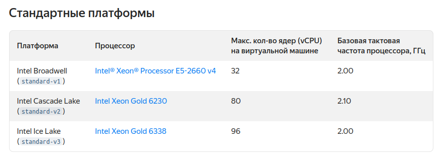

На этом конфигурирование виртуальных машин, параметры которых зависят от заданных рабочих пространств и управляются
параметрами `count` или `for_each`, завершено.

---

## Задача 2. Инициализируем проект и создаем воркспейсы. 

1. Выполните `terraform init`:
    * если был создан бэкэнд в S3, то терраформ создат файл стейтов в S3 и запись в таблице 
dynamodb.
    * иначе будет создан локальный файл со стейтами.  
1. Создайте два воркспейса `stage` и `prod`.
1. В уже созданный `aws_instance` добавьте зависимость типа инстанса от вокспейса, что бы в разных ворскспейсах 
использовались разные `instance_type`.
1. Добавим `count`. Для `stage` должен создаться один экземпляр `ec2`, а для `prod` два. 
1. Создайте рядом еще один `aws_instance`, но теперь определите их количество при помощи `for_each`, а не `count`.
1. Что бы при изменении типа инстанса не возникло ситуации, когда не будет ни одного инстанса добавьте параметр
жизненного цикла `create_before_destroy = true` в один из рессурсов `aws_instance`.
1. При желании поэкспериментируйте с другими параметрами и рессурсами.

В виде результата работы пришлите:
* Вывод команды `terraform workspace list`.
* Вывод команды `terraform plan` для воркспейса `prod`.  

===

**Решение:**

Рабочие пространства `stage` и `prod` уже были созданы при первоначальной настройке системы в предыдущем задании:

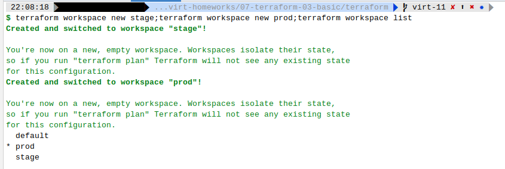

Еще раз обращаем внимание, что текущим рабочим пространством выбран `prod`.

Инициализируем объявленную конфигурацию командой `terraform init`:
````
$ terraform init                                                                     
Initializing modules...
- vm-test-count in modules/instance
- vm-test-for-each in modules/instance
Initializing the backend...
Initializing provider plugins...
- Finding latest version of yandex-cloud/yandex...
- Installing yandex-cloud/yandex v0.73.0...
- Installed yandex-cloud/yandex v0.73.0 (self-signed, key ID E40F590B50BB8E40)
...
Terraform has been successfully initialized!
You may now begin working with Terraform. Try running "terraform plan" to see
any changes that are required for your infrastructure. All Terraform commands
should now work.
If you ever set or change modules or backend configuration for Terraform,
rerun this command to reinitialize your working directory. If you forget, other
commands will detect it and remind you to do so if necessary.
````

Видим, что были проинициализированы оба модуля, а также плагины провайдер конфигурации.

>Инициализация конфигурации создает служебные папки и файлы `terraform`. Имя текущего рабочего пространства
>хранится в файле `.terraform/environment`.

Выведем план конфигурирования для текущего рабочего пространства `prod`:
````
$ terraform plan
Terraform used the selected providers to generate the following execution plan. Resource actions are indicated with the following symbols:
  + create

Terraform will perform the following actions:

  # yandex_iam_service_account.terraform-netology-sa will be created
  + resource "yandex_iam_service_account" "terraform-netology-sa" {
      + created_at  = (known after apply)
      + description = "Service account to be used by Terraform"
      + folder_id   = (known after apply)
      + id          = (known after apply)
      + name        = "terraform-netology-sa-prod"
    }

  # yandex_iam_service_account_static_access_key.terraform-sa-static-key will be created
  + resource "yandex_iam_service_account_static_access_key" "terraform-sa-static-key" {
      + access_key           = (known after apply)
      + created_at           = (known after apply)
      + description          = "Static access key for service account"
      + encrypted_secret_key = (known after apply)
      + id                   = (known after apply)
      + key_fingerprint      = (known after apply)
      + secret_key           = (sensitive value)
      + service_account_id   = (known after apply)
    }

  # yandex_resourcemanager_folder.netology-folder will be created
  + resource "yandex_resourcemanager_folder" "netology-folder" {
      + cloud_id    = "b1gnlr384lft1ojhej5f"
      + created_at  = (known after apply)
      + description = "Netology test folder"
      + id          = (known after apply)
      + name        = "netology-folder-prod"
    }

  # yandex_resourcemanager_folder_iam_member.terraform-netology-storage-editor will be created
  + resource "yandex_resourcemanager_folder_iam_member" "terraform-netology-storage-editor" {
      + folder_id = (known after apply)
      + id        = (known after apply)
      + member    = (known after apply)
      + role      = "storage.admin"
    }

  # yandex_storage_bucket.netology-bucket will be created
  + resource "yandex_storage_bucket" "netology-bucket" {
      + access_key         = (known after apply)
      + acl                = "private"
      + bucket             = "netology-bucket-prod"
      + bucket_domain_name = (known after apply)
      + force_destroy      = false
      + id                 = (known after apply)
      + secret_key         = (sensitive value)
      + website_domain     = (known after apply)
      + website_endpoint   = (known after apply)

      + grant {
          + id          = (known after apply)
          + permissions = [
              + "READ",
              + "WRITE",
            ]
          + type        = "CanonicalUser"
        }

      + versioning {
          + enabled = (known after apply)
        }
    }

  # yandex_vpc_network.netology-network will be created
  + resource "yandex_vpc_network" "netology-network" {
      + created_at                = (known after apply)
      + default_security_group_id = (known after apply)
      + description               = "Netology network"
      + folder_id                 = (known after apply)
      + id                        = (known after apply)
      + labels                    = (known after apply)
      + name                      = "netology-network"
      + subnet_ids                = (known after apply)
    }

  # yandex_vpc_subnet.netology-subnet will be created
  + resource "yandex_vpc_subnet" "netology-subnet" {
      + created_at     = (known after apply)
      + description    = "Netology subnet 0"
      + folder_id      = (known after apply)
      + id             = (known after apply)
      + labels         = (known after apply)
      + name           = "netology-subnet-0"
      + network_id     = (known after apply)
      + v4_cidr_blocks = [
          + "10.100.0.0/24",
        ]
      + v6_cidr_blocks = (known after apply)
      + zone           = "ru-central1-a"
    }

  # module.vm-test-count.yandex_compute_instance.instance[0] will be created
  + resource "yandex_compute_instance" "instance" {
      + allow_stopping_for_update = true
      + created_at                = (known after apply)
      + folder_id                 = (known after apply)
      + fqdn                      = (known after apply)
      + hostname                  = "vm-test-count-1"
      + id                        = (known after apply)
      + metadata                  = {
          + "ssh-keys" = <<-EOT
                centos:ssh-rsa AAD5*********************************************wmDt0= oleg@oleg-office
            EOT
        }
      + name                      = "vm-test-count-1"
      + network_acceleration_type = "standard"
      + platform_id               = "standard-v2"
      + service_account_id        = (known after apply)
      + status                    = (known after apply)
      + zone                      = "ru-central1-a"

      + boot_disk {
          + auto_delete = true
          + device_name = (known after apply)
          + disk_id     = (known after apply)
          + mode        = (known after apply)

          + initialize_params {
              + block_size  = (known after apply)
              + description = (known after apply)
              + image_id    = "fd86tafe9jg6c4hd2aqp"
              + name        = (known after apply)
              + size        = 40
              + snapshot_id = (known after apply)
              + type        = "network-hdd"
            }
        }

      + network_interface {
          + index              = (known after apply)
          + ip_address         = (known after apply)
          + ipv4               = true
          + ipv6               = (known after apply)
          + ipv6_address       = (known after apply)
          + mac_address        = (known after apply)
          + nat                = false
          + nat_ip_address     = (known after apply)
          + nat_ip_version     = (known after apply)
          + security_group_ids = (known after apply)
          + subnet_id          = (known after apply)
        }

      + placement_policy {
          + host_affinity_rules = (known after apply)
          + placement_group_id  = (known after apply)
        }

      + resources {
          + core_fraction = 20
          + cores         = 4
          + memory        = 2
        }

      + scheduling_policy {
          + preemptible = (known after apply)
        }
    }

  # module.vm-test-count.yandex_compute_instance.instance[1] will be created
  + resource "yandex_compute_instance" "instance" {
      + allow_stopping_for_update = true
      + created_at                = (known after apply)
      + folder_id                 = (known after apply)
      + fqdn                      = (known after apply)
      + hostname                  = "vm-test-count-2"
      + id                        = (known after apply)
      + metadata                  = {
          + "ssh-keys" = <<-EOT
                centos:ssh-rsa AAD5*********************************************wmDt0= oleg@oleg-office
            EOT
        }
      + name                      = "vm-test-count-2"
      + network_acceleration_type = "standard"
      + platform_id               = "standard-v2"
      + service_account_id        = (known after apply)
      + status                    = (known after apply)
      + zone                      = "ru-central1-a"

      + boot_disk {
          + auto_delete = true
          + device_name = (known after apply)
          + disk_id     = (known after apply)
          + mode        = (known after apply)

          + initialize_params {
              + block_size  = (known after apply)
              + description = (known after apply)
              + image_id    = "fd86tafe9jg6c4hd2aqp"
              + name        = (known after apply)
              + size        = 40
              + snapshot_id = (known after apply)
              + type        = "network-hdd"
            }
        }

      + network_interface {
          + index              = (known after apply)
          + ip_address         = (known after apply)
          + ipv4               = true
          + ipv6               = (known after apply)
          + ipv6_address       = (known after apply)
          + mac_address        = (known after apply)
          + nat                = false
          + nat_ip_address     = (known after apply)
          + nat_ip_version     = (known after apply)
          + security_group_ids = (known after apply)
          + subnet_id          = (known after apply)
        }

      + placement_policy {
          + host_affinity_rules = (known after apply)
          + placement_group_id  = (known after apply)
        }

      + resources {
          + core_fraction = 20
          + cores         = 4
          + memory        = 2
        }

      + scheduling_policy {
          + preemptible = (known after apply)
        }
    }

  # module.vm-test-for-each["test-for-each-1"].yandex_compute_instance.instance[0] will be created
  + resource "yandex_compute_instance" "instance" {
      + allow_stopping_for_update = true
      + created_at                = (known after apply)
      + folder_id                 = (known after apply)
      + fqdn                      = (known after apply)
      + hostname                  = "vm-test-for-each-1-1"
      + id                        = (known after apply)
      + metadata                  = {
          + "ssh-keys" = <<-EOT
                centos:ssh-rsa AAD5*********************************************wmDt0= oleg@oleg-office
            EOT
        }
      + name                      = "vm-test-for-each-1-1"
      + network_acceleration_type = "standard"
      + platform_id               = "standard-v2"
      + service_account_id        = (known after apply)
      + status                    = (known after apply)
      + zone                      = "ru-central1-a"

      + boot_disk {
          + auto_delete = true
          + device_name = (known after apply)
          + disk_id     = (known after apply)
          + mode        = (known after apply)

          + initialize_params {
              + block_size  = (known after apply)
              + description = (known after apply)
              + image_id    = "fd86tafe9jg6c4hd2aqp"
              + name        = (known after apply)
              + size        = 40
              + snapshot_id = (known after apply)
              + type        = "network-hdd"
            }
        }

      + network_interface {
          + index              = (known after apply)
          + ip_address         = (known after apply)
          + ipv4               = true
          + ipv6               = (known after apply)
          + ipv6_address       = (known after apply)
          + mac_address        = (known after apply)
          + nat                = false
          + nat_ip_address     = (known after apply)
          + nat_ip_version     = (known after apply)
          + security_group_ids = (known after apply)
          + subnet_id          = (known after apply)
        }

      + placement_policy {
          + host_affinity_rules = (known after apply)
          + placement_group_id  = (known after apply)
        }

      + resources {
          + core_fraction = 20
          + cores         = 4
          + memory        = 2
        }

      + scheduling_policy {
          + preemptible = (known after apply)
        }
    }

  # module.vm-test-for-each["test-for-each-2"].yandex_compute_instance.instance[0] will be created
  + resource "yandex_compute_instance" "instance" {
      + allow_stopping_for_update = true
      + created_at                = (known after apply)
      + folder_id                 = (known after apply)
      + fqdn                      = (known after apply)
      + hostname                  = "vm-test-for-each-2-1"
      + id                        = (known after apply)
      + metadata                  = {
          + "ssh-keys" = <<-EOT
                centos:ssh-rsa AAD5*********************************************wmDt0= oleg@oleg-office
            EOT
        }
      + name                      = "vm-test-for-each-2-1"
      + network_acceleration_type = "standard"
      + platform_id               = "standard-v2"
      + service_account_id        = (known after apply)
      + status                    = (known after apply)
      + zone                      = "ru-central1-a"

      + boot_disk {
          + auto_delete = true
          + device_name = (known after apply)
          + disk_id     = (known after apply)
          + mode        = (known after apply)

          + initialize_params {
              + block_size  = (known after apply)
              + description = (known after apply)
              + image_id    = "fd86tafe9jg6c4hd2aqp"
              + name        = (known after apply)
              + size        = 40
              + snapshot_id = (known after apply)
              + type        = "network-hdd"
            }
        }

      + network_interface {
          + index              = (known after apply)
          + ip_address         = (known after apply)
          + ipv4               = true
          + ipv6               = (known after apply)
          + ipv6_address       = (known after apply)
          + mac_address        = (known after apply)
          + nat                = false
          + nat_ip_address     = (known after apply)
          + nat_ip_version     = (known after apply)
          + security_group_ids = (known after apply)
          + subnet_id          = (known after apply)
        }

      + placement_policy {
          + host_affinity_rules = (known after apply)
          + placement_group_id  = (known after apply)
        }

      + resources {
          + core_fraction = 20
          + cores         = 4
          + memory        = 2
        }

      + scheduling_policy {
          + preemptible = (known after apply)
        }
    }

Plan: 11 to add, 0 to change, 0 to destroy.
````

В соответствии с планом будет создано 11 новых сущностей.

Применим конфигурации последовательно к обоим рабочим пространствам, к текущему `prod`:
````
$ terraform apply -auto-approve

Terraform used the selected providers to generate the following execution plan. Resource actions are indicated with the following symbols:
  + create

Terraform will perform the following actions:

  # yandex_iam_service_account.terraform-netology-sa will be created
  + resource "yandex_iam_service_account" "terraform-netology-sa" {
      + created_at  = (known after apply)
...
Plan: 11 to add, 0 to change, 0 to destroy.
yandex_resourcemanager_folder.netology-folder: Creating...
yandex_resourcemanager_folder.netology-folder: Creation complete after 1s [id=b1gqb8gdvrptvkc3l85o]
yandex_iam_service_account.terraform-netology-sa: Creating...
yandex_vpc_network.netology-network: Creating...
yandex_iam_service_account.terraform-netology-sa: Creation complete after 1s [id=aje5kindtb967ofbnfof]
yandex_resourcemanager_folder_iam_member.terraform-netology-storage-editor: Creating...
yandex_iam_service_account_static_access_key.terraform-sa-static-key: Creating...
yandex_vpc_network.netology-network: Creation complete after 1s [id=enptbllgbaj3f0mll6v5]
yandex_vpc_subnet.netology-subnet: Creating...
yandex_iam_service_account_static_access_key.terraform-sa-static-key: Creation complete after 0s [id=aje0c12t1g7vf8dto84b]
yandex_storage_bucket.netology-bucket: Creating...
yandex_vpc_subnet.netology-subnet: Creation complete after 1s [id=e9b9e3vqru6kirup2tdq]
module.vm-test-for-each["test-for-each-2"].yandex_compute_instance.instance[0]: Creating...
module.vm-test-for-each["test-for-each-1"].yandex_compute_instance.instance[0]: Creating...
module.vm-test-count.yandex_compute_instance.instance[0]: Creating...
module.vm-test-count.yandex_compute_instance.instance[1]: Creating...
yandex_resourcemanager_folder_iam_member.terraform-netology-storage-editor: Creation complete after 2s [id=b1gqb8gdvrptvkc3l85o/storage.admin/serviceAccount:aje5kindtb967ofbnfof]
yandex_storage_bucket.netology-bucket: Creation complete after 2s [id=netology-bucket-prod]
module.vm-test-for-each["test-for-each-2"].yandex_compute_instance.instance[0]: Still creating... [10s elapsed]
module.vm-test-for-each["test-for-each-1"].yandex_compute_instance.instance[0]: Still creating... [10s elapsed]
module.vm-test-count.yandex_compute_instance.instance[0]: Still creating... [10s elapsed]
module.vm-test-count.yandex_compute_instance.instance[1]: Still creating... [10s elapsed]
module.vm-test-for-each["test-for-each-1"].yandex_compute_instance.instance[0]: Still creating... [20s elapsed]
module.vm-test-for-each["test-for-each-2"].yandex_compute_instance.instance[0]: Still creating... [20s elapsed]
module.vm-test-count.yandex_compute_instance.instance[0]: Still creating... [20s elapsed]
module.vm-test-count.yandex_compute_instance.instance[1]: Still creating... [20s elapsed]
module.vm-test-count.yandex_compute_instance.instance[1]: Creation complete after 24s [id=fhm1lr5jtkdm2uovekcu]
module.vm-test-for-each["test-for-each-2"].yandex_compute_instance.instance[0]: Creation complete after 24s [id=fhm10odrcnsv00c3hblg]
module.vm-test-for-each["test-for-each-1"].yandex_compute_instance.instance[0]: Creation complete after 24s [id=fhmth1beceekth5cpkef]
module.vm-test-count.yandex_compute_instance.instance[0]: Creation complete after 24s [id=fhmb4b5arv3p7ml87ov0]
````

Затем сделаем рабочее пространство `stage` текущим:
````
$ terraform workspace select stage
Switched to workspace "stage".

$ terraform workspace list        
  default
  prod
* stage
````

И применим конфигурацию к текущему рабочему пространству `stage`:
````
$ terraform apply -auto-approve

Terraform used the selected providers to generate the following execution plan. Resource actions are indicated with the following symbols:
  + create

Terraform will perform the following actions:

  # yandex_iam_service_account.terraform-netology-sa will be created
  + resource "yandex_iam_service_account" "terraform-netology-sa" {
      + created_at  = (known after apply)
...
Plan: 11 to add, 0 to change, 0 to destroy.
yandex_resourcemanager_folder.netology-folder: Creating...
yandex_resourcemanager_folder.netology-folder: Creation complete after 1s [id=b1ghsgbihnuib2856g5c]
yandex_iam_service_account.terraform-netology-sa: Creating...
yandex_vpc_network.netology-network: Creating...
yandex_iam_service_account.terraform-netology-sa: Creation complete after 1s [id=ajebf5eobua18fc1dqon]
yandex_resourcemanager_folder_iam_member.terraform-netology-storage-editor: Creating...
yandex_iam_service_account_static_access_key.terraform-sa-static-key: Creating...
yandex_vpc_network.netology-network: Creation complete after 1s [id=enpm9g8776h97joegb5v]
yandex_vpc_subnet.netology-subnet: Creating...
yandex_iam_service_account_static_access_key.terraform-sa-static-key: Creation complete after 0s [id=ajeornaao0tj1gd7o335]
yandex_storage_bucket.netology-bucket: Creating...
yandex_vpc_subnet.netology-subnet: Creation complete after 0s [id=e9b8gqkfdmlb7f9d21uf]
module.vm-test-for-each["test-for-each-1"].yandex_compute_instance.instance[0]: Creating...
module.vm-test-count.yandex_compute_instance.instance[0]: Creating...
module.vm-test-for-each["test-for-each-2"].yandex_compute_instance.instance[0]: Creating...
yandex_resourcemanager_folder_iam_member.terraform-netology-storage-editor: Creation complete after 1s [id=b1ghsgbihnuib2856g5c/storage.admin/serviceAccount:ajebf5eobua18fc1dqon]
module.vm-test-for-each["test-for-each-1"].yandex_compute_instance.instance[0]: Still creating... [10s elapsed]
module.vm-test-count.yandex_compute_instance.instance[0]: Still creating... [10s elapsed]
module.vm-test-for-each["test-for-each-2"].yandex_compute_instance.instance[0]: Still creating... [10s elapsed]
module.vm-test-for-each["test-for-each-1"].yandex_compute_instance.instance[0]: Still creating... [20s elapsed]
module.vm-test-count.yandex_compute_instance.instance[0]: Still creating... [20s elapsed]
module.vm-test-for-each["test-for-each-2"].yandex_compute_instance.instance[0]: Still creating... [20s elapsed]
module.vm-test-for-each["test-for-each-1"].yandex_compute_instance.instance[0]: Creation complete after 20s [id=fhmqgra16ouclv8cmo8p]
module.vm-test-for-each["test-for-each-2"].yandex_compute_instance.instance[0]: Creation complete after 21s [id=fhmj1tge7og3r1au66dc]
module.vm-test-count.yandex_compute_instance.instance[0]: Creation complete after 22s [id=fhm775ce53ctcdl51nge]
yandex_storage_bucket.netology-bucket: Creating...
yandex_storage_bucket.netology-bucket: Creation complete after 24s [id=netology-bucket-stage]
````

После применения конфигураций, созданные сущности можно наблюдать через веб-интерфейс.

Каталоги для каждого из рабочих пространств:

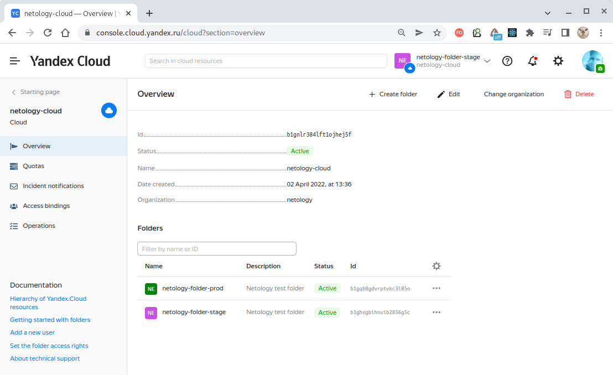

Состав каталога рабочего пространства `prod`:

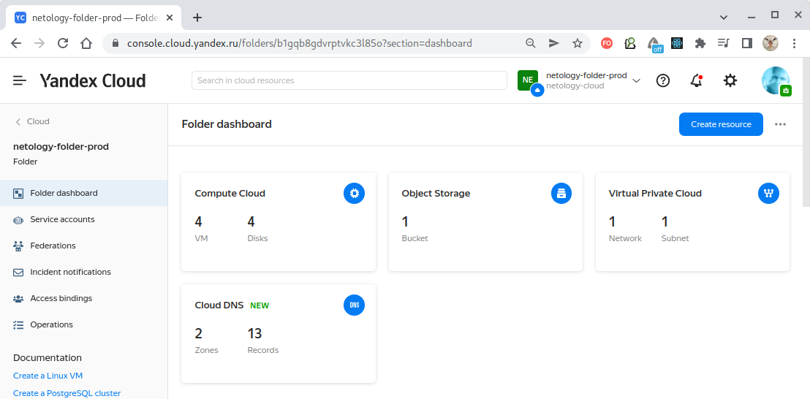

Состав каталога рабочего пространства `stage`:

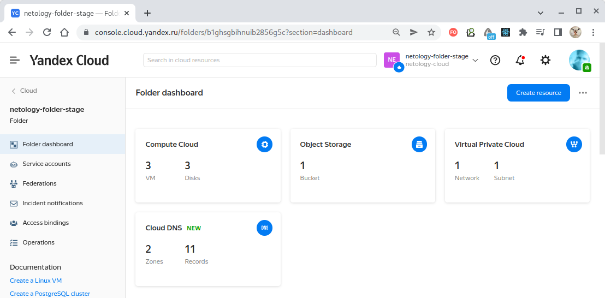

Сервисные аккаунт рабочего пространства `prod`:

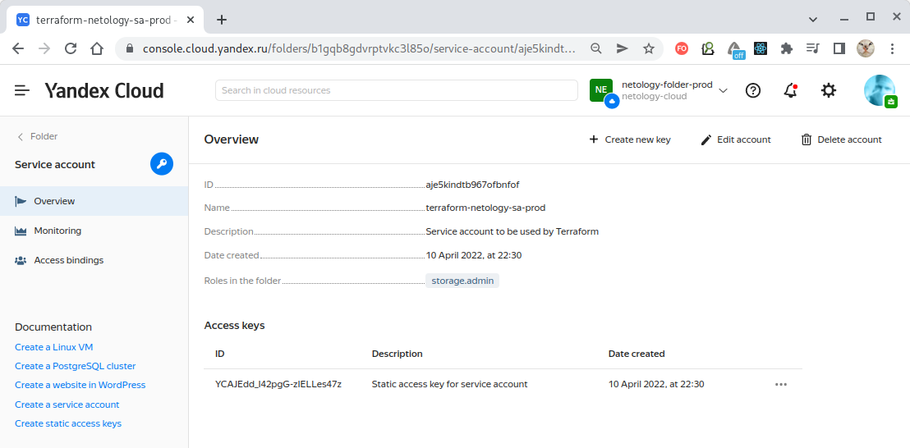

Сервисные аккаунт рабочего пространства `stage`:

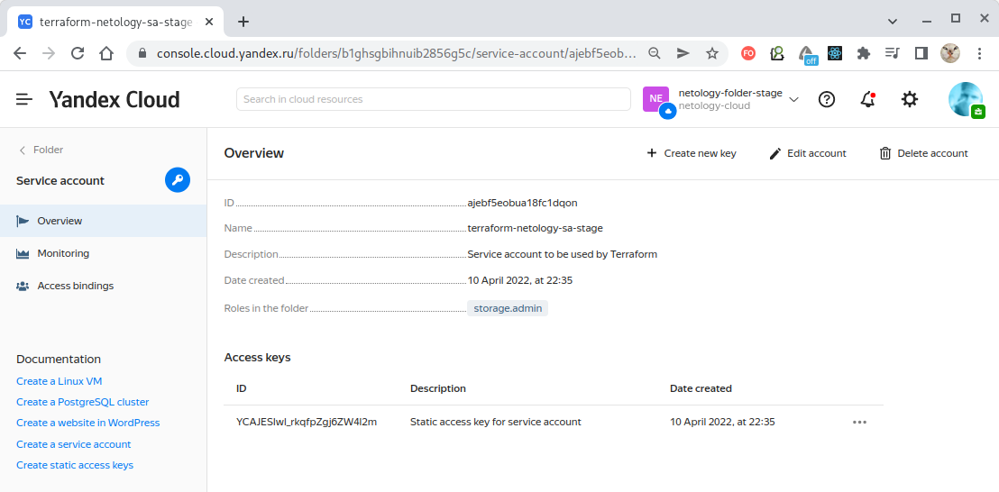

Виртуальные машины `prod`, созданные как с помощью параметра `count` так и оператора `for_each`:

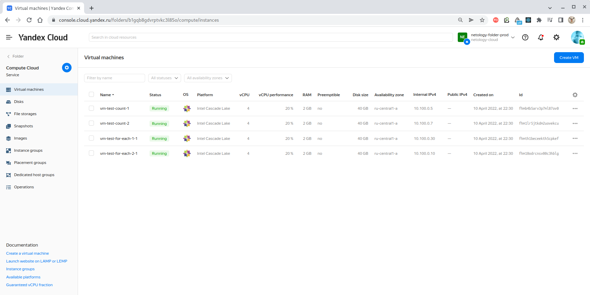

>Видим, что с помощью параметра `count` было создано 2 виртуальных машины, как и требовалось.

Виртуальные машины `stage`, созданные как с помощью параметра `count` так и оператора `for_each`:

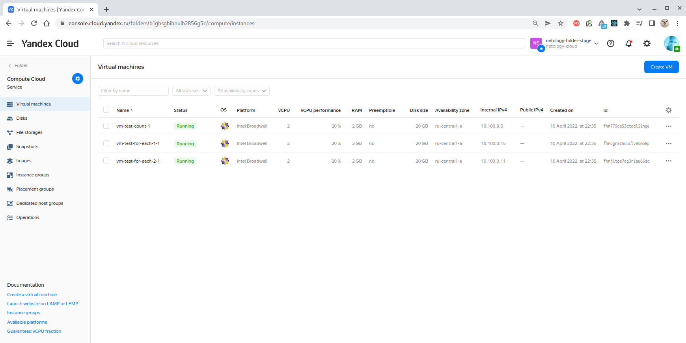

>Видим, что с помощью параметра `count` была создана только одна виртуальная машина, как и требовалось.

С помощью параметра `for_each` для обоих рабочих пространств создавалось по 2 виртуальных машины, потому что мы
привязывались к количеству имен для машин, а оно в обоих случаях было одинаковым, в отличие от параметра `count`.

Соответственно, было создано сетевое окружение для рабочего пространства `prod`:

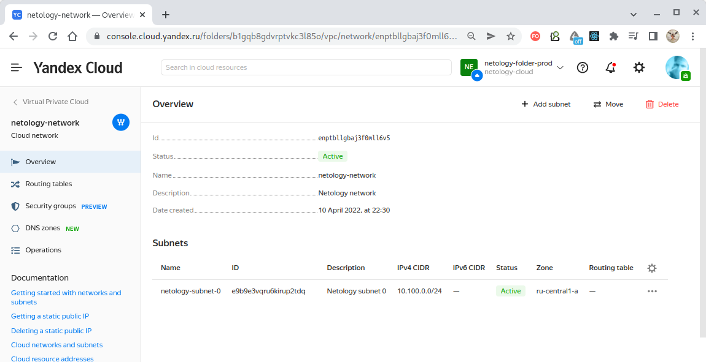

И для рабочего пространства `stage`:

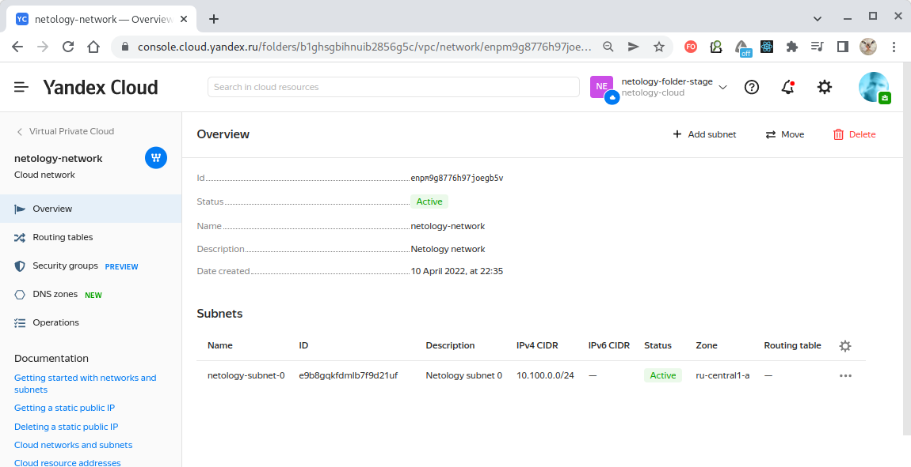

###На этом конфигурирование виртуального окружения с помощью `terraform` завершено.

---

###ПРИЛОЖЕНИЕ 1. ИСПОЛЬЗОВАНИЕ КОНСОЛИ Yandex.Cloud.

Для использования консоли её сначала необходимо инициализировать командой `yc init` с указанием следующих сведений:
- токен (получен из веб-интерфейса и сохранён в переменной окружения `YC_TOKEN`),
- идентификатор облака (получен через веб-интерфейс);
- идентификатор каталога (получен через веб-интерфейс);
- зона доступности;

````
$ yc init                 
Welcome! This command will take you through the configuration process.
Pick desired action:
 [1] Re-initialize this profile 'default' with new settings 
 [2] Create a new profile
Please enter your numeric choice: 1
Please go to https://oauth.yandex.ru/authorize?response_type=token&client_id=1a6990aa636648e9b2ef855fa7bec2fb in order to obtain OAuth token.

Please enter OAuth token: [AQAAAAABL*********************PBEbq222c] <Здесь вводим OAuth токен!>
You have one cloud available: 'netology-cloud' (id = b1gnlr384lft1ojhej5f). It is going to be used by default.
Please choose folder to use:
 [1] default (id = b1g3j5pl8kbac9e2kvoq)
 [2] netology-folder (id = b1gbr7pk3ho7i5fmbc6f)
 [3] Create a new folder
Please enter your numeric choice: 2
Your current folder has been set to 'netology-folder' (id = b1gbr7pk3ho7i5fmbc6f).
Do you want to configure a default Compute zone? [Y/n] Y
Which zone do you want to use as a profile default?
 [1] ru-central1-a
 [2] ru-central1-b
 [3] ru-central1-c
 [4] Don't set default zone
Please enter your numeric choice: 1
Your profile default Compute zone has been set to 'ru-central1-a'.
````

YC-консоль инициализирована. **С этого момента ей можно пользоваться для управления облаком.**


###ПРИЛОЖЕНИЕ 2. СОКРЫТИЕ СЕКРЕТНЫХ ДАННЫХ, ИСПОЛЬЗУЕМЫХ В КОНФИГУРАЦИИ "TERRAFORM".

Существует два варианта, как не указывать секретные данные в конфигурации, спрятав их в `.bashrc` (`.zshrc`):

а) Указать значение под предопределенным идентификатором. Например, для хранения токена Yandex.Cloud следует задать
параметр под специальным именем переменной `YC_TOKEN`:
````
# Yandex.Cloud token variable. 
export YC_TOKEN=<Здесь указать значение токена!> 
````

В этом случае указывать токен в конфигурации `Terraform` вообще не придётся. Будет достаточно следующего объявления:
````
provider "yandex" {
  # Token is not needed here!
  cloud_id  = var.yandex-cloud-id
  zone      = "ru-central1-a"
}
````

б) Второй способ - это использовать предопределенный префикс в имени переменной. Для `Terrarorm` таковым префиксом
является `TF_VAR_`. Т.е. если в `.bashrc` задать переменную как:
````
# Yandex.Cloud variable.  
export TF_VAR_YC_TOKEN_TEST=<Здесь указать значение токена!>
````

И тогда она м.б. объявлена в конфигурации `Terraform` как:
````
variable "YC_TOKEN_TEST" {
  type = string
}
````

И станет доступна для использования в конфигурации провайдера:
````
provider "yandex" {
  token     = var.YC_TOKEN_TEST
  cloud_id  = var.yandex-cloud-id
  zone      = "ru-central1-a"
}
````

###ПРИЛОЖЕНИЕ 3. РОЛИ В Yandex.Cloud.

Получим список доступных ролей командой `yc iam role list`:

| ID группы ролей             | Применяется           | DESCRIPTION                                                                              |
|-----------------------------|-----------------------|------------------------------------------------------------------------------------------|
| admin                       |                       | Все разрешения для управления ресурсом, включая назначение ролей другим пользователям.   |
| editor                      |                       | Разрешение на все операции для управления ресурсом, кроме назначения ролей.              |
| viewer                      |                       | Разрешение на чтение к ресурсам                                                          |
| ai.*                        |                       |                                                                                          |
| alb.*                       | Каталог, Облако       | Роли для управления балансировщиком нагрузки (Applicaction Load Balancer).               |
| audit-trails.*              |                       |                                                                                          |
| cdn.*                       |                       | Управление CDN-ресурсами и группами источников.                                          |
| certificate-manager.*       |                       | Управление сертификатами и доступом к ним.                                               |
| cloudbeaver.*               |                       |                                                                                          |
| compute.*                   | Каталог, Облако       | Управление виртуальными машинами.                                                        |
| container-registry.*        | Каталог, Облако       | Управление реестрами.                                                                    |
| data-sphere.*               |                       |                                                                                          |
| data-transfer.*             | Каталог, Облако       | Управление ресурсами сервиса Data Transfer.                                              |
| datalens.instances.*        | Каталог, Облако       | Управление сервисом DataLens.                                                            |
| dataproc.*                  | Каталог, Облако       | Управление кластером Data Proc.                                                          |
| datasphere.*                |                       | Управление проектами DataSphere.                                                         |
| dns.*                       |                       | Управление DNS-зонами и ресурсными записями.                                             |
| gitlab.*                    |                       |                                                                                          |
| iam.serviceAccounts.*       |                       | Управление сервисными аккаунтами.                                                        |
| iot.devices.*               |                       | Право отправления gRPC-сообщений в Yandex IoT Core от имени устройства или реестра.      |
| k8s.*                       |                       |                                                                                          |
| kms.*                       | Каталог, Облако, Ключ | Управление ключами.                                                                      |
| load-balancer.*             | Каталог, Облако       | Управление балансировщиками нагрузки и целевыми группами.                                |
| loadtesting.*               |                       |                                                                                          |
| lockbox.*                   |                       |                                                                                          |
| logging.*                   |                       | Управление логами.                                                                       |
| marketplace.meteringAgent   |                       |                                                                                          |
| mdb.*                       |                       | Контроль управляемых БД.                                                                 |
| mdb.dataproc.agent          |                       | Только на каталог или облако. Устаревшая - следует использовать dataproc.agent.          |
| monitoring.*                | Каталог, Облако       | Управление дашбордами и виджетами.                                                       |
| organization-manager.*      |                       |                                                                                          |
| resource-manager.*          |                       | Доступ к ресурсам облака. Владелец облака и сервисные аккаунты не нуждаются в этой роли. |
| serverless.containers.*     |                       | Управление списком контейнеров.                                                          |
| serverless.functions.*      |                       | Управление функциями.                                                                    |
| serverless.mdbProxies.user  |                       | Право подключаться к управляемым БД из функции.                                          |
| smart-captcha.*             |                       |                                                                                          |
| storage.*                   |                       | Управление сервисом Object Storage.                                                      |
| vpc.*                       |                       | Управление сетями, маршрутами, адресами и группами безопасности.                         |
| ydb.*                       |                       |                                                                                          |
| yds.*                       |                       |                                                                                          |
| ymq.*                       |                       |                                                                                          |

>Более полное описание ролей приведено на странице https://cloud.yandex.ru/docs/iam/concepts/access-control/roles
 
---