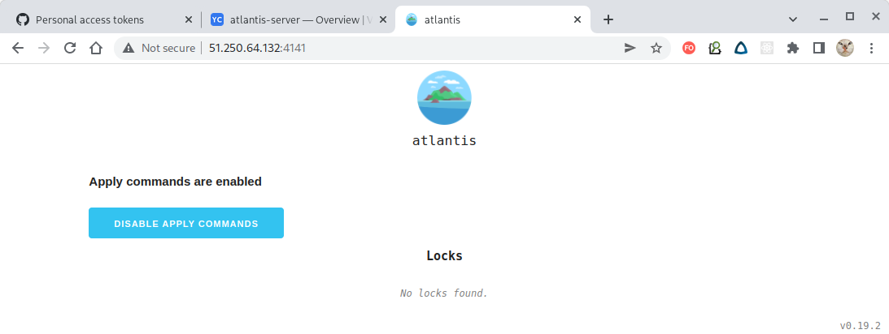
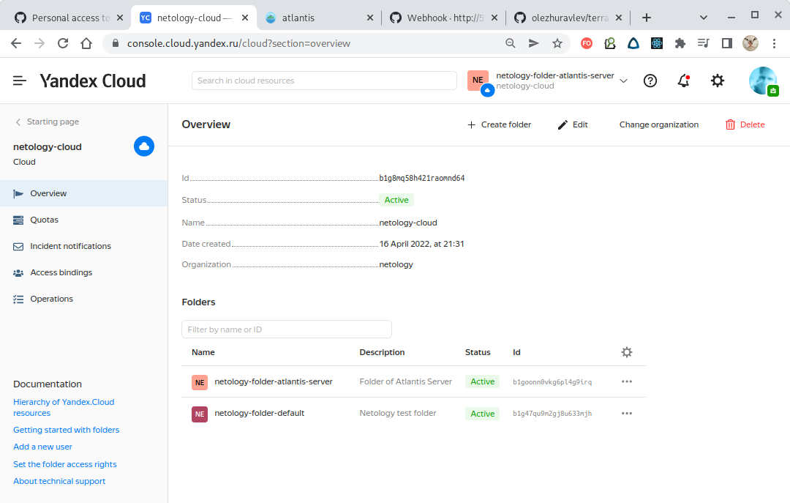

# Домашнее задание к занятию "7.4. Средства командной работы над инфраструктурой."

## Задача 1. Настроить terraform cloud (необязательно, но крайне желательно).

В это задании предлагается познакомиться со средством командой работы над инфраструктурой предоставляемым
разработчиками терраформа.

1. Зарегистрируйтесь на [https://app.terraform.io/](https://app.terraform.io/).
   (регистрация бесплатная и не требует использования платежных инструментов).
1. Создайте в своем github аккаунте (или другом хранилище репозиториев) отдельный репозиторий с
   конфигурационными файлами прошлых занятий (или воспользуйтесь любым простым конфигом).
1. Зарегистрируйте этот репозиторий в [https://app.terraform.io/](https://app.terraform.io/).
1. Выполните plan и apply.

В качестве результата задания приложите снимок экрана с успешным применением конфигурации.

===

**Решение:**

Включаем простейший VPN-плагин браузера и регистрируемся на [https://app.terraform.io/](https://app.terraform.io/).

К сожалению, вариант регистрации с помощью скрипта не работает, поэтому произведем всю настройку вручную.

Далее, рассмотрим всю процедуру по шагам.

После ввода первоначальных данных нам предлагается добавить поставщика VCS. Выбираем GitHub:


После этого сервис предоставляет нам ссылку для обратного вызова из git-репозитория:


Переходим в наш git-репозиторий и регистрируем в нём новое OAuth-приложение, указывая ссылку для
обратного вызова, сгенерированную для нас Terraform Cloud:


Когда OAuth-приложение создано, то GitHub предоставит нам уникальный идентификатор клиента этого приложения
и позволит сгенерировать его секретный ключ:


Возвращаемся на страницу настройки VCS-провайдера Terraform Cloud и вводим идентификатор клиента и секретный ключ,
сгенерированные на предыдущем шаге:


После этого Terraform Cloud обратится к нашему git-репозиторию и тот запросит разрешение на авторизацию:


Разрешаем доступ и VCS-провайдер для Terrafrom Cloud создан:


> Для того, чтобы Terrafrom Cloud имел возможность доступа к содержимому репозитория, необходимо создать и
> зарегистрировать
> **приватные и публичные ключи**. Ввиду тривиальности процедуры приводить её здесь не будем.

Далее необходимо зарегистрировать наш git-репозиторий в качестве источника данных конфигурации.
Для этого создаём рабочее пространство указав его тип:


И выбрав непосредственно репозиторий, содержащий `tf`-файлы. Нашем случае он имеет имя `terraform-cloud-test`:


С этого момента репозиторий привязан к Terraform Cloud:


Terraform Cloud позволяет указывать используемые переменные окружения. В нашем случае - в них хранится токен доступа
к Yandex.Cloud, без которого доступ к облачному провайдеру получить не удасться:


Опубликуем конфигурацию Terraform в наш git-репозиторий, привязанный к Terraform Cloud. Благодаря тому, что мы
предоставили
ссылку обратного вызова, GitHub известит Terraform Cloud о полученных изменениях в содержимом репозитория,
после чего Terraform Cloud прочитает новое состояние конфигурации (здесь наш коммит имеет подпись "gitignore added"):


После этого состояние конфигурации будет верифицировано и составлен план её применения:


> Здесь присутствует предупреждение об используемой, но не объявленной переменной `YC_TOKEN`.
> Это связано с тем, что мы выбрали безопасное сохранение токена в передопределенной переменной,
> вместо того, чтобы использовать стандартный подход, когда переменные окружения объявляются
> с префиксом `TF_VAR_`.
>
>В данном случае это предупреждение можно игнорировать.

Если мы соглашаемся с планом, то жмём кнопку "Применить" и план будет отправлен облачному провайдеру
для создания инфраструктуры:


Зайдя в консоль облачного провайдера, мы видим, что задекларированная инфраструктура успешно создана:


Таким образом, мы создали связку "Git-репозиторий -> "Terraform Cloud" -> "Yandex.Cloud" и успешно её применили.

---

## Задача 2. Написать серверный конфиг для атлантиса.

Смысл задания – познакомиться с документацией
о [серверной](https://www.runatlantis.io/docs/server-side-repo-config.html) конфигурации и конфигурации уровня
[репозитория](https://www.runatlantis.io/docs/repo-level-atlantis-yaml.html).

Создай `server.yaml` который скажет атлантису:

1. Укажите, что атлантис должен работать только для репозиториев в вашем github (или любом другом) аккаунте.
1. На стороне клиентского конфига разрешите изменять `workflow`, то есть для каждого репозитория можно
   будет указать свои дополнительные команды.
1. В `workflow` используемом по-умолчанию сделайте так, что бы во время планирования не происходил `lock` состояния.

Создай `atlantis.yaml` который, если поместить в корень terraform проекта, скажет атлантису:

1. Надо запускать планирование и аплай для двух воркспейсов `stage` и `prod`.
1. Необходимо включить автопланирование при изменении любых файлов `*.tf`.

В качестве результата приложите ссылку на файлы `server.yaml` и `atlantis.yaml`.

===

**Решение:**

#### 1. Конфигурирование серверной части инфраструктуры Atlantis

Для начала нам нужно создать сервер Atlantis с настроенным доступом к определенному Git-репозиторию, который он и будет
отслеживать.
Для предоставления доступа к серверу Atlantis в git-репозиторий воспользуемся **токеном персонального доступа**.

> Токен персонального доступа (**Personal Access Token**) позволяет назначить ему полномочия и срок действия.
> Обладая таким токеном сторонний пользователь (в нашем случае это будет сервер Atlantis) сможет получать доступ
> к репозиторию в соответствии с назначенными токену полномочиями используя строковый идентификатор токена.
>
> Строковый идентификатор токена отображается только один раз при создании токена и **в последующем узнать его нельзя**.
> Поэтому относиться к нему нужно как к паролю и сохранить в безопасном месте.

Создание такого токена производится в меню пользователя -> Settings -> Developer Settings -> Personal access tokens.
Процедура генерации тривиальна - нужно указать полномочия (для Atlantis достаточно только `repo`) - результат отображен
на веб-странице:


Как видно из скриншота, отображаются полномочия токена и срок его действия.
Полномочия токена можно изменять, токен можно пересоздать или отозвать вообще:


> Cтроковый идентификатор токена передается при запуске сервера Atlantis в параметре `--gh-token`.

Также нам понадобится секретная строка, помогающая обеспечить безопасность коммуникации между GitHub и сервером Atlantis.
Эта строка является набором случайных символов не менее 24 символов длиной. Сгенерировать такую строку можно любым способом.
Далее такая сторока будет называться **веб-хук секрет**.

> Веб-хук секрет передается при запуске сервера Atlantis в параметре `--gh-webhook-secret`.

Для запуска сервера Atlantis выберем его контейнеризированную версию и запустим её в сервисе [Yandex Container Solution](https://cloud.yandex.ru/docs/cos/), предназначенном для создания виртуальных машин, оптимизированных для запуска
Docker-контейнеров. В этом случае используются публичные образы операционных систем семейства `"container-optimized-image"`.

> **Container Optimized Image** — образ виртуальной машины, оптимизированный для запуска Docker-контейнеров.
> Образ включает в себя: Ubuntu LTS, Docker и демона для запуска Docker-контейнеров.

В файле Terraform, конфигурирующим виртуальную машину сервера Atlantis, метаданные экземпляра виртуальной машины
и её сетевого окружения конфигурируются стандартным способом, но обратим внимание на конфигурирование метаданных:

````
resource "yandex_compute_instance" "container-optimized-instance" {
...
  metadata = {
    ssh-keys = "ubuntu:${file("~/.ssh/id_rsa.pub")}"
    docker-container-declaration=file("./specification.yaml")
  }
...
}
````

Здесь интересен параметр `docker-container-declaration` в который передаётся содержимое файла
[specification.yaml](atlantis-server/specification.yaml), конфигурирующего параметры создаваемого Docker-контейнера. Приведем этот файл полностью:

````
spec:
  containers:
    - command:
      args:
        - atlantis
        - server
        - "--gh-user=olezhuravlev"
        - "--gh-token=<GitHub-токен>"
        - "--gh-webhook-secret=<Веб-хук секрет>"
        - "--repo-allowlist=github.com/olezhuravlev/*"
        - "--repo-config=/home/atlantis-server-config/server.yaml"
      env:
        - name: YC_TOKEN
          value: <Yandex.Cloud-токен>
      image: ghcr.io/runatlantis/atlantis:v0.19.2
      name: atlantis-server
      securityContext:
        privileged: false
      stdin: true
      tty: true
      volumeMounts:
        - mountPath: /home/atlantis-server-config
          name: atlantis-volume
  restartPolicy: Always
  volumes:
    - name: atlantis-volume
      hostPath:
        path: /home/ubuntu/atlantis-server-config
````

Здесь наибольший интерес представляет секция `command` являющаяся yaml-версией следующей строки запуска
Docker-контейнера:

````
docker run -it -d --name=atlantis-server \
 ghcr.io/runatlantis/atlantis:v0.19.2 atlantis server \ 
 --gh-user=GH_USERNAME \
 --gh-token=GH_TOKEN \
 --gh-webhook-secret=GH_WEBHOOK_SECRET \
 --gh-token=GH_TOKEN \
 --repo-allowlist=github.com/olezhuravlev/*
 --repo-config=/home/atlantis-server-config/server.yaml
````

Именно такой командой мы могли бы запустить контейнеризированный сервер Atlantis локально.

Данные параметры означают следующее:

- **gh-user** - имя пользователя git-репозитория;
- **gh-token** - строковый идентификатор токена git-репозитория (ранее сохраненная нами в безопасном месте);
- **gh-webhook-secret** - секрет веб-хука (случайная строка из не менее, чем 24 символов, позволяющая идентифицировать вызов веб-хука как легитимный);
- **repo-allowlist** - путь к git-репозиторию, который должен отслеживаться сервером Atlantis;
- **repo-config** - путь к файлу конфигурации Docker-контейнера (содержащего сервер Atlantis) для Yandex.Cloud.

> К сожалению, в отличие от вызова из командной строки, в файле [specification.yaml](atlantis-server/specification.yaml)
> значения токенов и секретных строк приходится **указывать в явном виде**, иначе в Docker-контейнер они переданы
> не будут! 

Следующий момент, на который следует обратить внимание - это монтирование тома Docker-контейнера. В этой папке будет
размещен файл конфигурации самого сервера Atlantis:

````
...
      volumeMounts:
        - mountPath: /home/atlantis-server-config
          name: atlantis-volume
  restartPolicy: Always
  volumes:
    - name: atlantis-volume
      hostPath:
        path: /home/ubuntu/atlantis-server-config
````

Здесь папка виртуальной машины `/home/ubuntu/atlantis-server-config` (мы работаем от пользователя `ubuntu`,
поэтому лучше использовать его домашнюю директорию) будет доступна в контейнере по пути `/home/atlantis-server-config`.

Соответственно, в конфигурации Terraform (файл [main.tf](atlantis-server/main.tf), ресурс "yandex_compute_instance") укажем, что в папку
виртуальной машины `/home/ubuntu/atlantis-server-config` нужно скопировать локальную директорию `configs`, содержащую файл с конфигурацией
сервера Atlantis:

````
  provisioner "file" {
    connection {
      host = yandex_compute_instance.container-optimized-instance.network_interface.0.nat_ip_address
      type = "ssh"
      user = "ubuntu"
    }
    destination = "/home/ubuntu/atlantis-server-config"
    source      = "./configs"
  }
````

Теперь сервер Atlantis, будучи запущенным в контейнере, сможет получить доступ к файлу
[server.yaml](atlantis-server/configs/server.yaml) используя путь `/home/atlantis-server-config`.

> Нам пришлось разместить файл [server.yaml](atlantis-server/configs/server.yaml) в отдельной папке потому что
> конструкция `provisioner "file"` в Yandex.Cloud **копирует папку, а не отдельный файл!**

После применения terraform-конфигурации сервера имеем запущенную виртуальную машину, обладающую внешним IP-адресом:


> В данном случае это адрес `51.250.64.132`, но в нашем случае он **не является статическим и при перезапуске
> виртуальной машины будет меняться!**

Если зайти по `http` на страницу сервера (используется порт `4141`), то увидим домашнуюю страницу сервера Atlantis:



Таким образом сервер Atlantis был создан и запущен.

#### 2. Конфигурирование веб-хуков git-репозитория

Для активации работы Atlantis-сервера следует создать веб-хук, который будет исполняться каждый раз
при внесении изменений в репозиторий. По сути - это `POST`-запрос к серверу Atlantis.

Для создания веб-хука репозитория переходим на страницу настроек **веб-хуков репозитория** (`Settings -> Webhooks`).
Далее создаём новый веб-хук (Add Webhook) и указываем следующие параметры:

- Payload URL: http://<Адрес сервера Atlantis>:<Порт>/events (указать протокол https, если используется SSL);
- Content type: application/json;
- Secret: секрет веб-хука (сгенерированный ранее и передаваемый серверу Atlantis через параметр `--gh-webhook-secret`);

> Здесь нам обязательно нужно использовать секретную строку, переданную ранее в параметр `--gh-webhook-secret`
> сервера Atlantis. **В противном случае сервер Atlantis будет считать такой веб-хук нелигитимным!**

- Указываем **Let me select individual events** и выбираем следующие события, для которых должен вызываться веб-хук:
    - Pull request reviews
    - Pushes
    - Issue comments
    - Pull requests
- Active: checked

> В нашем случае параметр Payload URL имеет значение **http://51.250.64.132:4141/events**
>
> Но при перезапуске сервера значение IP-адреса может измениться!
>
> Кроме того:
> - указываем порт (по умолчанию **4141**);
> - указываем путь как **/events** (ОБЯЗАТЕЛЬНО!)

После этого нажимаем `Add webhook` и на этом настройка веб-хука, предназначенного для уведомляния сервера Atlantis
о событиях, происходящих в git-репозитории, заканчивается.

Хук при своем создании сразу выполнит проверочный вызов (отправит POST-запрос к серверу Atlantis) и, в случае успеха,
его можно видеть на закладке "Recent Deliveries" помеченным зеленой галочкой. Также любой вызов можно повторить
и тогда он будет помечен тегом `redelivery`:


> Также событие вызова веб-хука при желании можно отслеживать в логах docker-контейнера сервера Atlantis.

#### 3. Конфигурирование сервера Atlantis

Файл [server.yaml](atlantis-server/configs/server.yaml) (имя м.б. любым), содержит сведения о конфигурации сервера Atlantis.

> Том для размещения этого файла мы сначала смонтировали в конфигурации Docker-контейнера сервера Atlantis,
> а затем путь к этому тому указали в файле [specification.yaml](atlantis-server/specification.yaml) в параметре запуска
> этого же контейнера> `"--repo-config=/home/atlantis-server-config/server.yaml"`
> 

Приведем этот файл полностью:
````
repos:
  - id: github.com/olezhuravlev/terraform-cloud-test
    branch: /.*/
    apply_requirements: [ approved, mergeable ]
    workflow: default
    allowed_overrides: [ workflow ]
    allow_custom_workflows: true
    delete_source_branch_on_merge: true
workflows:
  default:
    plan:
      steps:
        - run: echo "*** SERVER - BEFORE INIT ***"
        - init
        - plan:
            extra_args: [ "-lock=false" ]
        - run: echo "*** SERVER - AFTER INIT ***"
    apply:
      steps:
        - run: echo "*** SERVER - BEFORE APPLY ***"
        - apply
        - run: echo "*** SERVER - AFTER APPLY ***"
````

Данные параметры означают следующее:

- **id: github.com/olezhuravlev/terraform-cloud-test** - путь к репозиторию, которым должен управлять Atlantis. Здесь мы выбираем репозиторий `terraform-cloud-test` принадлежащий аккаунту `olezhuravlev`.

> Следует обратить внимание, что **для приватных репозиториев указание пути в виде шаблона не работает** и нужно указывать полный путь: `github.com/olezhuravlev/terraform-cloud-test`
> 
> Но для аккаунтов организаций можно указывать путь в виде шаблона: `github.com/olezhuravlev/*`
 
- **branch: /.*/** - Ветка репозитория, которой должен управлять Atlantis (здесь - отлеживать все ветки):
- **apply_requirements: [approved, mergeable]** - условия, которым должен удовлетворять пулл-риквест для применения конфигурации. Здесь пулл-риквест д.б. одобрен - ключ `approved`, а также не содержать конфликтов слияния - ключ `mergeable`;
- **workflow: default** - техпроцесс, применяемый к репозиторию (он также обязательно д.б. объявлен в секции `workflows` ниже). Здесь используется техпроцесс по умолчанию;
- **allowed_overrides: [workflow]** - если нужно разрешить репозиторию использовать файл [atlantis.yaml](atlantis-client-config/atlantis.yaml) (**имя файла не м.б. другим!**) для переопределения параметров конфигурации, задаваемых сервером, то здесь можно задать секции конфигурации, которые разрешается переопределить. Разрешим в клиентском файле изменять только настройки техпроцесса - секцию `workflow`;
- **allow_custom_workflows: true** - определяет, разрешено ли данному репозиторию определять свой собственный техпроцесс. Если `false`, то репозиторий может использовать только техпроцесс, определенный на сервере. Здесь мы разрешаем репозиторию иметь свой техпроцесс, т.е. определять свои собственные дополнительные команды;

> ВНИМАНИЕ! Разрешая репозиториям использовать собственные техпроцессы мы получаем **брешь в безопасности**, потому что 
> даём возможность испольнять произвольный код на сервере Atlantis.

- **delete_source_branch_on_merge: true** - задает, удалять ли ветку-источник данных после её слияния с целевой веткой. Будем удалять;

- **секция `workflows`** задает перечень пользовательских техпроцессов на стороне сервера. Здесь мы будем использовать техпроцесс по-умолчанию, но переопределим его так, чтобы во время планирования не происходила блокировка состояния (а также, в целях демонстрации, добавим сообщения, выводимые до и после выполнения команд). В соответствии с заданным техпроцессом будет происходить следующее:
  - вызов команды `plan`:
    - выводится сообщение "SERVER - BEFORE INIT";
    - выполняется команда `terraform init`;
    - выполняется команда `terraform plan` с ключом `lock=false` чтобы при выполнении процедуры планирования состояние сервера не блокировалось;
    - выводится сообщение "SERVER - AFTER INIT";
  - вызов команды `apply`:
    - выводится сообщение "SERVER - BEFORE APPLY";
    - выполняется команда `terraform apply` (ключ `-auto-approve` не требуется - интерактивные запросы Atlantis подавляет);
    - выводится сообщение "SERVER - AFTER APPLY";

> ВНИМАНИЕ! В документации присутствуют разночтения, как указывать дополнительные параметры.
> Например этот [пример использования](https://www.runatlantis.io/docs/repo-level-atlantis-yaml.html#example-using-all-keys)
> содержит указание задавать параметр как `extra_args: [ "-lock", "false" ]` (что является ошибкой),
> а в документации по созданию [пользовательских техпроцессов](https://www.runatlantis.io/docs/custom-workflows.html#adding-extra-arguments-to-terraform-commands)
> указан работоспособный синтаксис `extra_args: ["-lock=false"]`.
> 
> Синтаксис `extra_args: [ "-lock", "false" ]` приводит к тому, что команда вызывается как `terraform plan -lock false`, что явно является некорректным,
> потому что должно быть `terraform plan -lock=false`.

На этом конфигурирование серверной части Atlantis завершается.

#### 4. Конфигурирование клиентской части Atlantis (репозитория, управляемого Atlantis)

Файл [atlantis.yaml](atlantis-client-config/atlantis.yaml) (**имя д.б. точно таким!**) располагается в корневой директории репозитория и позволяет задавать параметры
работы Atlantis для этого репозитория в рамках разрешений, заданных конфигурацией на сервере.

Приведем этот файл полностью:
````
version: 3
automerge: true
parallel_plan: true
parallel_apply: true
projects:
  - name: atlantis-test-project   
  - dir: .
    workspace: stage
    autoplan:
      when_modified: [ "*.tf" ]
      enabled: true
    workflow: default
  - dir: .
    workspace: prod
    autoplan:
      when_modified: [ "*.tf" ]
      enabled: true
workflows:
  default:
    plan:
      steps:
        - run: echo "*** CLIENT - BEFORE INIT ***"
        - init
        - plan:
            extra_args: [ "-lock", "false" ]
        - run: echo "*** CLIENT - AFTER INIT ***"
````

Данные параметры означают следующее:

- **version: 3** - задаёт синтаксис конфигурационного файла. На данный момент во всех случаях используется третья версия;
- **automerge: true** - автоматически выполнять слияние пул-риквеста после применения всех планов;
- **parallel_plan: true** - разрешение выполнять `plan` разных проектов одновременно;
- **parallel_apply: true** - разрешение выполнять `apply` разных проектов одновременно;

> По умолчанию количество одновременно выполняемых операций ограничено 15, но этот лимит можно изменить с помощью
> параметра `--parallel-pool-size`.

- **секция `project`** предназначена для указания параметров проекта: 
  - **name** - имя проекта. Требуется, если в одной и той же директории и рабочем пространстве существуют более одного проекта;
  - **dir** - путь к директории проекта относительно корня репозитория (например `./project1`, где `.` - это корень репозитория);
  - **workspace** - рабочее пространство Terraform для проекта. Atlantis переключится на это рабочее пространство (или создаст его) при выполнении `plan` или `apply`;
  - **terraform_version** - sevmer-совместимый номер альтернативной версии Terraform для использования (Atlantis скачает её автоматически);

Если нужно использовать несколько рабочих пространств, то их нужно указать для одной и той же директории:
````
projects:
  - dir: .
    workspace: stage
  - dir: .
    workspace: prod
````

В случае обнаружения изменений в указанной директории, Atlantis выполнит планирование для обеих
рабочих пространств - `stage` и `prod`.

- **секция `autoplan`** - автопланирование позволяет Atlantis автоматически запускать планирование при обновлении проекта пул-риквестом.
  Здесь оно включено и отслеживает изменение `tf`-файлов пулл-риквестом:
````
autoplan:
  when_modified: [ "*.tf" ]
  enabled: true
````

> Ручной запуск планирования будет выполняться с учётом параметра `when_modified`, даже если автопланирование отключено!

- **секция `workflows`** аналогична настройкам сервера, но задает перечень пользовательских техпроцессов для репозитория. Здесь мы будем также использовать техпроцесс по-умолчанию, и снова переопределим его так, чтобы во время планирования не происходила блокировка состояния (и снова, в целях демонстрации, добавим сообщения, выводимые до и после операции планирования). В соответствии с заданным техпроцессом будет происходить следующее:
    - вызов команды `plan`:
        - выводится сообщение "CLIENT - BEFORE INIT";
        - выполняется команда `terraform init`;
        - выполняется команда `terraform plan` с ключом `lock=false` чтобы при выполнении процедуры планирования состояние сервера не блокировалось;
        - выводится сообщение "CLIENT - AFTER INIT";

Вызов команды `apply` мы для репозитория перегружать не будем, потому что нас устраивает дефолтный вариант.

На этом конфигурирование Atlantis для репозитория завершается.

#### 5. Проверка работоспособности сервера Atlantis

Цикл работы цепочки GitHub -> Atlantis -> Yandex.Cloud выглядит следующим образом:

1. Инициализация некоторой конфигурации в Yandex.Cloud;
2. Создание пул-риквеста в GitHub;
3. Проверка плана выполнения (вручную с помощью команды `atlantis plan`);
4. Получение одобрения пул-риквеста от другого пользователя (не автора пул-риквеста);
5. Применение вносимых изменений (запускается вручную командой `atlantis apply`);
6. Слияние изменений с целевой веткой;
7. Удаление ветки-источника;
8. Возвращение к п.2.

> Здесь следует обратить внимание, что вызов `atlantis apply` возможен только из комментария к пул-риквесту.
> Как следствие, мы **не можем инициализировать из него конфигурацию**, если пул-риквест полностью её не содержит!
> 
> Т.е. если конфигурации в облаке еще нет, а мы изменили, например, файл
> [variables.tf](atlantis-client-config/variables.tf), содержащий только сведения о переменных, то выполнение
> команды `atlantis apply` приведет к ошибке, потому что применяться будет только к файлам пул-риквеста, а не ко
> всей конфигурации, которая находится в целевой ветке, а слияние еще не проводилось.
> 
> В качестве обхода этой ситуации можно рассмотреть вариант со слиянием измений в промежуточную ветку, когда
> пул-риквест будет содержать полное описание конфигурации, а Terraform уже сам решит, что конкретно обновлять
> в инфраструктуре.

#### 1. Имеем первоначальную конфигурацию в Yandex.Cloud:



Здесь присутствует каталог `netology-folder-atlantis-server`, содержащий сервер Atlantis, а также каталог
`netology-folder-default`, являющийся целью наших экспериментов.

> Здесь следует обратить внимание, что рабочие пространства еще не инициализированы, что можно видеть из имени каталога!

#### 2. Создаём пул-риквест в GitHub 

В ознакомительных целях внесём простейшее изменение в конфигурацию - изменим описание каталога.
Изменение выполним непосредственно через веб-интерфейс GitHub:


Сохраним изменения в новой ветке:


И создадим для неё новый пул-риквест:


#### 3. Проверка плана выполнения

Сразу после создания пул-риквеста Atlantis начинает проверку на наличие конфликтов слияния (их нет, пункт помечен
зеленой галочкой) и далее выполняет действия в соответствии с настройками,
заданными в файлах конфигурации Atlantis
([server.yaml](atlantis-server/configs/server.yaml) и/или [atlantis.yaml](atlantis-client-config/atlantis.yaml)):


Когда проверки завершены Atlantis добавит соответствующие комментарии (но сделает их от имени пользователя, создавшего
веб-хук):


Можно увидеть детальную информацию о выполненных операциях.

Для рабочего пространства **stage**:


И для рабочего пространства **prod**:


Как видим, для обеих рабочих пространств предполагается изменить описание ресурса `yandex_resourcemanager_folder`.

По сути, это результат выполнения команды `terraform plan` для указанных рабочих пространств (Atlantis использует для
выполнения команд свой экземпляр Terraform, версия которого может быть задана в параметре `terraform_version`,
если дефолтная по какой-либо причине не устраивает).

Кроме того, выведенные сообщения "BEFORE..." и "AFTER..." были определены в файле репозитория
[atlantis.yaml](atlantis-client-config/atlantis.yaml), что означает, что используется именно клиентская конфигурация
Atlantis.

В этих же комментариях Atlantis приводит подсказку, что можно применить команды `atlantis apply` и `atlantis unlock`.
Помимо этого, можно вручную выполнить команду `atlantis plan` для повторной генерации плана:


На этой стадии мы на домашней странице сервера Atlantis (http://IP-адрес-сервера:4141) увидим, что две конфигурации
для разных рабочих пространств находятся в заблокированном состоянии:


> Эти блокировки будут сняты после успешного выполнения `apply`.

#### 4, 5. Получение одобрения пул-риквеста и применение изменений

Применяются вносимые изменения путем ручного ввода команды `atlantis apply`
но **только после того, как пул-риквест был одобрен**:

Если мы попробуем выполнить `atlantis apply` для неодобренного пул-риквеста, то получим соответствующее предупреждение,
что риквест д.б. одобрен кем-то другим, кроме автора:


До одобрения пул-риквеста ничего сделать нельзя, но после одобрения процесс можно продолжить повторно введя команду
`atlantis apply`:


Как видим, Atlantis успешно выполнил `terraform apply`, обновив тем самым облачную конфигурацию.

Здесь следует обратить внимание, что здесь наши сообщения "BEFORE..." и "AFTER..." не выводились, хотя для серверной
конфигурации они определены. Это произошло потому, что в конфигурационном файле
[atlantis.yaml](atlantis-client-config/atlantis.yaml) репозитория мы не переопределяли действия для `apply`, поэтому
Atlantis применил дефолтный алгоритм.

> Отсюда следует важное замечание, что если конфигурационный файл репозитория присутствует и его применение разрешено
> сервером, то он целиком применяется вместо серверного конфигурационного файла.
> Отсутствующие же секции применяются в своём дефолтном варианте, а не в том варианте, как они были переопределены на
> сервере!

#### 6, 7. Слияние изменений и удаление ветки-источника

После успешного выполнения `apply` Atlantis автоматически выполняет слияние с целевой веткой репозитория,
после чего удалит ветку-источник (т.к. установлен параметр `delete_source_branch_on_merge: true`).
С этого момента работа с пулл-риквестом считается завершенной:


Как результат, мы получим обновлённую инфраструктуру Yandex.Cloud, где присутствуют созданные для сгенерированных
Atlantis рабочих пространств `stage` и `prod` (до этого их не существовало) папки `netology-folder-stage` и
`netology-folder-prod` соответственно:


Таким образом мы полностью реализовали и продемонстрировали весь цикл взаимодействия GitHub -> Atlantis -> Yandex.Cloud.

### Результат:

#### Конфигурационный файл сервера: [server.yaml](atlantis-server/configs/server.yaml)

#### Конфигурационный файл репозитория: [atlantis.yaml](atlantis-client-config/atlantis.yaml)

---

## Задача 3. Знакомство с каталогом модулей.

1. В [каталоге модулей](https://registry.terraform.io/browse/modules) найдите официальный модуль от aws для создания
   `ec2` инстансов.
2. Изучите как устроен модуль. Задумайтесь, будете ли в своем проекте использовать этот модуль или непосредственно
   ресурс `aws_instance` без помощи модуля?
3. В рамках предпоследнего задания был создан ec2 при помощи ресурса `aws_instance`.
   Создайте аналогичный инстанс при помощи найденного модуля.

В качестве результата задания приложите ссылку на созданный блок конфигураций.

===

**Ответы:**

### 1. Модуль [aws:ec2-instance](https://registry.terraform.io/modules/terraform-aws-modules/ec2-instance/aws/latest)
упрощает создание экземпляров виртуальных машин `es2`, избавляя пользователя от необходимости применения шаблонного кода.


### 2. Скачаем модуль по приведенной [ссылке](https://github.com/terraform-aws-modules/terraform-aws-ec2-instance),
удалим из него политическую рекламу и нецензурную брань, после чего рассмотрим код.

Модуль устроен стандартным образом - присутствуют все рекомендуемые файлы - `main.tf`, `variables.tf`, `outputs.tf`
и `versions.tf`. Прилагаются два примера использования этого модуля.

Использование файлов `variables.tf`, `outputs.tf` и `versions.tf` тривиально, а в `main.tf` декларируется создание
заданного количества экземпляров виртуальных машин `aws_instance` и `aws_spot_instance`
(через `aws_spot_instance_request`) внутри которых с помощью конструкций `dynamic` объявляются требуемые свойства
этих экземпляров. Значение принимаются через `variables` от пользователя модуля.

По сути, модуль представляет собой заготовку для создания виртуальных машин `es2`.


#### Тем не менее, использовать в своих проектах этот модуль я не буду по следующим причинам:

- код объёмист и его освоение сопоставимо с освоением работы с ресурсами AWS непосредственно;

- автор модуля постарался сделать его по возможности универсальным, но для создания виртуальных машин для конкретной
цели эта универсальность может оказаться избыточной;

- при использовании сторонних модулей появляется ненужная зависимость от посредника ввиде автора модуля - придётся
отслеживать версии, быть уверенным в доступности внешних ресурсов, отсутствии ошибок и т.д. и т.п.;

- вопросы безопасности - придется отслеживать отсутствие зловредного кода, брешей в модуле.

На мой взгляд, подобные модули являются удобным способом сокращения шаблонных операций, но только для собственных
ресурсов и **создавать такие модули нужно самостоятельно, под конкретные цели**.

### 3. Применим модуль,
предназначенный для использования в Yandex.Cloud.

Но сначала такой модуль необходимо создать. Учитывая демонстрационный характер действия, модуль будет простым и
предназначенным исключительно для создания экземпляра виртуальной машины и некоторых других ресурсов в Yandex.Cloud.
Кроме того, для краткости мы не будем заполнять описания для входных и выходных данных, просто опишем руководство
в README-файле.

Пусть данный [модуль](./terraform-yandex-compute-instance) создает экземпляр виртуальной машины Yandex.Cloud с доступом по ssh и
набором ресурсов. Содержимое конфигурации тривиально и уже многократно описывалось в предыдущих задачах.

Разместим конфигурацию в git-репозитории: https://github.com/olezhuravlev/terraform-yandex-compute-instance

> Обращаем внимание на формат имени репозитория: оно должно состоять из следующих частей:
> **terraform-<Имя провайдера>-<Имя модуля>**. Это нужно для правильной идентификации принадлежности модуля провайдеру в
> репозитории Terraform!

> Обязательно нужно назначить коммиту ярлык с Symver-корректной версией и отправить ярлыки в репозиторий отдельной
> командой `git push --tags` (простым `git push` они не отправляются) - без наличия версии разместить модуль
> в репозитории не удасться!

После выполнения простой процедуры опубликования созданного модуля в [регистре Terraform](https://registry.terraform.io/modules/olezhuravlev/compute-instance/yandex/latest)
его немедленно можно наблюдать через веб-интерфейс:


Обращаем внимание, что имя модуля составлено из имени репозитория - `terraform-yandex-compute-instance`
превратилось в `compute-instance`.

Являясь публичным, этот модуль доступен для всех пользователей и его даже можно найти в списке:


Чтобы воспользоваться созданным модулем достаточно создать локальный модуль со ссылкой на репозиторий, как
указано в подсказке на веб-странице справа:


А именно:

````hcl
module "compute-instance" {
  source  = "olezhuravlev/compute-instance/yandex"
  version = "1.0.0"
  yandex_cloud_id    = <Идентификатор Yandex.Cloud облака>
  folder_id          = <Идентификатор папки>
  path_to_public_key = "~/.ssh/id_rsa.pub"
}
````

После применения данной конфигурации, состоящей всего из 5 строк, мы получаем развернутый экземпляр виртуальной машины
в полном соответствии с описанной в модуле конфигурацией.


> К сожалению, в реальности воспользоваться репозиторием `Terraform` указанным способом пока невозможно по причине его
> заблокированности для России и Беларуссии, но всегда можно скачать модуль по
> [ссылке](https://github.com/olezhuravlev/terraform-yandex-compute-instance) (ссылка указана на странице каждого
> модуля) и разместить его в папке `modules` локальной конфигурации, получив тот же результат, что делает Terraform
> автоматически, скачивая модуль из репозитория.

Таким образом мы продемонстрировали использование модуля, размещенного в каталоге модулей Terraform. 

---