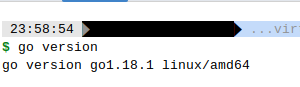

# Домашнее задание к занятию "7.5. Основы golang"

С `golang` в рамках курса, мы будем работать не много, поэтому можно использовать любой IDE.
Но рекомендуем ознакомиться с [GoLand](https://www.jetbrains.com/ru-ru/go/).

## Задача 1. Установите golang.

1. Воспользуйтесь инструкций с официального сайта: [https://golang.org/](https://golang.org/).
2. Так же для тестирования кода можно использовать песочницу: [https://play.golang.org/](https://play.golang.org/).

===

**Результат:**



---

## Задача 2. Знакомство с gotour.

У Golang есть обучающая интерактивная консоль [https://tour.golang.org/](https://tour.golang.org/).
Рекомендуется изучить максимальное количество примеров. В консоли уже написан необходимый код,
осталось только с ним ознакомиться и поэкспериментировать как написано в инструкции в левой части экрана.

===

**Результат:**

Сделано.

---

## Задача 3. Написание кода.

Цель этого задания закрепить знания о базовом синтаксисе языка. Можно использовать редактор кода
на своем компьютере, либо использовать песочницу: [https://play.golang.org/](https://play.golang.org/).

1. Напишите программу для перевода метров в футы (1 фут = 0.3048 метр). Можно запросить исходные данные
   у пользователя, а можно статически задать в коде.
   Для взаимодействия с пользователем можно использовать функцию `Scanf`:
    ```
    package main
    
    import "fmt"
    
    func main() {
        fmt.Print("Enter a number: ")
        var input float64
        fmt.Scanf("%f", &input)
    
        output := input * 2
    
        fmt.Println(output)    
    }
    ```

1. Напишите программу, которая найдет наименьший элемент в любом заданном списке, например:
    ```
    x := []int{48,96,86,68,57,82,63,70,37,34,83,27,19,97,9,17,}
    ```
1. Напишите программу, которая выводит числа от 1 до 100, которые делятся на 3. То есть `(3, 6, 9, …)`.

В виде решения ссылку на код или сам код.

===

**Решение:**

#### 1. Программа перевода футов в метры:

````bash
package main

import "fmt"

func FeetConvertor(val float64) float64 {
  // Convert in meters and round result to 2 decimal places.
  //return math.Round(val*0.3048*100) / 100
  return math.Round(val*0.3048*100) / 100
}

func main() {
  fmt.Print("Enter length in feet: ")

  // Receive user input.
  var input float64
  fmt.Scanf("%f", &input)

  // Print out the result.
  fmt.Println(fmt.Sprintf("In meters it's: %.2f\n", FeetConvertor(input)))
}
````
Здесь мы отделили этап ввода данных от этапа расчета значений для более удобного тестирования в дальнейшем.

Программа запросит у пользователя ввести значение в футах и выведет это же значение в метрах.

#### 2. Программа поиска наименьшего элемента в списке:

````bash
package main

import "fmt"

func FindMin(collection []int) *int {

  // We'll use pointer to distinguish situation of no values in provided collection.
  var found *int

  for _, s : = range collection {
    if found == nil {
      // Initialize value.
      found = new(int)
      *found = s
    } else if s < *found {
      // Register new minimal value.
      *found = s
    }
  }

  return found
}

func main() {
  x : = []int{48, 96, 86, 68, 57, 82, 63, 70, 37, 34, 83, 27, 19, 97, 9, 17}
  //x := []int{}

  min : = FindMin(x)

  // If empty pointer returned then there was no any value found.
  if min == nil {
    fmt.Printf("No values found!\n")
  } else {
    fmt.Printf("The minimal value is: %d\n", *min)
  }
}
````

Программа выведет найденное минимальное значение для непустых списков и сообщение, если ни одного элемента
не было идентифицировано.

#### 3. Напишите программу, которая выводит числа от 1 до 100, которые делятся на 3. То есть `(3, 6, 9, …)`.

````bash
func ShowDevisibleBy(begin, end, devisor int) []int {
  result : = []int{}
  for i : = begin; i <= end; i++ {
    if i % devisor == 0 {
      result = append(result, i)
    }
  }
  return result
}

func main() {
  fmt.Print("Devisible values: ", ShowDevisibleBy(1, 10, 3), "\n")
}
````

Программа выводит кратные числа для любых возрастающих интервалов и любых делителей.

---

## Задача 4. Протестировать код (не обязательно).

Создайте тесты для функций из предыдущего задания.

===

**Решение:**

Создадим файл [main_test.go](tasks/main_test.go) и протестируем все созданные фунции:

````bash
package main

import "testing"

func TestFeetConvertor(t *testing.T) {
	got := FeetConvertor(10)
	want := float64(3.05)
	if got != want {
		t.Errorf("Must be %0.2f but %0.2f returned", want, got)
	}
}

func TestFindMin(t *testing.T) {
	resultEmpty := FindMin([]int{})
	if resultEmpty != nil {
		t.Errorf("Must be empty reference!")
	}

	result := FindMin([]int{48, 96, 86, 68, 57, 82, 63, 70, 37, 34, 83, 27, 19, 97, 9, 17})
	if result == nil {
		t.Errorf("Must be actual reference!")
	}

	got := *result
	want := 9

	if got != want {
		t.Errorf("Must be %d but %d returned", want, got)
	}
}

func TestShowDevisibleBy(t *testing.T) {
	got := ShowDevisibleBy(1, 10, 3)
	want := 3
	if len(got) != want {
		t.Errorf("Must be %d long but is %d", want, len(got))
		return
	}

	wanted_result := []int{3, 6, 9}
	for i := range wanted_result {
		if wanted_result[i] != got[i] {
			t.Errorf("Must be %d long but is %d", wanted_result, got)
			return
		}
	}
}
````

Если намеренно исказить ожидаемые значения для тестов, то результаты тестирования будут выглядеть следующим образом:
````bash
$ go test
--- FAIL: TestFeetConvertor (0.00s)
    main_test.go:9: Must be 3.06 but 3.05 returned
--- FAIL: TestFindMin (0.00s)
    main_test.go:28: Must be 91 but 9 returned
--- FAIL: TestShowDevisibleBy (0.00s)
    main_test.go:36: Must be 31 long but is 3
FAIL
exit status 1
FAIL    this-project/cmd/gobegin        0.001s

````

Но если установить правильные ожидаемые значения, то тестирование всех функций заканчивается успехом:
````bash
$ go test
PASS
ok      tasks/tasks     0.001s
````

---
