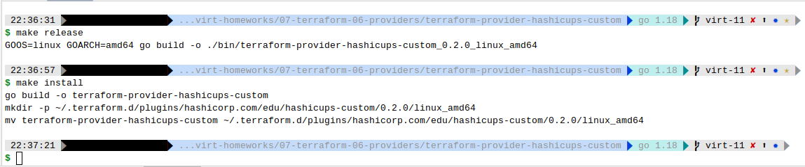
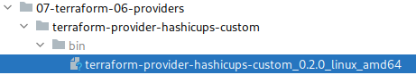
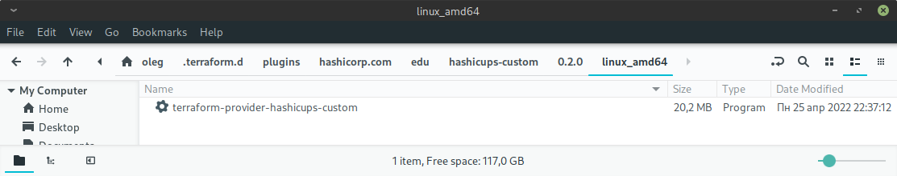

# Домашнее задание к занятию "7.6. Написание собственных провайдеров для Terraform."

Бывает, что 
* общедоступная документация по терраформ ресурсам не всегда достоверна,
* в документации не хватает каких-нибудь правил валидации или неточно описаны параметры,
* понадобиться использовать провайдер без официальной документации,
* может возникнуть необходимость написать свой провайдер для системы используемой в ваших проектах.   

## Задача 1. 
Давайте потренируемся читать исходный код AWS провайдера, который можно склонировать от сюда: 
[https://github.com/hashicorp/terraform-provider-aws.git](https://github.com/hashicorp/terraform-provider-aws.git).
Просто найдите нужные ресурсы в исходном коде и ответы на вопросы станут понятны.  


1. Найдите, где перечислены все доступные `resource` и `data_source`, приложите ссылку на эти строки в коде на 
гитхабе.   
1. Для создания очереди сообщений SQS используется ресурс `aws_sqs_queue` у которого есть параметр `name`. 
    * С каким другим параметром конфликтует `name`? Приложите строчку кода, в которой это указано.
    * Какая максимальная длина имени? 
    * Какому регулярному выражению должно подчиняться имя? 

===

**Ответ:**

**1. Ресурсы и источники данных**

Файл [provider.go](https://github.com/hashicorp/terraform-provider-aws/blob/main/internal/provider/provider.go) предназначен
для описания провайдера, включая схему ресурсов и источники данных.

По общему соглашению имя **файла ресурсов** должно иметь формат `resource_<Наименование ресурса>.go`. Поиск даёт
следующий набор файлов ресурсов:
````
$ find . -name "resource_*.go" -not -name "*_test.go" -type f
./providerlint/vendor/github.com/hashicorp/terraform-plugin-sdk/v2/helper/schema/resource_data_get_source.go
./providerlint/vendor/github.com/hashicorp/terraform-plugin-sdk/v2/helper/schema/resource_data.go
./providerlint/vendor/github.com/hashicorp/terraform-plugin-sdk/v2/helper/schema/resource_importer.go
./providerlint/vendor/github.com/hashicorp/terraform-plugin-sdk/v2/helper/schema/resource_diff.go
./providerlint/vendor/github.com/hashicorp/terraform-plugin-sdk/v2/helper/schema/resource_timeout.go
./providerlint/vendor/github.com/hashicorp/terraform-plugin-sdk/v2/terraform/resource_address.go
./providerlint/vendor/github.com/hashicorp/terraform-plugin-sdk/v2/terraform/resource_provider.go
./providerlint/vendor/github.com/hashicorp/terraform-plugin-sdk/v2/terraform/resource_mode.go
./providerlint/vendor/github.com/hashicorp/terraform-plugin-sdk/v2/terraform/resource_mode_string.go
./internal/service/route53recoveryreadiness/resource_set.go
./internal/service/cloudwatchlogs/resource_policy.go
./internal/service/cognitoidp/resource_server.go
./internal/service/ram/resource_association.go
./internal/service/ram/resource_share_accepter.go
./internal/service/ram/resource_share.go
./internal/service/ram/resource_share_data_source.go
./internal/service/codebuild/resource_policy.go
./internal/service/glue/resource_policy.go
./internal/service/lakeformation/resource_data_source.go
./internal/service/apigateway/resource_data_source.go
./internal/service/ssm/resource_data_sync.go
./internal/service/cloudcontrol/resource_data_source.go
./internal/service/networkfirewall/resource_policy.go
./internal/service/organizations/resource_tags_data_source.go
./internal/service/inspector/resource_group.go
./internal/verify/resource_differ.go
````

Файлы тестов (оканчиваются на `_test.go`) исключены из результата.

> Ресурсы в папке [internal](https://github.com/hashicorp/terraform-provider-aws/tree/main/internal) предназначены для
> внутреннего использования.
> Такое использование является [стандартным](https://github.com/golang-standards/project-layout/tree/master/internal)
> для Golang.

По общему соглашению имя файла **источника данных** должно иметь формат `<Наименование Источника Данных>_data_source.go`.
Простой поиск даёт следующий набор файлов источников данных:
````
$ find . -name "*_data_source.go" -type f   
./internal/service/ds/directory_data_source.go
./internal/service/sts/caller_identity_data_source.go
./internal/service/transfer/server_data_source.go
./internal/service/workspaces/workspace_data_source.go
./internal/service/workspaces/image_data_source.go
./internal/service/workspaces/directory_data_source.go
./internal/service/workspaces/bundle_data_source.go
./internal/service/sns/topic_data_source.go
./internal/service/kafka/broker_nodes_data_source.go
./internal/service/kafka/cluster_data_source.go
./internal/service/kafka/kafka_version_data_source.go
./internal/service/kafka/configuration_data_source.go
./internal/service/datapipeline/pipeline_data_source.go
./internal/service/datapipeline/pipeline_definition_data_source.go
./internal/service/cloudwatchlogs/group_data_source.go
./internal/service/cloudwatchlogs/groups_data_source.go
./internal/service/cognitoidp/user_pool_clients_data_source.go
./internal/service/cognitoidp/user_pool_client_data_source.go
./internal/service/cognitoidp/user_pool_signing_certificate_data_source.go
./internal/service/cognitoidp/user_pools_data_source.go
./internal/service/ram/resource_share_data_source.go
./internal/service/grafana/workspace_data_source.go
./internal/service/connect/quick_connect_data_source.go
./internal/service/connect/lambda_function_association_data_source.go
./internal/service/connect/queue_data_source.go
./internal/service/connect/bot_association_data_source.go
./internal/service/connect/instance_data_source.go
./internal/service/connect/hours_of_operation_data_source.go
./internal/service/connect/contact_flow_module_data_source.go
./internal/service/connect/contact_flow_data_source.go
./internal/service/connect/prompt_data_source.go
./internal/service/servicequotas/service_data_source.go
./internal/service/servicequotas/service_quota_data_source.go
./internal/service/wafv2/rule_group_data_source.go
./internal/service/wafv2/ip_set_data_source.go
./internal/service/wafv2/regex_pattern_set_data_source.go
./internal/service/wafv2/web_acl_data_source.go
./internal/service/cloudfront/origin_access_identity_data_source.go
./internal/service/cloudfront/response_headers_policy_data_source.go
./internal/service/cloudfront/cache_policy_data_source.go
./internal/service/cloudfront/log_delivery_canonical_user_id_data_source.go
./internal/service/cloudfront/distribution_data_source.go
./internal/service/cloudfront/origin_request_policy_data_source.go
./internal/service/cloudfront/function_data_source.go
./internal/service/cloudfront/realtime_log_config_data_source.go
./internal/service/sagemaker/prebuilt_ecr_image_data_source.go
./internal/service/memorydb/parameter_group_data_source.go
./internal/service/memorydb/user_data_source.go
./internal/service/memorydb/cluster_data_source.go
./internal/service/memorydb/snapshot_data_source.go
./internal/service/memorydb/subnet_group_data_source.go
./internal/service/memorydb/acl_data_source.go
./internal/service/directconnect/location_data_source.go
./internal/service/directconnect/gateway_data_source.go
./internal/service/directconnect/locations_data_source.go
./internal/service/directconnect/connection_data_source.go
./internal/service/batch/compute_environment_data_source.go
./internal/service/batch/job_queue_data_source.go
./internal/service/batch/scheduling_policy_data_source.go
./internal/service/sfn/state_machine_data_source.go
./internal/service/sfn/activity_data_source.go
./internal/service/glue/data_catalog_encryption_settings_data_source.go
./internal/service/glue/script_data_source.go
./internal/service/glue/connection_data_source.go
./internal/service/codeartifact/authorization_token_data_source.go
./internal/service/codeartifact/repository_endpoint_data_source.go
./internal/service/emr/release_labels_data_source.go
./internal/service/guardduty/detector_data_source.go
./internal/service/servicecatalog/portfolio_data_source.go
./internal/service/servicecatalog/portfolio_constraints_data_source.go
./internal/service/servicecatalog/product_data_source.go
./internal/service/servicecatalog/launch_paths_data_source.go
./internal/service/servicecatalog/constraint_data_source.go
./internal/service/backup/vault_data_source.go
./internal/service/backup/framework_data_source.go
./internal/service/backup/report_plan_data_source.go
./internal/service/backup/plan_data_source.go
./internal/service/backup/selection_data_source.go
./internal/service/elb/hosted_zone_id_data_source.go
./internal/service/elb/service_account_data_source.go
./internal/service/elb/load_balancer_data_source.go
./internal/service/redshift/cluster_data_source.go
./internal/service/redshift/service_account_data_source.go
./internal/service/redshift/orderable_cluster_data_source.go
./internal/service/elasticache/user_data_source.go
./internal/service/elasticache/replication_group_data_source.go
./internal/service/elasticache/cluster_data_source.go
./internal/service/lambda/layer_version_data_source.go
./internal/service/lambda/invocation_data_source.go
./internal/service/lambda/alias_data_source.go
./internal/service/lambda/function_url_data_source.go
./internal/service/lambda/code_signing_config_data_source.go
./internal/service/lambda/function_data_source.go
./internal/service/iam/user_ssh_key_data_source.go
./internal/service/iam/user_data_source.go
./internal/service/iam/instance_profile_data_source.go
./internal/service/iam/policy_data_source.go
./internal/service/iam/group_data_source.go
./internal/service/iam/saml_provider_data_source.go
./internal/service/iam/policy_document_data_source.go
./internal/service/iam/users_data_source.go
./internal/service/iam/server_certificate_data_source.go
./internal/service/iam/openid_connect_provider_data_source.go
./internal/service/iam/role_data_source.go
./internal/service/iam/roles_data_source.go
./internal/service/iam/session_context_data_source.go
./internal/service/iam/account_alias_data_source.go
./internal/service/ecrpublic/authorization_token_data_source.go
./internal/service/lakeformation/data_lake_settings_data_source.go
./internal/service/lakeformation/permissions_data_source.go
./internal/service/lakeformation/resource_data_source.go
./internal/service/resourcegroupstaggingapi/resources_data_source.go
./internal/service/kms/ciphertext_data_source.go
./internal/service/kms/key_data_source.go
./internal/service/kms/secret_data_source.go
./internal/service/kms/alias_data_source.go
./internal/service/kms/public_key_data_source.go
./internal/service/kms/secrets_data_source.go
./internal/service/rds/event_categories_data_source.go
./internal/service/rds/cluster_data_source.go
./internal/service/rds/snapshot_data_source.go
./internal/service/rds/cluster_snapshot_data_source.go
./internal/service/rds/engine_version_data_source.go
./internal/service/rds/subnet_group_data_source.go
./internal/service/rds/certificate_data_source.go
./internal/service/rds/orderable_instance_data_source.go
./internal/service/rds/instance_data_source.go
./internal/service/rds/proxy_data_source.go
./internal/service/autoscaling/group_data_source.go
./internal/service/autoscaling/groups_data_source.go
./internal/service/autoscaling/launch_configuration_data_source.go
./internal/service/cloudhsmv2/cluster_data_source.go
./internal/service/neptune/engine_version_data_source.go
./internal/service/neptune/orderable_db_instance_data_source.go
./internal/service/elasticbeanstalk/hosted_zone_data_source.go
./internal/service/elasticbeanstalk/application_data_source.go
./internal/service/elasticbeanstalk/solution_stack_data_source.go
./internal/service/ecr/authorization_token_data_source.go
./internal/service/ecr/repository_data_source.go
./internal/service/ecr/image_data_source.go
./internal/service/ses/active_receipt_rule_set_data_source.go
./internal/service/ses/domain_identity_data_source.go
./internal/service/ses/email_identity_data_source.go
./internal/service/elasticsearch/domain_data_source.go
./internal/service/serverlessrepo/application_data_source.go
./internal/service/apigateway/domain_name_data_source.go
./internal/service/apigateway/vpc_link_data_source.go
./internal/service/apigateway/export_data_source.go
./internal/service/apigateway/api_key_data_source.go
./internal/service/apigateway/rest_api_data_source.go
./internal/service/apigateway/sdk_data_source.go
./internal/service/apigateway/resource_data_source.go
./internal/service/ssm/maintenance_windows_data_source.go
./internal/service/ssm/instances_data_source.go
./internal/service/ssm/parameters_by_path_data_source.go
./internal/service/ssm/patch_baseline_data_source.go
./internal/service/ssm/document_data_source.go
./internal/service/ssm/parameter_data_source.go
./internal/service/apigatewayv2/api_data_source.go
./internal/service/apigatewayv2/export_data_source.go
./internal/service/apigatewayv2/apis_data_source.go
./internal/service/iot/endpoint_data_source.go
./internal/service/elbv2/listener_data_source.go
./internal/service/elbv2/target_group_data_source.go
./internal/service/elbv2/load_balancer_data_source.go
./internal/service/cloudtrail/service_account_data_source.go
./internal/service/ecs/service_data_source.go
./internal/service/ecs/task_definition_data_source.go
./internal/service/ecs/cluster_data_source.go
./internal/service/ecs/container_definition_data_source.go
./internal/service/mq/broker_data_source.go
./internal/service/acm/certificate_data_source.go
./internal/service/imagebuilder/image_pipeline_data_source.go
./internal/service/imagebuilder/container_recipes_data_source.go
./internal/service/imagebuilder/image_recipes_data_source.go
./internal/service/imagebuilder/image_pipelines_data_source.go
./internal/service/imagebuilder/components_data_source.go
./internal/service/imagebuilder/container_recipe_data_source.go
./internal/service/imagebuilder/distribution_configurations_data_source.go
./internal/service/imagebuilder/image_data_source.go
./internal/service/imagebuilder/distribution_configuration_data_source.go
./internal/service/imagebuilder/image_recipe_data_source.go
./internal/service/imagebuilder/component_data_source.go
./internal/service/imagebuilder/infrastructure_configurations_data_source.go
./internal/service/imagebuilder/infrastructure_configuration_data_source.go
./internal/service/cloudcontrol/resource_data_source.go
./internal/service/acmpca/certificate_data_source.go
./internal/service/acmpca/certificate_authority_data_source.go
./internal/service/opensearch/domain_data_source.go
./internal/service/qldb/ledger_data_source.go
./internal/service/route53resolver/endpoint_data_source.go
./internal/service/route53resolver/rule_data_source.go
./internal/service/route53resolver/rules_data_source.go
./internal/service/cur/report_definition_data_source.go
./internal/service/secretsmanager/secret_data_source.go
./internal/service/secretsmanager/secret_version_data_source.go
./internal/service/secretsmanager/secret_rotation_data_source.go
./internal/service/codecommit/repository_data_source.go
./internal/service/codecommit/approval_rule_template_data_source.go
./internal/service/globalaccelerator/accelerator_data_source.go
./internal/service/servicediscovery/dns_namespace_data_source.go
./internal/service/ec2/security_groups_data_source.go
./internal/service/ec2/nat_gateways_data_source.go
./internal/service/ec2/transit_gateway_dx_gateway_attachment_data_source.go
./internal/service/ec2/ebs_snapshot_data_source.go
./internal/service/ec2/eip_data_source.go
./internal/service/ec2/common_schema_data_source.go
./internal/service/ec2/ami_ids_data_source.go
./internal/service/ec2/eips_data_source.go
./internal/service/ec2/client_vpn_endpoint_data_source.go
./internal/service/ec2/vpc_peering_connections_data_source.go
./internal/service/ec2/nat_gateway_data_source.go
./internal/service/ec2/local_gateway_route_tables_data_source.go
./internal/service/ec2/vpn_gateway_data_source.go
./internal/service/ec2/vpc_ipam_pool_data_source.go
./internal/service/ec2/transit_gateway_route_tables_data_source.go
./internal/service/ec2/instance_type_data_source.go
./internal/service/ec2/availability_zone_data_source.go
./internal/service/ec2/customer_gateway_data_source.go
./internal/service/ec2/spot_price_data_source.go
./internal/service/ec2/local_gateway_virtual_interface_data_source.go
./internal/service/ec2/network_interface_data_source.go
./internal/service/ec2/ami_data_source.go
./internal/service/ec2/launch_template_data_source.go
./internal/service/ec2/instance_type_offerings_data_source.go
./internal/service/ec2/instances_data_source.go
./internal/service/ec2/ebs_snapshot_ids_data_source.go
./internal/service/ec2/transit_gateway_multicast_domain_data_source.go
./internal/service/ec2/transit_gateway_vpc_attachments_data_source.go
./internal/service/ec2/transit_gateway_data_source.go
./internal/service/ec2/subnet_ids_data_source.go
./internal/service/ec2/instance_types_data_source.go
./internal/service/ec2/route_table_data_source.go
./internal/service/ec2/transit_gateway_vpn_attachment_data_source.go
./internal/service/ec2/coip_pool_data_source.go
./internal/service/ec2/vpc_data_source.go
./internal/service/ec2/local_gateway_virtual_interface_group_data_source.go
./internal/service/ec2/transit_gateway_route_table_data_source.go
./internal/service/ec2/transit_gateway_peering_attachment_data_source.go
./internal/service/ec2/subnet_data_source.go
./internal/service/ec2/serial_console_access_data_source.go
./internal/service/ec2/local_gateway_route_table_data_source.go
./internal/service/ec2/local_gateway_virtual_interface_groups_data_source.go
./internal/service/ec2/route_data_source.go
./internal/service/ec2/instance_type_offering_data_source.go
./internal/service/ec2/vpcs_data_source.go
./internal/service/ec2/subnets_data_source.go
./internal/service/ec2/instance_data_source.go
./internal/service/ec2/security_group_data_source.go
./internal/service/ec2/transit_gateway_connect_data_source.go
./internal/service/ec2/vpc_peering_connection_data_source.go
./internal/service/ec2/prefix_list_data_source.go
./internal/service/ec2/ebs_volume_data_source.go
./internal/service/ec2/transit_gateway_vpc_attachment_data_source.go
./internal/service/ec2/transit_gateway_connect_peer_data_source.go
./internal/service/ec2/network_interfaces_data_source.go
./internal/service/ec2/coip_pools_data_source.go
./internal/service/ec2/ebs_default_kms_key_data_source.go
./internal/service/ec2/internet_gateway_data_source.go
./internal/service/ec2/key_pair_data_source.go
./internal/service/ec2/local_gateways_data_source.go
./internal/service/ec2/vpc_dhcp_options_data_source.go
./internal/service/ec2/managed_prefix_list_data_source.go
./internal/service/ec2/availability_zones_data_source.go
./internal/service/ec2/ebs_encryption_by_default_data_source.go
./internal/service/ec2/route_tables_data_source.go
./internal/service/ec2/vpc_ipam_preview_next_cidr_data_source.go
./internal/service/ec2/network_acls_data_source.go
./internal/service/ec2/vpc_endpoint_data_source.go
./internal/service/ec2/vpc_endpoint_service_data_source.go
./internal/service/ec2/local_gateway_data_source.go
./internal/service/ec2/host_data_source.go
./internal/service/ec2/ebs_volumes_data_source.go
./internal/service/sqs/queue_data_source.go
./internal/service/waf/rule_data_source.go
./internal/service/waf/ipset_data_source.go
./internal/service/waf/web_acl_data_source.go
./internal/service/waf/rate_based_rule_data_source.go
./internal/service/codestarconnections/connection_data_source.go
./internal/service/appmesh/virtual_service_data_source.go
./internal/service/appmesh/mesh_data_source.go
./internal/service/route53/delegation_set_data_source.go
./internal/service/route53/traffic_policy_document_data_source.go
./internal/service/route53/zone_data_source.go
./internal/service/meta/billing_service_account_data_source.go
./internal/service/meta/service_data_source.go
./internal/service/meta/default_tags_data_source.go
./internal/service/meta/region_data_source.go
./internal/service/meta/arn_data_source.go
./internal/service/meta/regions_data_source.go
./internal/service/meta/partition_data_source.go
./internal/service/meta/ip_ranges_data_source.go
./internal/service/organizations/resource_tags_data_source.go
./internal/service/organizations/delegated_administrators_data_source.go
./internal/service/organizations/delegated_services_data_source.go
./internal/service/organizations/organizational_units_data_source.go
./internal/service/organizations/organization_data_source.go
./internal/service/lexmodels/slot_type_data_source.go
./internal/service/lexmodels/bot_alias_data_source.go
./internal/service/lexmodels/intent_data_source.go
./internal/service/lexmodels/bot_data_source.go
./internal/service/eks/node_groups_data_source.go
./internal/service/eks/cluster_data_source.go
./internal/service/eks/addon_version_data_source.go
./internal/service/eks/clusters_data_source.go
./internal/service/eks/node_group_data_source.go
./internal/service/eks/addon_data_source.go
./internal/service/eks/cluster_auth_data_source.go
./internal/service/kinesis/stream_consumer_data_source.go
./internal/service/kinesis/stream_data_source.go
./internal/service/docdb/engine_version_data_source.go
./internal/service/docdb/orderable_db_instance_data_source.go
./internal/service/inspector/rules_packages_data_source.go
./internal/service/s3/bucket_policy_data_source.go
./internal/service/s3/canonical_user_id_data_source.go
./internal/service/s3/bucket_objects_data_source.go
./internal/service/s3/bucket_object_data_source.go
./internal/service/s3/object_data_source.go
./internal/service/s3/bucket_data_source.go
./internal/service/s3/objects_data_source.go
./internal/service/ssoadmin/instances_data_source.go
./internal/service/ssoadmin/permission_set_data_source.go
./internal/service/identitystore/user_data_source.go
./internal/service/identitystore/group_data_source.go
./internal/service/dynamodb/table_data_source.go
./internal/service/firehose/delivery_stream_data_source.go
./internal/service/events/bus_data_source.go
./internal/service/events/source_data_source.go
./internal/service/events/connection_data_source.go
./internal/service/outposts/site_data_source.go
./internal/service/outposts/outposts_data_source.go
./internal/service/outposts/outpost_instance_types_data_source.go
./internal/service/outposts/sites_data_source.go
./internal/service/outposts/outpost_data_source.go
./internal/service/outposts/outpost_instance_type_data_source.go
./internal/service/efs/file_system_data_source.go
./internal/service/efs/access_points_data_source.go
./internal/service/efs/mount_target_data_source.go
./internal/service/efs/access_point_data_source.go
./internal/service/storagegateway/local_disk_data_source.go
./internal/service/signer/signing_profile_data_source.go
./internal/service/signer/signing_job_data_source.go
./internal/service/cloudformation/stack_data_source.go
./internal/service/cloudformation/type_data_source.go
./internal/service/cloudformation/export_data_source.go
./internal/service/networkmanager/site_data_source.go
./internal/service/networkmanager/global_network_data_source.go
./internal/service/networkmanager/link_data_source.go
./internal/service/networkmanager/device_data_source.go
./internal/service/networkmanager/sites_data_source.go
./internal/service/networkmanager/global_networks_data_source.go
./internal/service/networkmanager/devices_data_source.go
./internal/service/networkmanager/links_data_source.go
./internal/service/networkmanager/connection_data_source.go
./internal/service/networkmanager/connections_data_source.go
./internal/service/kafkaconnect/worker_configuration_data_source.go
./internal/service/kafkaconnect/custom_plugin_data_source.go
./internal/service/kafkaconnect/connector_data_source.go
./internal/service/pricing/product_data_source.go
./internal/service/wafregional/rule_data_source.go
./internal/service/wafregional/ipset_data_source.go
./internal/service/wafregional/web_acl_data_source.go
./internal/service/wafregional/rate_based_rule_data_source.go
````

Как видим, все они расположены в папке [service](https://github.com/hashicorp/terraform-provider-aws/tree/main/internal/service).

**2. Параметры очереди сообщений**

2.1. Параметры [name](https://github.com/hashicorp/terraform-provider-aws/blob/main/internal/service/sqs/queue.go#L82)
и [name_prefix](https://github.com/hashicorp/terraform-provider-aws/blob/main/internal/service/sqs/queue.go#L89)
конфликтуют друг с другом, что указано в определениях этих параметров:
````
"name": {
   Type:          schema.TypeString,
   Optional:      true,
   Computed:      true,
   ForceNew:      true,
   ConflictsWith: []string{"name_prefix"},
},
"name_prefix": {
   Type:          schema.TypeString,
   Optional:      true,
   Computed:      true,
   ForceNew:      true,
   ConflictsWith: []string{"name"},
},
````

Конфликт в данном случае означает, что нужно задавать имя очереди или с помощью параметра
[name](https://github.com/hashicorp/terraform-provider-aws/blob/main/internal/service/sqs/queue.go#L82)
или с помощью опционального параметра [name_prefix](https://github.com/hashicorp/terraform-provider-aws/blob/main/internal/service/sqs/queue.go#L89),
который также предназначен для создания имени, но с определенным префиксом.


2.2. [В 424 строке файла queue.go](https://github.com/hashicorp/terraform-provider-aws/blob/main/internal/service/sqs/queue.go#L424)
указаны регулярные выражения, которым должно удовлетворять имя очереди:
````
if fifoQueue {
   re = regexp.MustCompile(`^[a-zA-Z0-9_-]{1,75}\.fifo$`)
} else {
   re = regexp.MustCompile(`^[a-zA-Z0-9_-]{1,80}$`)
}
````

Соответственно, **длина имени ограничена 80 символами**, при этом для `FIFO` реально можно задать только 75 символов,
потому что оставшиеся 5 символов будут заняты строкой `".fifo"`.

2.3. Регулярное выражение, непосредственно относящееся к имени очереди, выглядит как `[a-zA-Z0-9_-]`. Это значает,
что строка имени может содержать **прописные и/или строчные символы, цифры, подчеркивание и дефис**.

---

## Задача 2. (Не обязательно) 
В рамках вебинара и презентации мы разобрали как создать свой собственный провайдер на примере кофемашины. 
Также вот официальная документация о создании провайдера: 
[https://learn.hashicorp.com/collections/terraform/providers](https://learn.hashicorp.com/collections/terraform/providers).

1. Проделайте все шаги создания провайдера.
2. В виде результата приложение ссылку на исходный код.
3. Попробуйте скомпилировать провайдер, если получится то приложите снимок экрана с командой и результатом компиляции.   

===

**Решение:**

1. В результате выполнения всех шагов получен [Terraform-провайдер](./terraform-provider-hashicups-custom), порядок
компиляции и использования приведен в соответствующем [описании](./terraform-provider-hashicups-custom/README.md);
2. Исходный код получившегося провайдера приведен в папке [hashicups](./terraform-provider-hashicups-custom/hashicups);
3. Для упрощения компиляции и размещения провайдера были созданы соответствующие [make-скрипты](./terraform-provider-hashicups-custom/Makefile).
Результат выполнения процедуры компиляции выглядит следующим образом:



В результате компиляции (`make release`, а, точнее, `GOOS=linux GOARCH=amd64 go build -o ./bin/${BINARY}_${VERSION}_linux_amd64`)
в папке `bin` создаётся бинарный файл Golang, содержащий код провайдера:



Команда `make install` копирует бинарный файл провайдера в локальный репозиторий terraform-провайдеров (путь
`/home/<Имя пользователя>/.terraform.d/plugins/<Имя хоста>/<Пространство имён>/<Имя провайдера>/<Версия>/<Версия ОС>`):



После размещения бинарного кода провайдера в репозитории, к нему можно обращаться по его реквизитам:
````
terraform {
  required_providers {
    hashicups = {
      version = "0.2.0"
      source  = "hashicorp.com/edu/hashicups-custom"
    }
  }
}
````

---
